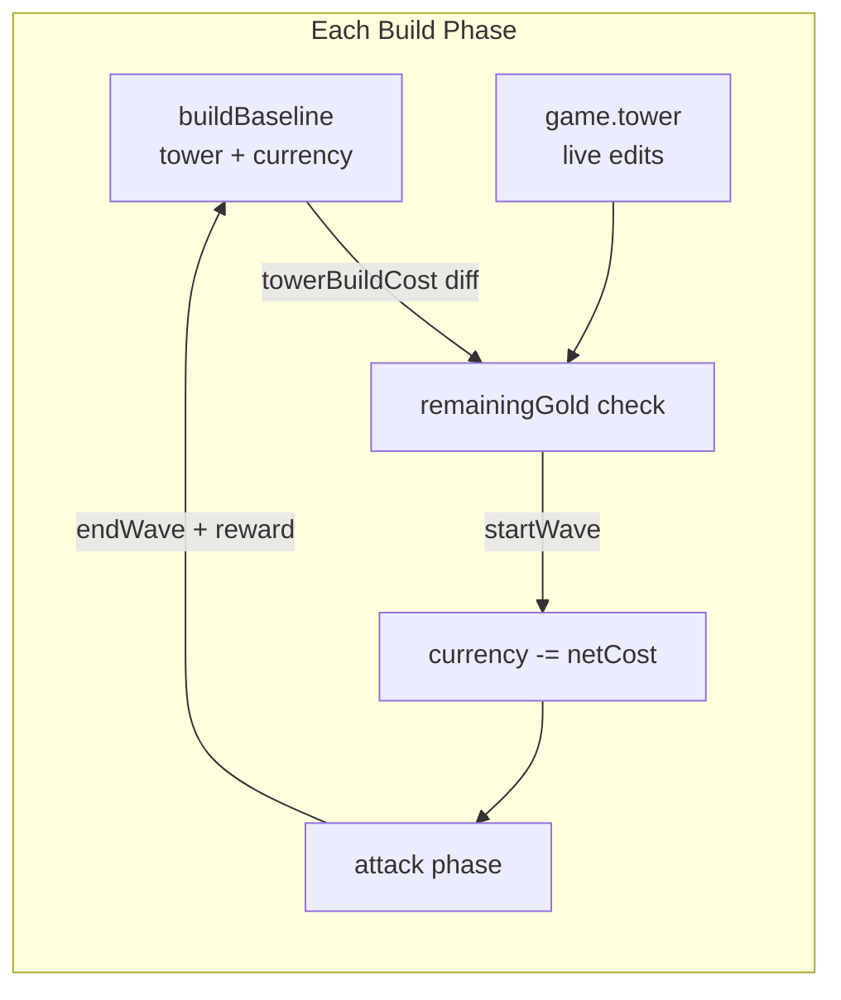

# Build-Phase Planning (Free Layout + Cost Diff)

## Your idea is sound

The correct diff is **aggregate investment**, not per-room identity:

```typescript
netBuildCost = towerBuildCost(draftTower) - towerBuildCost(baselineTower);
remainingGold = baseline.currency - netBuildCost;
```

On **Start Wave**, commit once: `player.currency = baseline.currency - netBuildCost`, then `beginWave()`.

This naturally handles:

- Place then remove → net cost returns to 0 (no punishment)
- Remove a room that existed at phase start → negative diff → gold back on commit (full value, not 50% sell)
- Add mods → included in `towerBuildCost` via level costs

Do **not** diff by room id — removing room A and adding room B is just a cost delta.



## Scope (per your choice)

Applies to **every build phase** (first layout and all inter-wave reinforcement). Baseline is captured fresh when each build phase begins.

---

## 1. Model: build cost + baseline

**New in [`src/calculations/buildCost.ts`](src/calculations/buildCost.ts)** (or `economy.ts`):

- `roomBuildCost(room)` — blueprint `cost` + sum of `modificationCost(def, 1..level)` per mod
- `towerBuildCost(tower)` — sum over rooms
- `netBuildCost(baseline, draft)` — `towerBuildCost(draft) - towerBuildCost(baseline.tower)`
- `remainingBuildGold(baseline, draft)` — `baseline.currency - netBuildCost(...)`

**Extend [`GameState`](src/model/types.ts)**:

```typescript
buildBaseline: { tower: Tower; currency: number } | null;
```

**Capture baseline** in [`src/model/phases.ts`](src/model/phases.ts):

- After `startRun()` (empty tower + starting gold)
- After `endWave()` reward, when re-entering `build` (tower may have battle damage; cost ignores HP)

Use `structuredClone` for tower snapshot (plain data, no clone util exists today).

**Clear or ignore baseline** during `attack` (only read during `build`).

---

## 2. Store: defer economy until commit

Refactor [`src/store/store.ts`](src/store/store.ts) `placeSelected`, `sellRoomById`, `addModificationTo`, `upgradeModificationOn`:

| Action                    | Today                        | Planning (build + baseline)                                                |
| ------------------------- | ---------------------------- | -------------------------------------------------------------------------- |
| Place room                | `spend` immediately          | No spend; reject if `remainingGold < blueprint.cost` after projected place |
| Sell / right-click remove | 50% room refund + mod refund | `removeRoom` only, no `reward`                                             |
| Add / upgrade mod         | `spend` immediately          | No spend; reject if projected `netBuildCost` exceeds baseline              |

**Affordability helper** (store or selector):

```typescript
function canAffordBuild(baseline, draftTower, extraCost = 0): boolean {
  return netBuildCost(baseline, draftTower) + extraCost <= baseline.currency;
}
```

**`startWave` intent** (before `beginWave`):

1. Existing `isTowerStable` gate stays
2. `net = netBuildCost(baseline, game.tower)`
3. `game.player.currency = baseline.currency - net`
4. `beginWave(game)` — baseline left stale until next `endWave`

**`restart`**: new game + recapture baseline via `beginRun` path.

**Dev `+50 gold` during build**: bump `buildBaseline.currency` (and optionally `player.currency` for consistency) so planning budget matches cheat.

---

## 3. UI / copy changes

- **[`src/view/dom/hud.ts`](src/view/dom/hud.ts)**: During build, show `remainingBuildGold` (e.g. `Gold: 33`) instead of raw `player.currency` (frozen at baseline during phase). Optional sublabel: `12 committed` when `netBuildCost > 0`.
- **[`src/view/dom/modal.ts`](src/view/dom/modal.ts)**: Sell button → **Remove** with no `+Xg` during planning; show refund only when baseline is absent (shouldn't happen in normal flow) or post-commit legacy path removed.
- **[`src/view/dom/library.ts`](src/view/dom/library.ts) / tooltip**: Mention free rearrangement during build; suppress per-action economy spam in [`store`](src/store/store.ts) (or quieter messages: "Placed Spire Block" without gold line).
- **Phase label**: optional `Planning` vs `Building` — low priority.

Existing canvas **ghost preview** ([`selectGhostPlacement`](src/store/selectors.ts)) stays; it already previews validity. No need to ghost the whole tower unless you want a visual diff later (out of scope v1).

---

## 4. Drag-to-place (follow-up, enabled by planning)

Add to [`src/view/input.ts`](src/view/input.ts) after planning economy lands:

- `pointerdown` on canvas → record start cell + blueprint
- `pointermove` → if distance/cell changed past threshold, enter drag mode
- While dragging: on each **new** hovered origin cell, dispatch `placeSelectedAt` (same rules as click; planning mode makes undo cheap)
- `pointerup` → end drag; distinguish short click (inspect / single place) vs drag via ~5px threshold
- **Multi-cell blueprints** (buttress): place only when origin cell changes; same as repeated clicks
- **Right-drag or right-button drag** for erase: optional v2
- **Conflict**: click room opens modal — use drag threshold so click-on-room still inspects

No store changes required beyond existing `placeSelectedAt` / `removeRoomAt` intents.

---

## Issues and edge cases

| Issue                                 | Resolution                                                                                          |
| ------------------------------------- | --------------------------------------------------------------------------------------------------- |
| **Per-room sell refund vs diff**      | During build, never call `reward` on remove; diff handles refunds on commit                         |
| **Mod removal without selling room**  | Not supported today; user must sell room (remove). OK for v1                                        |
| **Room HP resets on remove/re-place** | Acceptable in planning; committed tower gets fresh rooms                                            |
| **Unstable / disconnected layout**    | Unchanged — `startWave` still blocked by `isTowerStable`                                            |
| **Message log spam**                  | Shorten or batch place/remove messages during planning                                              |
| **Attack phase gold**                 | `player.currency` updated only at wave start; wave rewards applied in `endWave` before new baseline |
| **Baseline tower memory**             | One cloned tower per build phase; negligible size                                                   |
| **Tests assuming immediate spend**    | Update [`tower.test`](src/model/tower.test.ts) / store tests; add `buildCost.test.ts` for diff math |

---

## 5. Tests

- `towerBuildCost`: empty tower, rooms, rooms + mods
- `netBuildCost`: add room, remove room, swap layout with same cost
- `remainingBuildGold` never negative when edits rejected
- Integration: build phase place/remove/place → net 0; start wave deducts once
- `endWave` → new baseline includes reward; inter-wave remove refunds on commit

---

## Implementation order

1. `buildCost.ts` + `buildBaseline` on `GameState` + capture in `phases.ts`
2. Store refactor (planning branch + commit on `startWave`)
3. HUD / modal / message copy
4. Tests
5. Drag-to-place in `input.ts` (separate small PR if preferred)
