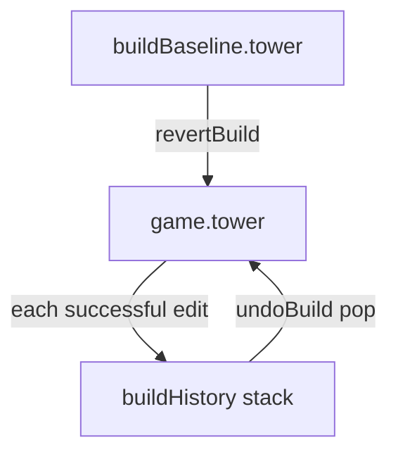

# Build-Phase Undo and Revert

## ContextL

Build-phase planning is already implemented (`[buildCost.ts](src/calculations/buildCost.ts)`, `[buildBaseline](src/model/types.ts)`, `[store.ts](src/store/store.ts)`). Place/remove/mod mutations defer gold until **Start Wave**. This extension adds step-level undo and full revert to the phase template.



## Behavior

| Action         | Effect                                                           | Enabled when                       |
| -------------- | ---------------------------------------------------------------- | ---------------------------------- |
| **Undo**       | Restore tower to state **before** the last successful build edit | `buildHistory.length > 0`          |
| **Revert all** | `game.tower = clone(buildBaseline.tower)`; clear history         | Tower layout differs from baseline |

**Disabled when no differential:**

- Undo: empty history (no recorded steps this phase)
- Revert: `towersEqual(game.tower, buildBaseline.tower)` — structural layout match, not just `netBuildCost === 0` (same-cost swaps still revertable)

Undo and revert do **not** touch `player.currency` (still committed only on Start Wave).

## 1. Tower equality helper

Add `towersEqual(a, b)` in `[src/model/tower.ts](src/model/tower.ts)` (or `[buildCost.ts](src/calculations/buildCost.ts)`):

- Compare `occupancy` keys and room ids
- Per room: `blueprintId`, `origin`, `size`, `hp`, `modifications` (id + level, order-independent)

Used by revert button enablement and tests.

## 2. Undo stack in Store

Private field on `[Store](src/store/store.ts)`:

```typescript
private buildHistory: Tower[] = [];
```

**Push** (before applying change, on success path only) in:

- `placeSelected`
- `sellRoomById` / `removeAt`
- `addModificationTo`
- `upgradeModificationOn`

```typescript
private recordBuildStep(): void {
  this.buildHistory.push(structuredClone(this.game.tower));
}
```

**Clear** history when:

- `beginRun` / `restart`
- `startWave` (leaving build phase)
- `revertBuild`
- Phase transition `attack → build` in `flush()` (new baseline from `[endWave](src/model/phases.ts)`; track `private lastPhase` on store)

**Expose** in `[Snapshot](src/store/store.ts)`:

```typescript
buildUndoDepth: number; // buildHistory.length
```

## 3. New intents

In `[src/store/intents.ts](src/store/intents.ts)`:

```typescript
| { type: 'undoBuild' }
| { type: 'revertBuild' }
```

`**undoBuild**` (build phase + baseline only):

- If `buildHistory.length === 0`, no-op
- `game.tower = buildHistory.pop()!`
- Close room modal if inspected room no longer exists

`**revertBuild**`:

- If `towersEqual(game.tower, baseline.tower)`, no-op
- `game.tower = structuredClone(baseline.tower)`
- `buildHistory = []`
- Close modal if needed

Quiet log messages: `"Undid last change."` / `"Reverted to wave start layout."`

## 4. Selectors

Extend `[src/store/selectors.ts](src/store/selectors.ts)`:

```typescript
export type BuildUndoState = {
  canUndo: boolean;
  canRevert: boolean;
};

export function selectBuildUndoState(snapshot: Snapshot): BuildUndoState;
```

- `canUndo` = `snapshot.buildUndoDepth > 0` and build phase
- `canRevert` = baseline exists and `!towersEqual(game.tower, baseline.tower)`

## 5. HUD buttons

In `[src/view/dom/hud.ts](src/view/dom/hud.ts)`, inside build-phase controls (above **Start Wave**):

```html
<div class="build-undo-row">
  <button data-action="undoBuild" disabled>Undo</button>
  <button data-action="revertBuild" disabled>Revert all</button>
</div>
```

Use existing `pointerdown` + `disabled` guard pattern. Optional CSS row in `[styles.css](src/view/styles.css)` (flex gap, match `.dev-row`).

## 6. Edge cases

| Case                                        | Handling                                                                     |
| ------------------------------------------- | ---------------------------------------------------------------------------- |
| Drag-to-place fires many `placeSelectedAt`  | Each success = one history entry; undo removes one cell at a time (expected) |
| Undo removes room open in modal             | Close modal (same as sell today)                                             |
| Revert with same cost, different layout     | Revert enabled via `towersEqual`                                             |
| Failed place (invalid/overlap/unaffordable) | No history push                                                              |
| In-place mod upgrade                        | Push tower clone **before** mutating `room.modifications`                    |
| Dev +50 gold                                | Unaffected; baseline currency already bumped                                 |

**Out of scope:** redo stack, Ctrl+Z keyboard shortcut (easy follow-up).

## 7. Tests

`**[src/model/tower.test.ts](src/model/tower.test.ts)**` or new `**buildCost.test.ts**`: `towersEqual` cases (empty, same, moved room, mod change).

`**[src/store/store.planning.test.ts](src/store/store.planning.test.ts)**`:

- Place twice → undo once → one room remains
- Place → revert all → empty tower matching baseline
- `canUndo` / `canRevert` false at phase start
- Revert disabled after revert; undo disabled when history empty

## Implementation order

1. `towersEqual` + unit tests
2. Store history push/clear + `undoBuild` / `revertBuild` intents
3. `selectBuildUndoState` + snapshot `buildUndoDepth`
4. HUD buttons + CSS
5. Store integration tests

No changes to the existing plan file; this is a follow-up on top of the completed planning work.
