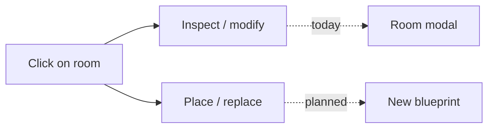

# Build mode vs Select mode

## The UX problem today

In [`src/view/input.ts`](src/view/input.ts), a short click always does:

- **Room under cursor** → `inspectRoomAt` (open modification modal)
- **Empty cell** → `placeSelectedAt` (if build phase)

A blueprint is **always selected** in the library ([`store.ts`](src/store/store.ts) defaults to the first unlocked blueprint). So the player is always in an implicit "I have a blueprint ready" state, but clicks on rooms **never place** — they only inspect.

That worked when placement was empty-cells-only. It breaks once you add **replace-on-occupied**:

| Player intent                       | Current behavior                    | With replace enabled (no mode split)      |
| ----------------------------------- | ----------------------------------- | ----------------------------------------- |
| "Add spikes to this room"           | Click room → modal                  | Click room → **replaces room** (disaster) |
| "Replace this buttress with a mine" | Must right-click remove, then place | Click with blueprint → replace (good)     |

Same click target, opposite outcomes — classic mode ambiguity.



## Recommended resolution: explicit modes

**Build mode** — blueprint selected in library:

- Click or drag → `placeSelectedAt` on empty **or** occupied cells (per footprint replace rules)
- **Never** opens the room inspector

**Select mode** — Hand tool, or no blueprint selected (`selectedBlueprintId: null`):

- Click room → `inspectRoomAt`
- Click empty → no-op (or close modal)

```mermaid
stateDiagram-v2
  [*] --> SelectMode: start or Hand tool
  SelectMode --> BuildMode: pick blueprint
  BuildMode --> SelectMode: Hand or Esc or toggle blueprint off

  state SelectMode {
    clickRoom: inspect
  }
  state BuildMode {
    clickRoom: place or replace
  }
```

This matches RTS / city-builder conventions: **tool in hand** vs **selection tool**.

## Implementation touchpoints

| File                                                 | Change                                                                                                                                        |
| ---------------------------------------------------- | --------------------------------------------------------------------------------------------------------------------------------------------- |
| [`src/view/input.ts`](src/view/input.ts)             | Branch on `selectedBlueprintId`: build → always place; select → room inspect only. Remove drag guard `if (roomAt(...)) return` in build mode. |
| [`src/view/dom/library.ts`](src/view/dom/library.ts) | Hand/Select button; toggle blueprint off on second click; Esc handler                                                                         |
| [`src/store/store.ts`](src/store/store.ts)           | Default `selectedBlueprintId: null`; `selectBlueprint` intent supports `null` for Hand                                                        |
| [`src/store/selectors.ts`](src/store/selectors.ts)   | Ghost preview on occupied cells when in build mode (replace valid/invalid)                                                                    |
| [`src/view/dom/modal.ts`](src/view/dom/modal.ts)     | Close modal after successful place/replace                                                                                                    |
| HUD hint                                             | `Placing: Gold Mine` vs `Select rooms to modify`                                                                                              |

## Supporting polish

- **Start in Select mode** (`selectedBlueprintId: null`) so first tower click inspects — friendlier for returning players.
- **Replace ghost** on rooms (red/green overlay) so build mode clicks feel intentional, not accidental.
- **Auto-close modal** when placing over the inspected room.
- Optional: opening inspect while a blueprint is selected **deselects** blueprint (safe return to canvas).

## Alternatives considered (not chosen)

- **Shift+click** to replace — hidden, easy to miss
- **Smart click** (context-dependent) — ambiguous, hard to learn
- **Inspect-only from library** (click room in list) — poor spatial UX
- **Right-click to replace** — conflicts with existing right-click remove

## Relation to room-types plan

This UX work ships alongside footprint replacement in [`room_types_vs_mods_62dcae45.plan.md`](/Users/katerberg/.cursor/plans/room_types_vs_mods_62dcae45.plan.md). No separate Convert panel — type changes are library placement only; inspector stays modifications-only.
