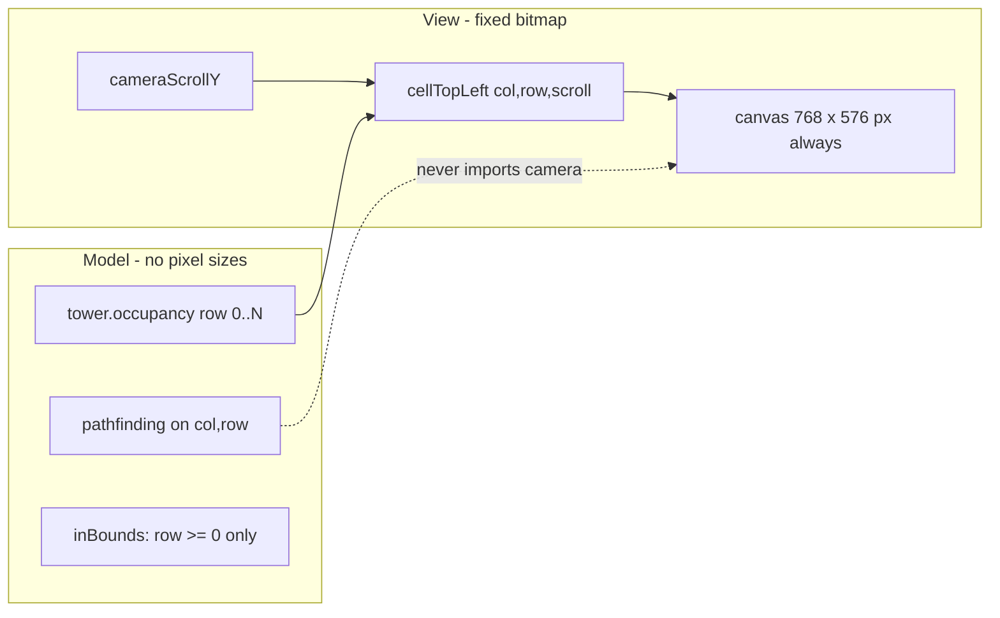
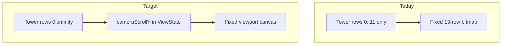

# Infinite Tower Height + Scrollable Viewport

## Logic vs visualization (your expectation is correct)

These are **two separate layers** and should stay that way:

| Layer             | What it knows                                                       | Height limit                                                |
| ----------------- | ------------------------------------------------------------------- | ----------------------------------------------------------- |
| **Model / logic** | Integer `(col, row)` cells, sparse `occupancy`, pathfinding, combat | **Unbounded** upward (`row >= 0`, width still `GRID_COLS`)  |
| **View**          | Fixed-size canvas bitmap + camera offset                            | **Fixed** ~12 rows visible (`VIEWPORT_HEIGHT`), never grows |

The model never allocates a grid array sized to tower height. It already uses a sparse map (`occupancy: Record<string, string>`) and iterates occupied keys — that scales fine to arbitrary row numbers.

The view only answers: _"given camera scroll Y, which rows intersect the viewport, and where do those cells land in pixels?"_ That is pure projection math in [`camera.ts`](src/view/canvas/camera.ts). A row-500 room is just `row: 500` in the model; the renderer draws it only if `500` falls in `visibleRowRange(scrollY)`.



**Browser max canvas dimensions are not a concern for this plan.** They only apply to the rejected alternative where `canvas.height = towerRows * CELL_SIZE` (the bitmap grows with the tower). We are not doing that.

What we **are** doing: canvas stays a fixed "window" (e.g. 576px tall); wheel changes `cameraScrollY`; the renderer draws only the slice of the world that window covers. Tower can be 10 rows or 10,000 rows — same canvas size.

### Where logic and view are wrongly coupled today (the actual bug)

The problem is not canvas size — it is **`GRID_ROWS` doing double duty** as both "viewport height" and "max tower row":

- `inBounds()` rejects `row >= GRID_ROWS` → **logic cap** (wrong)
- `inAirBounds()` uses `row <= GRID_ROWS` → **logic cap** (wrong)
- `cellTopLeft()` uses `(GRID_ROWS - row)` → **view math** (correct idea, wrong constant — should use scroll, not a world ceiling)

Fix: remove upper row from logic bounds; rename `GRID_ROWS` → `VIEWPORT_ROWS` for view-only sizing; camera handles the rest.

## Current constraints (what breaks today)

Tower height is capped in four places that must be decoupled:

| Location                                                                                 | Current limit                                    | Effect                                     |
| ---------------------------------------------------------------------------------------- | ------------------------------------------------ | ------------------------------------------ |
| [`src/calculations/grid.ts`](src/calculations/grid.ts) `inBounds()`                      | `row < GRID_ROWS` (12)                           | Blocks room placement above row 11         |
| [`src/calculations/exteriorGraph.ts`](src/calculations/exteriorGraph.ts) `inAirBounds()` | `row <= GRID_ROWS`                               | Enemies/wizard cannot exist above row 12   |
| [`src/view/canvas/camera.ts`](src/view/canvas/camera.ts)                                 | Y math anchored to `GRID_ROWS`                   | All pixel coords assume a 13-row world     |
| [`src/view/canvas/renderer.ts`](src/view/canvas/renderer.ts)                             | Fixed `BOARD_HEIGHT`, grid loop `0..GRID_ROWS+1` | Canvas bitmap is 13 rows tall, never grows |

[`#stage`](src/view/styles.css) already has `overflow: auto`, but `#board` is sized to the same fixed height and `max-height: 100%`, so there is nothing to scroll yet.



## Architecture: viewport camera (manual scroll)

**World coordinates** (keep existing logic convention: row 0 = ground, rows increase upward):

- `worldY(row) = row * CELL_SIZE` measured from the ground upward
- **Viewport** stays fixed size: `BOARD_WIDTH = GRID_COLS * CELL_SIZE`, `VIEWPORT_HEIGHT = GRID_ROWS * CELL_SIZE` (reuse 12 rows as viewport height — ~576px — or derive from `#stage` client height)
- **Camera** stores `cameraScrollY` (pixels scrolled upward from ground). Manual only: mouse wheel on `#stage` / canvas (no auto-follow)

Screen mapping (canvas Y-down):

```typescript
screenY(row) = VIEWPORT_HEIGHT - (row + 1) * CELL_SIZE + cameraScrollY;
screenToRow(py) = floor((VIEWPORT_HEIGHT - py + cameraScrollY) / CELL_SIZE) - 1; // + edge handling
```

New helpers in [`src/view/canvas/camera.ts`](src/view/canvas/camera.ts):

- `cellTopLeft(col, row, scrollY)` / `cellCenter(...)` — replace `GRID_ROWS`-anchored math
- `screenToCell(px, py, scrollY)` — for input hit-testing
- `visibleRowRange(scrollY, viewportHeight)` — `{ minRow, maxRow }` for culling
- `clampScrollY(scrollY, tower)` — floor at 0 (ground pinned at bottom when scroll=0); optional soft max = wizard row + padding

## Model changes (unbounded height)

1. **`inBounds(col, row)`** in [`src/calculations/grid.ts`](src/calculations/grid.ts):
   - Keep width: `0 <= col < GRID_COLS`
   - Height: `row >= 0` only (remove upper bound)

2. **`inAirBounds(col, row, tower)`** in [`src/calculations/exteriorGraph.ts`](src/calculations/exteriorGraph.ts):
   - Replace fixed `GRID_ROWS` with dynamic ceiling: `row <= getWizardPosition(tower).row` (or a shared `towerTopExteriorRow(tower)` helper in [`src/model/tower.ts`](src/model/tower.ts))
   - Enemies can climb as high as the wizard perch; no artificial cap below that

3. **Add `towerExtents(tower)`** in [`src/model/tower.ts`](src/model/tower.ts):
   - `{ minOccupiedRow: 0, maxOccupiedRow, wizardRow }` — single source for camera bounds, culling, and air bounds

4. **Constants** in [`src/config/constants.ts`](src/config/constants.ts):
   - Keep `GRID_COLS`
   - Rename/repurpose `GRID_ROWS` → `VIEWPORT_ROWS` (visible window height, not world limit)
   - Remove any implication that it caps tower height

## View / input changes

1. **ViewState** ([`src/store/intents.ts`](src/store/intents.ts)): add `cameraScrollY: number` (default `0`)

2. **Intents** + store ([`src/store/store.ts`](src/store/store.ts)):
   - `scrollCamera { deltaY }` — clamp via `clampScrollY`
   - Reset `cameraScrollY = 0` on `restart` / new run (optional: preserve scroll during build — default reset is simpler)

3. **Input** ([`src/view/input.ts`](src/view/input.ts)):
   - Pass `cameraScrollY` into `screenToCell`
   - Add `wheel` listener on `#stage` (or canvas) with `{ passive: false }` + `preventDefault` to scroll the camera, not the page

4. **Renderer** ([`src/view/canvas/renderer.ts`](src/view/canvas/renderer.ts)):
   - Canvas internal size = viewport (fixed), not world height
   - Draw only rows in `visibleRowRange` (+ 1 row padding)
   - Ground line at row 0 using camera transform
   - Grid lines for visible rows only
   - All draws go through camera-transformed `cellTopLeft` / `cellCenter`

5. **CSS** ([`src/view/styles.css`](src/view/styles.css)):
   - `#stage`: remove reliance on `overflow: auto` for world scrolling (camera handles it); keep as flex center or top-align
   - `#board`: fixed viewport dimensions (`width`/`height` match canvas), drop `max-height: 100%` shrink behavior that fights fixed viewport

## Future problems to watch (explicitly)

### Correctness / gameplay

- **Manual scroll during attack**: player must scroll up to see high combat; log still works but action may be off-screen. Acceptable per your choice; later UX add-ons: "scroll to wizard" button, minimap.
- **Building at the top**: user must scroll up to place; ghost/tooltip must use camera-aware `screenToCell` or they'll misalign.
- **Wizard/enemy air bounds**: must track live tower height, not a constant — if this drifts from `getWizardPosition`, pathfinding breaks silently.
- **Empty tower**: wizard defaults to row 0 ([`getWizardPosition`](src/model/tower.ts)); scroll clamp and air bounds must handle `maxOccupiedRow = -1` / no rooms.

### Performance (logic scales; view stays constant)

- **Pathfinding A\***: search space grows with tower height, but walkable surface is a thin shell (~O(height × cols)). Fine for hundreds of rows; if slow later, cache paths or limit repath frequency. This is logic cost, unrelated to canvas size.
- **Renderer culling**: only draw rows in `visibleRowRange` — cost is O(viewport rows), not O(tower height).
- **Occupancy map**: sparse `Record<string,string>` — scales well.

### Not a problem here: growing canvas / browser limits

The "browser max ~16,384px canvas" warning applies only if the canvas bitmap height equals tower height. **This plan explicitly avoids that** by keeping a fixed viewport. Mentioned only so we don't accidentally regress to a growing-canvas approach later.

### UX gaps (out of scope for v1, note for later)

- No scroll bounds indicator (can't tell how high the tower goes)
- Wheel-only scroll; no touch/drag pan
- No keyboard page-up/down
- Tall towers: hard to find the wizard perch without scrolling

## Tests to update

- [`src/model/tower.test.ts`](src/model/tower.test.ts): add case placing a room above old `GRID_ROWS - 1` limit; verify `canPlace` / stability still work
- [`src/calculations/exteriorGraph.test.ts`](src/calculations/exteriorGraph.test.ts): `inAirBounds` uses tower-relative ceiling
- New [`src/view/canvas/camera.test.ts`](src/view/canvas/camera.test.ts): `screenToCell` ↔ `cellCenter` round-trip at various `scrollY`; `visibleRowRange` culling

## Implementation order

1. Add `towerExtents`, relax `inBounds` / `inAirBounds`
2. Refactor `camera.ts` to scroll-based coords + culling helpers
3. Add `cameraScrollY` to ViewState, wheel intent, store clamp
4. Update renderer to viewport + culling
5. Fix input/tooltip coordinate mapping
6. CSS + constants cleanup (`VIEWPORT_ROWS`)
7. Tests
