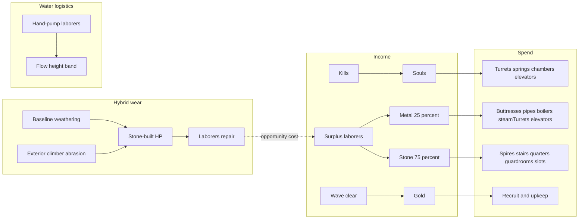

# Resource Economy — Plan Index

Use this file to **orient and sequence work**. Each slice should get its **own plan file** before implementation (same pattern as [`spell_system_index.plan.md`](./spell_system_index.plan.md)).

**Status:** Rounds 1–3 **concept locked** (wallet / wear / abstract harvest). Numbers/balance deferred. **Amendment:** site-based mine harvest + gem→gold — see [`docs/MINES.md`](../../docs/MINES.md) and [`mine_harvest_index.plan.md`](./mine_harvest_index.plan.md). Abstract 25/75 surplus harvest remains until that track ships.

---

## Locked decisions

### Economy shape

| Topic | Decision |
|-------|----------|
| Wallet | **metal · stone · souls · gold** (no water stockpile) |
| Souls income | **Kills only** |
| Souls spend | Magical track: turrets, mana springs, chambers; elevators also take souls; future magic tech. Not housing. |
| Gold income | **Wave clear** (height-scaled payroll) **+** future mine **gem→gold** ([`docs/MINES.md`](../../docs/MINES.md)); clear remains primary |
| Gold spend | **Recruit + upkeep (payroll) only** — not construction |
| Water | Logistics **height band** only (pipes placeable anywhere; flow needs hand-pump / pumps) |
| Gold Mine | **Remove** (harvest replaces it) |
| Laborer reserve | Hand-pump first; then repair; then harvest |
| Harvest split | **Shipped (engine):** surplus laborers → **mine stone patches** ([`docs/MINES.md`](../../docs/MINES.md)). Metal/gem veins later. |
| Repair | **Laborer time only** — no stone (or other) materials fee |
| Wear model | **Hybrid (W3):** baseline weathering + exterior climber abrasion (weather events can plug into the same channel later) |
| Wear targets v1 | **Stone-built only** (spire, stairs, quarters, guardroom, slot footprints) |
| Fantasy target | Height ~5–10 with full fancy barracks/slots ≈ **stone break-even** via repair pulling laborers off harvest; lean or purposeful climb to net stone |

### Cost matrix

| Blueprint / thing | Cost |
|-------------------|------|
| Spire Block | Stone |
| Stairs | Stone |
| Quarters / guardroom / slot | Stone |
| Buttress 2/3 | Metal |
| Pipes | Metal |
| Elevators | Metal + souls |
| Boiler / steam turret | Metal |
| Turret / mana spring / chamber | Souls |
| Mods (v1) | Same type(s) as parent, higher amount |
| Kill reward | Souls |
| Wave clear reward | Gold |
| Recruit / upkeep | Gold |
| Repair | Laborer time only |

---

## Stone wear — locked concept (numbers later)

### Player-facing loop

1. Build mundane mass with stone (upfront placement cost).
2. Mass takes **weathering** (keep towers lean) and **abrasion** from climbers (kill early / shorten traffic).
3. Repair is **laborer time only** — damaged mass pulls workers off harvest (opportunity-cost tax). No materials fee / stall.
4. Surplus laborers harvest at **25% metal / 75% stone**.

### Why no mortar

Stone already gates **placing** mass. Wear’s job is to punish **keeping** too much mass by stealing harvest labor. A second stone sink on repair doubles the accounting without a clearer fantasy — drop it unless playtests show opportunity cost alone is too soft.

### Exterior abrasion (not interior footsteps)

Climbers use the **exterior** graph ([`docs/INFRASTRUCTURE.md`](../../docs/INFRASTRUCTURE.md)). Abrasion applies when a climber steps along an exterior cell: small damage to **stone-built framing/room on that clung face**. Incentivizes early kills and shorter exposure. Future weather events can deal weathering-channel damage without new currency rules.

### HP scale

Intent: attrition logistics, not instant deletes. Use a playtest knob (`WEAR_HP_SCALE`); do **not** hard-lock literal 100× until repair rates, flier damage, and earthquake are retuned.

### v1 wear / repair scope

| Piece | Place with | Wear v1 | Repair |
|-------|------------|---------|--------|
| Spire / stairs / quarters / guardroom / slot | Stone | Yes | Laborer time |
| Buttress / pipes / boiler / steam turret | Metal | No | Laborer time |
| Turret / spring / chamber | Souls | No | Laborer time |

### Anti-grind

Harvest scales with laborer-seconds; wear scales with mass (+ traffic) and steals those seconds via repair. If dwell still stockpiles stone, raise weathering or cut harvest — do not add a materials fee first.

### Deferred (not blocking)

- Exact HP scale, wear per cell, harvest units/sec
- Metal/souls rooms joining wear channel
- Framing collapse beyond abrasion ticks
- Weather event content (channel reserved)
- Exact clear-gold curve / starting gold / upkeep amounts

---

## Slice order

| # | Slice | Suggested plan file | Notes |
|---|-------|---------------------|-------|
| 1 | Wallet + cost matrix + remove Gold Mine + kill→souls + clear→gold + gold payroll | `resource_wallet_costs.plan.md` | Foundation (four resources) |
| 2 | Harvest 25/75 + laborer job priorities (pump → repair → harvest) | `resource_laborer_harvest.plan.md` | Needs wallet |
| 3 | Hybrid wear (weathering + exterior abrasion) + HP scale knob | `resource_stone_wear.plan.md` | Needs harvest/repair jobs |
| 4 | Water height band + hand pump | `resource_water_height_band.plan.md` | |
| 5 | Pump buildings | `resource_water_pumps.plan.md` | |
| 6 | Balance / docs | `resource_economy_balance.plan.md` | |

**Workflow:** one detailed slice plan → one branch/PR → merge → next. Do not implement from this index alone.

---

## Codebase anchors

| Concern | Where |
|---------|--------|
| Wallet today | `Player.currency`, `BuildBaseline.currency` in [`src/model/types.ts`](../../src/model/types.ts) |
| Economy / build cost | [`economy.ts`](../../src/calculations/economy.ts), [`buildCost.ts`](../../src/calculations/buildCost.ts) |
| Blueprints | [`blueprints.ts`](../../src/model/blueprints.ts), [`infraBlueprints.ts`](../../src/model/infraBlueprints.ts) |
| Kill / clear rewards | [`game.ts`](../../src/model/game.ts), [`phases.ts`](../../src/model/phases.ts) |
| Gold Mine (delete) | [`goldMineRoom.ts`](../../src/model/roomBehaviors/goldMineRoom.ts) |
| Laborer repair | [`staff/index.ts`](../../src/model/staff/index.ts) |
| Exterior vs interior | [`docs/INFRASTRUCTURE.md`](../../docs/INFRASTRUCTURE.md) |
| Anti-grind | [`docs/HEIGHT_PROGRESSION.md`](../../docs/HEIGHT_PROGRESSION.md) |

---

## Still open (balance / later)

1. Starting gold and clear-gold curve (height-scaled; anti-dwell if needed)
2. Exact harvest rates / wear numbers / `WEAR_HP_SCALE`
3. Whether metal rooms later join the wear channel
