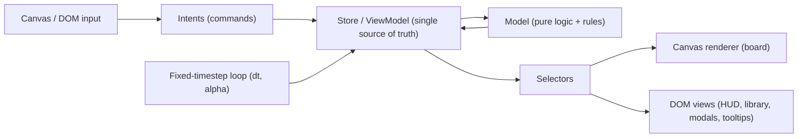

# Tower Builder Prototype Scaffold

Stack: TypeScript + Vite (vanilla), Canvas 2D for the board, DOM for chrome, Vitest for testing the pure model. No game framework. **Remove** the existing Godot stub at `wizard-tower-builder/` during scaffold; the web app lives at the repo root.

## Architecture (strict MVVM)

The hard rule that keeps logic testable and swappable: **`src/model/*` imports nothing from the DOM, canvas, or store.** Everything flows one direction.



- Model: pure, deterministic game state + rules. Seeded RNG so runs are reproducible.
- ViewModel (store): wraps model state, exposes `getState()`, `subscribe()`, and `dispatch(intent)`. Holds transient presentation state (selected blueprint, hovered cell, open modal). Translates intents into model mutations and notifies subscribers.
- View: `CanvasView` draws the tower/enemies from a snapshot each frame; DOM views subscribe to selectors and only update on relevant change.

## Proposed file structure

- `index.html`, `package.json`, `tsconfig.json`, `vite.config.ts`
- `src/main.ts` — bootstrap: build model -> store -> views -> start loop
- `src/config/constants.ts` — `CELL_SIZE`, `FIXED_DT = 1/60`, grid bounds, starting currency, `symbols`, `colors`, `MAX_OVERHANG_STEP = 1`, `MIN_STABILIZER_WIDTH = 2`
- `src/static/names.ts` — flavor name pools for enemies/items (7drl pattern)
- `src/model/` (PURE, no DOM/canvas):
  - `types.ts`, `rng.ts` (seeded)
  - `grid.ts` — coordinates + occupancy + cantilever/support checks
  - `tower.ts` — `canPlace()`, `placeRoom()`, `removeRoom()`, `getWizardPosition()`, tower silhouette, stabilizer detection
  - `exteriorGraph.ts` — build climb graph from tower occupancy; node validity per `MovementProfile`
  - `pathfinding.ts` — A\* on exterior graph (pure, no rot.js)
  - `blueprints.ts` — static room library (id, name, size w/h, cost, glyph)
  - `enemies.ts`, `progression.ts` — enemy defs + linear wave/level tables (interface allows future roguelike branching)
  - `waves.ts` — v1 linear escalating wave defs per `levelIndex` (consumes `progression.ts`)
  - `combat.ts` — attack-phase resolution, `computeDamage()`, `computeRoomStats()`, advanced by `step(dt)` (pure)
  - `messages.ts` — append/query game log messages
  - `economy.ts` — single currency, room costs
  - `phases.ts` — scene/phase finite state machine
  - `game.ts` — `GameState` + top-level `step(dt)` / reducers
- `src/store/store.ts` — reactive store + selectors; `src/store/intents.ts` — intent/command types
- `src/view/loop.ts` — fixed-timestep accumulator loop
- `src/view/canvas/renderer.ts`, `src/view/canvas/camera.ts` (world<->screen + click-to-cell picking)
- `src/view/dom/hud.ts`, `library.ts`, `modal.ts`, `tooltip.ts`, `messageLog.ts`
- `src/view/input.ts` — pointer -> intents
- Colocated `*.test.ts` for `model/` (grid/gravity, placement, combat, economy)

## Comparison with [7drl](https://github.com/katerberg/7drl)

Your prior roguelike is a monolithic `Game` class (rot.js Display + Scheduler) where model and view are intertwined. The tower-builder plan intentionally splits that apart, but several **game-model concepts** from 7drl are worth carrying forward even though the genre differs.

### What 7drl had that maps well to this game

| 7drl concept             | 7drl shape                                        | Tower-builder equivalent                             | Plan status                                    |
| ------------------------ | ------------------------------------------------- | ---------------------------------------------------- | ---------------------------------------------- |
| Static enemy templates   | `enemies.GOBLIN` with stats, xp, drop%, color     | `EnemyTemplate` in `enemies.ts`                      | Was partial — now added                        |
| Named instances          | enemy name from `goblins[]` pool                  | optional flavor name on spawned enemy                | Was missing — now added                        |
| Item/loot (`Cache`)      | type + name + `{ attack, defense, hp }` modifiers | `Item` in room contents                              | Was partial — concrete `Modifier` shape added  |
| Gear slots               | Weapon / Armor / Amulet typed slots               | room `capacity` + `allowedItemKinds` / slot types    | Was partial — now spelled out                  |
| Computed effective stats | `effectiveMaxHp`, `getDamage()` from base + gear  | `computeRoomStats()` from blueprint + contents       | Was missing — now added                        |
| Level-scaled loot        | `Cache(level)` scales modifiers by depth          | offers/items scale with `levelIndex`                 | Deferred — note for v2                         |
| XP + threshold table     | `xpLevels` map, `addXp()` → `levelUp()`           | in-run progression beyond currency                   | Deferred — currency-only v1                    |
| Combat resolution        | dex dodge, armor absorption                       | `computeDamage(attacker, defender)`                  | Was missing — stub in v1                       |
| Enemy pathfinding        | A\* via rot.js, topology per type                 | A\* on tower **exterior** graph toward static wizard | **Resolved for v1** — `under_overhang` default |
| Enemy drops              | `dropPercentage` → `Cache` on death               | currency + optional item drop                        | Partial — template has drop fields             |
| Consumable vs equipable  | Potion (instant) vs gear (modal equip)            | `ItemKind: module \| consumable`                     | Was missing — now added                        |
| Message log              | `sendMessage()` combat feedback                   | `messages: GameMessage[]` in model                   | Was missing — now added                        |
| Persistence              | `localStorage` full-state save each turn          | save/resume run                                      | Deferred — design state as JSON-serializable   |
| Static content pools     | `static/enemies.ts`, `static/animals.ts`          | `static/names.ts` flavor pools                       | Was missing — now added                        |
| Symbol/color registry    | `constants.symbols`, `constants.colors`           | centralized glyph + color map                        | Was partial — now in constants                 |
| Dev mode                 | `?devmode` cheats (skip level, force level-up)    | debug intents for fast iteration                     | Was missing — now added                        |

### What 7drl had that we intentionally drop

- **Turn scheduler** (`rot-js Scheduler`) — replaced by build-phase (event-driven) + attack-phase (real-time fixed timestep).
- **FOV / `seenSpaces`** — full board visibility; no fog of war needed.
- **Procedural dungeon map** (`Map.Digger`, `freeCells`) — replaced by player-placed tower on a fixed grid.
- **Player avatar on grid** — replaced by a **static wizard** auto-positioned atop the highest room; not player-controlled movement.
- **rot.js coupling** — no library; pure TS model + canvas renderer.

## Data modeling

Concrete starting shapes (refined after 7drl review):

```ts
type Cell = { col: number; row: number }; // row 0 = ground (bottom)

type Modifier = { attack?: number; defense?: number; hp?: number };

type Blueprint = {
  id: string;
  name: string;
  glyph: string;
  color: string;
  size: { w: number; h: number };
  cost: number;
  baseHp: number;
  // v2+: capacity, allowedItemKinds, slotTypes, upgrades
};

// v2+ — room contents deferred for v1
type ItemKind = "module" | "consumable";
type Item = {
  id: string;
  kind: ItemKind;
  name: string;
  glyph: string;
  modifiers: Modifier;
  effects: Effect[];
};

type Room = {
  id: string;
  blueprintId: string;
  origin: Cell;
  size: { w: number; h: number };
  contents: Item[]; // always [] in v1
  hp: number;
  level: number;
};

type RoomStats = { maxHp: number; attack: number; defense: number }; // computed, not stored

type Tower = { rooms: Room[]; occupancy: Record<string, string> }; // "col,row" -> roomId

// --- Wizard (static defender / enemy target) ---

type Wizard = {
  hp: number;
  maxHp: number;
  glyph: string;
  // position is DERIVED each frame from tower via getWizardPosition(tower):
  // top-center of the highest room (by row + height)
};

// --- Exterior pathfinding (enemies climb outside rooms, not through them) ---

type ExteriorFace = "left" | "right" | "top";

type ExteriorNode = { col: number; row: number; face: ExteriorFace };

type MovementKind =
  | "under_overhang" // v1 default: crawl up the outside face, including under protruding rooms
  | "attack_overhang" // v2+: climb side and strike overhanging rooms directly
  | "fly" // v2+: bypass exterior graph, arc over/around tower
  | "face_transfer"; // v2+: crawl across tower face to opposite side
// Note: `surface_climb` (blocked by overhangs) intentionally omitted — on T-shaped
// towers those enemies would have no valid path to the wizard and soft-lock.

type MovementProfile = {
  kind: MovementKind;
  canPassUnderOverhang: boolean; // true for under_overhang (v1 default)
  canAttackOverhang: boolean;
  canFly: boolean;
  canTransferFaces: boolean;
};

type EnemyTemplate = {
  id: string;
  type: string;
  glyph: string;
  color: string;
  stats: { strength: number; dexterity: number; maxHp: number };
  speed: number;
  currencyReward: number;
  movement: MovementProfile; // v1: all enemies use under_overhang defaults
  dropChance?: number;
  dropItemId?: string;
};

type Enemy = {
  id: string;
  templateId: string;
  name: string;
  pos: ExteriorNode; // current position on exterior graph
  path: ExteriorNode[]; // cached A* path toward wizard
  pathIndex: number;
  currentHp: number;
};

type GameMessage = {
  tick: number;
  text: string;
  kind: "info" | "combat" | "economy";
};

type Player = {
  currency: number; // single in-run currency (v1)
  unlockedBlueprints: string[];
  levelIndex: number;
  wizard: Wizard;
};

type ProgressionMode = "linear" | "branching"; // v1 uses "linear" only

type Phase = "build" | "attack";
type Scene = "menu" | "run" | "gameOver" | "victory";

type GameState = {
  scene: Scene;
  phase: Phase;
  progressionMode: ProgressionMode; // always "linear" in v1; field preserves future branching
  levelIndex: number;
  waveIndex: number;
  waveTimer: number;
  tick: number;
  player: Player;
  tower: Tower;
  enemies: Enemy[];
  messages: GameMessage[];
  rngState: number;
  devMode: boolean;
};
```

- **Wizard placement**: `getWizardPosition(tower)` returns the top-center exterior node of the highest room. Recomputed whenever the tower changes (build phase placement) or a room is destroyed. The wizard glyph renders above/atop that room in both phases.
- **Enemy targeting**: all enemies path toward `getWizardPosition(tower)` via A\* on the exterior graph. When an enemy reaches the wizard node, it attacks the wizard. Room-based defense (turrets, contents) deferred with room contents (v2+).
- **Exterior graph (v1)**: nodes on the left/right faces of the tower silhouette at each row, plus under-overhang transit nodes where rooms protrude, and a top node at the wizard. Edges connect vertically (climb), horizontally along ground/ledges, and **under overhangs** (horizontal edges beneath protruding room cells).
- **Movement extensibility**: `MovementProfile` on `EnemyTemplate` gates which edges/nodes are valid. v1 implements only `under_overhang`; other kinds are stubbed in types but not in pathfinding logic until v2+.
- **Computed stats**: `computeRoomStats(room, blueprint)` stubbed for v1 (baseHp only); full contents-based stats when room contents land (v2+).
- **Currency**: single in-run currency only (confirmed for v1).
- **Progression**: linear escalating levels/waves via `waves.ts` + `progression.ts`. Use a `ProgressionProvider` interface / `progressionMode` field so roguelike branching maps can plug in later without rewriting the FSM.
- **Room contents**: deferred — `Room.contents` stays `[]` in v1; types stubbed for future use.
- **Build constraints** (budget caps, max height, footprint): deferred for v1.
- **Time**: build phase is untimed (event-driven); attack phase advances via `step(FIXED_DT)`; build phase does not call `step` (just renders).
- **Phases/scenes**: FSM in `phases.ts` — `menu -> run`, then `run` loops `build <-> attack`, exiting to `gameOver`/`victory`.
- **Persistence**: defer full localStorage save for v1, but design `GameState` as JSON-serializable from day one (7drl's `storeState` pattern).

## Gravity / placement rules (v1 — cantilever with stabilizer gate)

`canPlace(tower, blueprint, origin)` returns `{ ok, reason }` and is the single authority.

### Always required

1. **In-bounds** and no overlap with existing rooms.
2. **Connectivity**: the resulting structure connects to the ground (no floating clusters).
3. **Per-cell support** — every cell of the new room must be supported by row below (`row 0` = ground counts as support):
   - **Direct stack**: column occupied on row below, or
   - **Cantilever (1-step)**: column extends at most `MAX_OVERHANG_STEP` (1) beyond the min/max column range of occupied cells on row below, and shares an edge with a supported cell on the same row of the new room (horizontal continuity within the room).

### Stabilizer gate (first cantilever tier)

Before any cell may use **cantilever support** (not directly stacked on a cell below), the tower must contain at least one **horizontal stabilizer room** somewhere in the connected structure:

- A stabilizer is any placed room with `size.w >= MIN_STABILIZER_WIDTH` (2+ cells wide).
- Narrow 1-wide stem rooms stacked vertically on the ground are always valid **before** a stabilizer exists.
- Once a stabilizer exists, cantilever rules apply at any height — enabling stepped tower shapes.

### Example: valid stepped tower (cols relative, row 0 = ground)

```
row 4:     x          ← 1-step cantilever left of stem
row 3:    x x         ← bridges stem + cantilever arm (each cell supported, max 1-step)
row 2:   xxx          ← 3-wide stabilizer (unlocks cantilever above)
row 1:     x          ← 1-wide stem
row 0:     x          ← 1-wide stem on ground
```

Build order matters: stem on ground → stem up → **stabilizer (`xxx`)** → cantilevered tiers above. Without the stabilizer, only pure vertical stacking (1-wide or aligned stacks) is allowed.

### Implementation notes

- `towerHasStabilizer(tower)` — true if any room has `size.w >= 2`.
- `cellSupportAt(col, row, occupancy)` — returns direct | cantilever | unsupported.
- `canPlace` rejects cantilever cells when `!towerHasStabilizer(tower)`.
- Reject any cell that would extend **more than 1** column beyond the occupied range on the row below.
- Build View ghost preview: green when valid, red with reason (`needs_stabilizer`, `overhang_too_far`, `no_support`, etc.).

Center-of-mass / structural collapse on room destruction deferred to v2+.

**Overhang side effect (feeds pathfinding):** cantilevered cells create exterior overhangs. v1 enemies use `under_overhang` and traverse under protrusions via dedicated under-overhang edges.

## Wizard + exterior pathfinding

```mermaid
flowchart TB
  subgraph buildPhase [Build Phase]
    placeRoom["placeRoom()"] --> tower["Tower occupancy"]
    tower --> wizardPos["getWizardPosition()"]
  end
  subgraph attackPhase [Attack Phase]
    spawn["Spawn enemies at base exterior nodes"]
    tower --> graph["buildExteriorGraph(tower, movementProfile)"]
    wizardPos --> goal["Wizard node at tower top"]
    graph --> astar["A* from spawn to goal"]
    astar --> climb["Enemies step along exterior path"]
    climb --> reach{"Reached wizard?"}
    reach -->|yes| damage["computeDamage(enemy, wizard)"]
    reach -->|no| continue["Continue climbing"]
  end
```

### v1 pathfinding rules (`under_overhang`)

1. Enemies spawn at ground-level exterior nodes adjacent to the tower footprint (left/right of bottom rooms).
2. Valid moves: up/down along a face, horizontal along ground, horizontal along a ledge at the same row, **horizontal under an overhang** (beneath protruding room cells).
3. Invalid: passing through room interiors; transferring to opposite face (deferred to `face_transfer`).
4. Path recomputed when tower shape changes mid-wave (room destroyed) — enemies recalculate A\*.

**T-shaped tower example:** a wide top room on a narrow stem creates left/right overhangs. `under_overhang` enemies crawl up the stem face, pass under the protruding top room via under-overhang edges, then continue upward to the wizard. A hypothetical `surface_climb` enemy would dead-end at the overhang with no route to the goal — hence it is not a movement type in this game.

### Future movement types (v2+, types stubbed now)

| Kind              | Behavior                                                                                 |
| ----------------- | ---------------------------------------------------------------------------------------- |
| `attack_overhang` | Can stop at overhang and attack the overhanging room directly (instead of passing under) |
| `fly`             | Uses air nodes; ignores exterior graph edges; arcs over tower                            |
| `face_transfer`   | Can move from left face to right face across the front of the tower                      |

Each kind is a distinct `MovementProfile` checked inside `buildExteriorGraph()` and `findPath()` — no changes to the core A\* algorithm, just different adjacency rules.

## Visuals for the two phases (canvas + DOM)

- Board (canvas): grid lines; each room drawn as a `w x h` block outline with its glyph centered; ground line at `row 0`. (Content glyphs inside rooms deferred until room contents land.)
- **Wizard**: static glyph rendered at the top-center of the highest room (both phases). In attack phase, show wizard HP bar near glyph.
- **Exterior paths (debug/devMode)**: optional overlay showing exterior graph nodes/edges and enemy A\* paths.
- Build phase: DOM library/palette panel of blueprints with costs, currency HUD, selected-blueprint highlight, ghost preview on hover, click-to-place / click-to-inspect (modal), "Start Wave" button.
- Attack phase: enemies rendered on exterior nodes (offset left/right of room faces, not centered in cells); thin HP rects on damaged rooms; wave/level + timer + wizard HP HUD. On wave clear: award currency, return to build.
- Interaction: canvas picking converts pointer -> cell -> intent (place/select); DOM handles modals, tooltips, menus. Both feed the same intent pipeline.

## Game loop (attack phase only)

Fixed-timestep accumulator per current best practice: cap frame time at `0.25s`, run `update(FIXED_DT)` to advance the model, render with interpolation `alpha`. During build phase the loop renders but skips `update`.

## Milestone order (vertical slice first, to test "is it fun")

1. Project scaffold + **remove Godot stub** + bootstrap + empty canvas + grid render.
2. Model: grid + cantilever `canPlace` (1-step overhang, stabilizer gate) + place/remove, with tests including stepped tower ASCII shape.
3. Build View: blueprint library, ghost preview, click-to-place, currency spend.
4. Attack View: exterior graph + A\* (`under_overhang`), spawn wave at base, enemies climb outside (including under overhangs) to wizard, wizard takes damage on contact, fixed-timestep loop, award currency, return to build.
5. Phase/scene FSM + lose condition (wizard HP to 0) + linear escalating level/wave progression.
6. Inspect modal + tooltips + a second blueprint type (room contents still empty).

## Resolved decisions (v1 scope)

| Topic             | Decision                                                                                                       |
| ----------------- | -------------------------------------------------------------------------------------------------------------- |
| Room contents     | Deferred — `contents: []` in v1; types stubbed for v2+                                                         |
| Currency          | Single in-run currency                                                                                         |
| Progression       | Linear escalating levels/waves; `ProgressionProvider` / `progressionMode` field for future roguelike branching |
| Build constraints | Deferred (budget, height, footprint caps)                                                                      |
| Godot stub        | Remove `wizard-tower-builder/` during scaffold                                                                 |

## Open questions / things to consider for the first pass

- ~~Enemy targeting~~ **Resolved:** static wizard at top of tower; enemies A\* up the exterior face (`under_overhang` in v1).
- ~~Lose condition~~ **Resolved for v1:** wizard HP reaches 0. Room destruction affecting wizard position (tower reshapes) is a v2 concern.
- Overhang pathfinding edge cases: T-shaped and stepped silhouettes need test cases in `exteriorGraph.test.ts` — verify under-overhang edges connect correctly and paths always reach the wizard when one exists.
- ~~Gravity depth~~ **Resolved for v1:** cantilever allowed, max 1-cell step per row; first cantilever requires a horizontal stabilizer room (`width >= 2`) somewhere in the tower first. Structural collapse on room destruction deferred to v2+.
- ~~Room contents~~ **Deferred for v1.**
- ~~Currency~~ **Resolved:** single in-run currency.
- ~~Progression~~ **Resolved for v1:** linear escalating; design for future branching via `progression.ts` abstraction.
- ~~Build constraints~~ **Deferred for v1.**
- ~~Godot folder~~ **Resolved:** remove during scaffold.
- Room defense / turrets: deferred with room contents (v2+).
- Attack pacing: auto-running real-time (with pause) vs discrete ticks. Recommend auto real-time via the fixed loop.
- Persistence/save and seeded-run sharing: deferred for v1?
