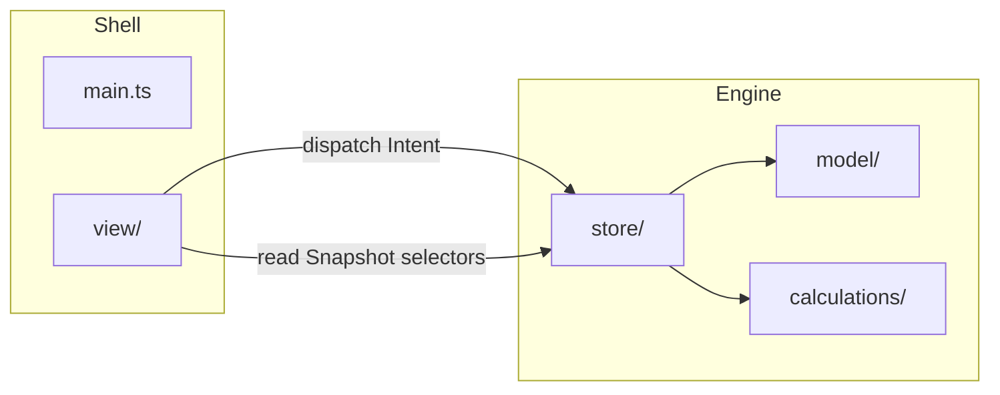
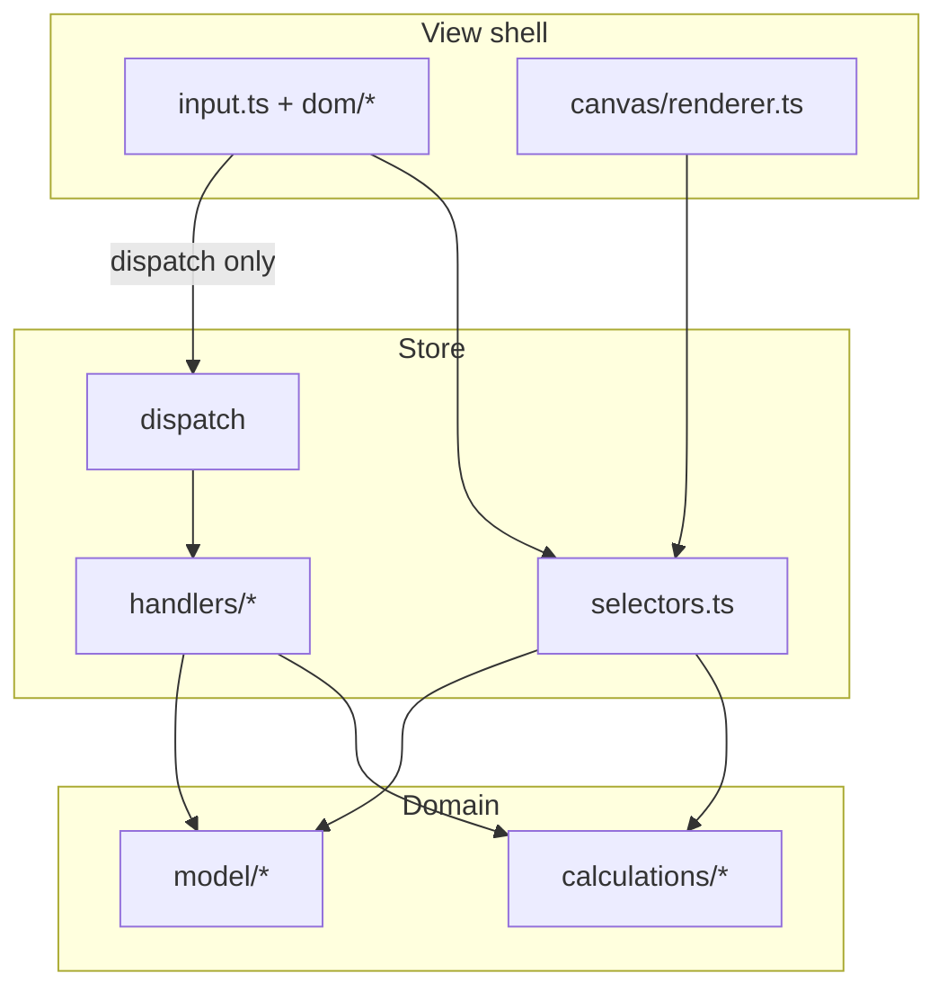
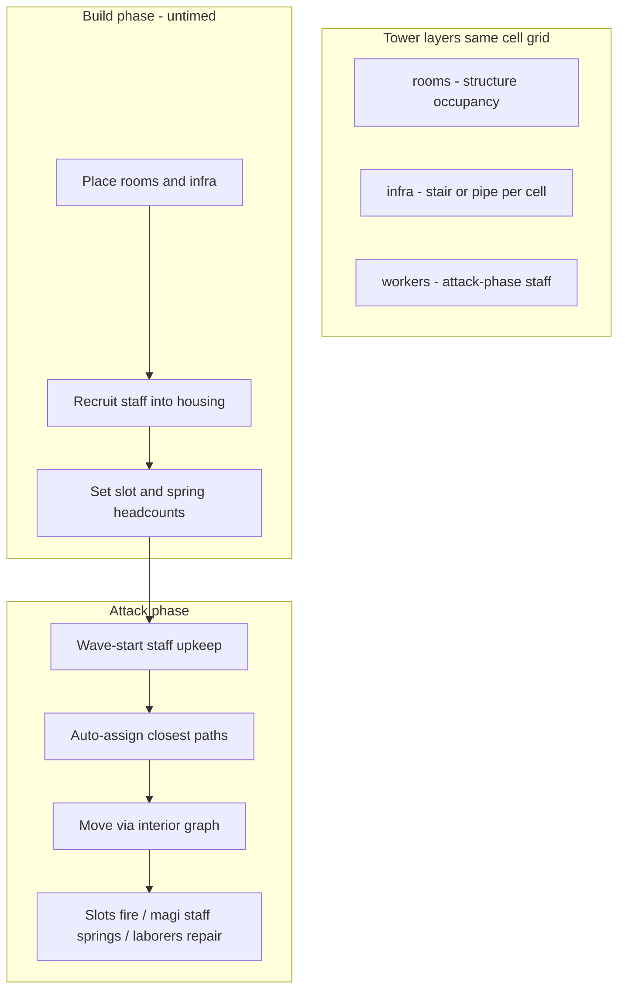

# Wizard Tower Builder

A small prototype for a gravity-constrained, room-stacking tower-defense roguelike. The goal is to model the game quickly and playtest whether the core loop is fun before adding visual polish.

Stack: **TypeScript**, **Vite**, **HTML5 Canvas** (board), **DOM** (UI chrome). No game framework.

## Gameplay

The run alternates between two phases:

1. **Build** — Spend gold to place rooms and infra on a grid. Rooms must obey gravity and support rules (see below). Paint **stairs** and **pipes**; recruit staff into housing; allocate slot/spring headcounts. Use the **Select** tool to inspect rooms and add modifications. Pick a **blueprint** to place or replace rooms. Right-click to remove. When the tower is stable, start the wave.
2. **Attack** — Enemies spawn at the base and pathfind up the **exterior** of the tower toward the wizard at the top. Staff path on the **interior** (stairs through passable rooms) to slots, mana springs, and repair jobs. Defenses: wizard **Wand Strike** (auto) plus a four-spell hotbar; **Turret** / **Steam Turret** rooms; soldier **Slots**; **spikes** (modification). **Gold Mines** pay out when a wave clears; mana regenerates from staffed springs. Survive the wave to earn gold and return to build. Lose if the wizard’s HP reaches zero.

Progression is linear and escalating for now (designed so branching roguelike paths can be added later).

### Spells

Mana powers the wizard’s hotbar (keys **1–4** to select, click to aim/cast during attack). Three elemental schools ship today — **fire**, **air**, and **earth** — swapped via the HUD school picker in **dev mode**. Wand Strike is always on and not part of any school kit. Water school, spell shop / grimoire unlocks, and Mana Well rooms remain deferred. School design notes live under `.cursor/plans/spell_school_*.plan.md`.

### Tower placement rules

Placement and post-removal validity share a single authority: `validateTower()`. Anything you can place must remain valid; anything that becomes invalid after a removal is flagged.

- **Ground** — Row 0 is the floor; rooms can be placed directly on it.
- **Spire blocks (1-wide)** — Must sit on the ground or directly on another room (spire or buttress). They cannot overhang empty space.
- **Buttress (2 or 3 wide)** — Wide platforms; outer cells may cantilever at most **one step** beyond support below. Only buttress may “float” over gaps.
- **Single tower** — All rooms must form **one connected mass** (4-way adjacency). New placements must touch the existing structure; you cannot start a second tower elsewhere on the grid.

Unstable towers (floating rooms or illegal cantilevers) are highlighted on the board and block starting a wave.

### Controls

| Action               | Input                                               |
| -------------------- | --------------------------------------------------- |
| Select / inspect     | **Select** tool (default), then click a room        |
| Place / replace      | Pick a blueprint, click or drag on grid             |
| Deselect blueprint   | **Esc**, Select tool, or click same blueprint again |
| Remove room          | Right-click grid (build phase)                      |
| Undo / revert layout | HUD buttons (build phase)                           |
| Start wave           | HUD button (when tower is stable)                   |
| Cast spell           | Hotkeys **1–4**, then click (attack phase)          |
| Scroll tower         | Mouse wheel on board                                |

Dev mode toggles are available via intents (`toggleDevMode`, `devAddCurrency`, `devSkipWave`, `devSetSpellSchool`) for local testing.

### Enemy movement

Enemies are surface crawlers, not fliers. Pathfinding (`src/calculations/`) builds a one-cell-thick "shell" of empty cells that hug the tower on a **flat** surface: the ground (row 0), the left and right walls of rooms, ledges on top of rooms, and the pockets beneath overhangs. A cell that only touches a room diagonally is clinging to a bare corner — it is _not_ a surface, so enemies never perch there. Cells out in open air are never walkable, so enemies must follow the structure up to the wizard.

Most steps are orthogonal: enemies climb flat walls and ledges one cell at a time. The single exception is a constrained **corner-wrap** — a diagonal step that wraps the outer corner of one solid block (exactly one of the two cells flanking the diagonal is a room, the other open). This lets a crawler move flat-to-flat _around_ a convex corner (e.g. from a wall onto the roof above it) without ever standing on the corner, while still forbidding free-air leaps (no room between the cells) and squeezing through a diagonal gap (a room on both sides). A\* uses a Manhattan metric with a uniform step cost.

A `MovementProfile` gates which surfaces a given enemy may use. The only profile implemented today is `under_overhang`, which may pass through the pockets beneath protruding rooms. Other kinds (`surface_climb`, `attack_overhang`, `fly`, `face_transfer`) are defined in the types and partially gated (for example, `surface_climb` cannot enter cells beneath an overhang) but are not yet assigned to any enemy.

## Getting started

Requires **Node.js LTS** (see `.nvmrc`; matches CI).

```bash
npm install
npm run dev      # dev server (Vite)
npm test         # Vitest (engine tests)
npm run typecheck
npm run lint     # ESLint + typecheck
npm run build    # production build to dist/
```

Open the URL Vite prints (usually `http://localhost:5173`).

Contributor recipes: [`docs/CONTRIBUTING.md`](docs/CONTRIBUTING.md).

## Architecture

### Agent quick-start

- All user actions flow **Input → Intent → Store handlers → Model**
- Rules live in `src/model/` and `src/calculations/`; test with Vitest
- **UI never mutates `GameState` directly** — only `store.dispatch(intent)`
- Build phase uses draft economy (`buildBaseline`); gold commits on `startWave`
- **Build vs Select mode:** blueprint selected = place/replace; Select tool = inspect/modify

### Engine vs shell

The **engine** (`model/`, `calculations/`, `store/`) is UI-agnostic. The **shell** (`view/`, `main.ts`) is disposable — swap canvas/DOM for another renderer without changing game rules.



**UI contract** (all a replacement shell needs):

| Export         | Role                                                       |
| -------------- | ---------------------------------------------------------- |
| `Store`        | `dispatch`, `getSnapshot`, `subscribe`, `advance`, `flush` |
| `Intent`       | Typed user/system actions                                  |
| `Snapshot`     | `game` + `view` + render interpolation                     |
| `selectors.ts` | Affordances and derived display state                      |

### Data flow



### Layer dependency rules

| Layer           | May import                                    | Must not import                     |
| --------------- | --------------------------------------------- | ----------------------------------- |
| `model/`        | `calculations/`, `config/`                    | `store/`, `view/`                   |
| `calculations/` | `config/`, `model/`                           | `store/`, `view/`                   |
| `store/`        | `model/`, `calculations/`, `config/`          | **`view/`**                         |
| `view/`         | `store/`, presentation metadata from `model/` | Rule predicates — use **selectors** |

ESLint enforces these boundaries (`npm run lint`).

### Agent guardrails

1. Never import `view/` from `store/`, `model/`, or `calculations/`.
2. Never mutate `game` outside `store/handlers/`.
3. Never call `canPlace` / `canApplyModification` from `view/` — use selectors.
4. New actions = new `Intent` + handler + tests; view only dispatches.
5. Run `npm run lint` before finishing.

### Bootstrap (`main.ts`)

1. `new Store()` — creates `GameState` + `ViewState`
2. `attachInput(canvas, stage, store)` — pointer/wheel → intents
3. DOM factories (`createHud`, `createLibrary`, …) — each returns a `render()` fn
4. `store.subscribe(renderDom)` — DOM updates on discrete state changes
5. `startLoop(store, draw)` — fixed-timestep attack sim + per-frame canvas draw

Mount points: `#board`, `#stage`, `#hud`, `#library`, `#message-log`, `#modal-root`, `#overlay-root`, `#tooltip-root` (see `index.html`).

### Domain glossary

| Term | Meaning |
|------|---------|
| **Tower** | Collection of rooms + occupancy grid |
| **Room** | Placed blueprint instance (origin, size, hp, modifications) |
| **Blueprint** | Room type definition (cost, size, base hp, description) — structure rooms and specialty rooms (Turret, Steam Turret, Gold Mine, housing, Slot, Boiler, Mana Spring, …) |
| **Modification** | Leveled add-on on a room (spikes, housing/slot/boiler expansions, …) |
| **Infra layer** | Per-cell overlay (`stair`, `pipe`, or `elevator`) on the same grid as rooms; one kind per cell |
| **Staff** | Mobile units (soldier / mage / laborer) recruited into housing; route to workplaces during attack |
| **Spell / school** | Hotbar ability spending mana; fire · air · earth kits today (water deferred) |
| **Layer** | Visibility/edit plane: `rooms`, `infra`, or `workers` (Maps-style toggles) |
| **Phase** | `build` or `attack` within a run |
| **Scene** | `menu`, `run`, `gameOver`, `victory` |
| **Intent** | Typed action dispatched to the store |
| **buildBaseline** | Tower + gold snapshot at phase start; planning edits diff against this |
| **Selectors** | Pure functions deriving UI affordances from `Snapshot` |

### Project layout

```
src/
  main.ts                 # Shell bootstrap
  config/constants.ts     # Grid size, tuning, colors
  model/                  # Game entities, phases, tower, waves, mods, pipes, staff, spells
  calculations/           # Grid, pathfinding, combat, economy, camera math
  store/
    store.ts              # Store class
    intents.ts            # Intent + ViewState types
    selectors.ts          # UI affordances (single read authority)
    handlers/             # Intent handlers (only writers of game state)
  view/
    canvas/               # Board renderer + pixel camera
    dom/                  # HUD, library, modal, tooltip, overlay
    input.ts              # Pointer → intents
    loop.ts               # Fixed-timestep game loop
docs/
  CONTRIBUTING.md         # Task recipes for contributors and agents
```

Key model entry points:

- `tower.ts` — `canPlace()`, `placeRoomReplacing()`, `validateTower()`, `isTowerStable()`
- `game.ts` — `GameState`, `step(dt)` during attack
- `phases.ts` — build/attack lifecycle, `buildBaseline`

### Infrastructure & logistics (core loop)

This game is primarily an **economy and infrastructure** puzzler: mundane structures and soldier routing matter more than auto-turrets. Turrets and the wizard supplement slot defenses.

**Full design:** [`docs/INFRASTRUCTURE.md`](docs/INFRASTRUCTURE.md)



| Concept | Behavior |
|---------|----------|
| **Layers** | `rooms`, `infra`, `workers` — toggled for display; tool selection drives editing |
| **Infra granularity** | Same `(col, row)` as rooms; **one** of stair *or* pipe *or* elevator per cell (forces wider towers) |
| **Housing** | Guardroom (soldiers 3→6), chamber (magi 1→2), quarters (laborers 6→12) |
| **Slot** | Player sets headcount; auto-assign closest; fires during attack (2→4 via mod) |
| **Mana spring** | Water + stationed magi; regen falls off with more magi (cap 5) |
| **Stairs** | Cheap ad-hoc infra; slow vertical; one staffer per cell en route |
| **Elevators** | Expensive vertical shafts; one car (cap 6); call-to-idle; no free climb |
| **Movement** | Staff spawn from housing each wave; **attack phase only** |
| **Pathfinding** | Interior/infra graph for staff; exterior graph for enemies (unchanged) |
| **Logistics** | Warn-only before wave; hover/click shows broken routes |

**Implementation status:** Housing + staff workplaces shipped (see [`docs/HOUSING.md`](docs/HOUSING.md)). Pipes/boilers/springs shipped ([`docs/PIPES.md`](docs/PIPES.md)). Fire · air · earth spell schools shipped. Elevators shipped. Mid-wave pipe breaks remain deferred.

## Deferred / not in v1

Still not done:

- Dynamic pipe/network breaks on room destruction
- Soldier death / targeting; pipe damage
- Advanced mage tech (research / combat casting) — housing basics shipped in [`docs/HOUSING.md`](docs/HOUSING.md)
- Multiple currencies beyond gold; roguelike map branching
- Alternative enemy movement modes (fly, attack overhangs, etc.) — all enemies use `under_overhang`
- Visual polish beyond ASCII-style glyphs on canvas
- Training rooms (troops of certain types required to populate other rooms)
- Research rooms; Mana Well / spell shop / grimoire unlocks
- Movement-controlling structures (e.g. moats, parapets, cornices)
- Structures such as crenels / murderholes beyond existing turrets
- Water school and further spell kits
- Additional turret / economy room types beyond Gold Mine, Boiler, Mana Spring, Turret, and Steam Turret
- Infra/mod repair and mid-wave building (laborers repair room HP only today)

## License

Copyright (C) 2026 Mark Katerberg

This project is licensed under the [GNU Affero General Public License v3.0 or later](LICENSE) (AGPL-3.0-or-later).

If you modify this software and run it as a network service, you must make the corresponding source available to users interacting with it over a network, as required by the Affero GPL.
