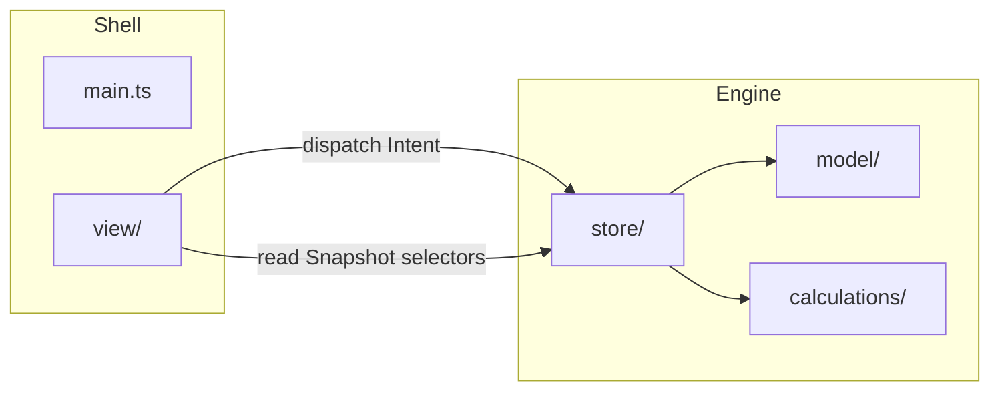
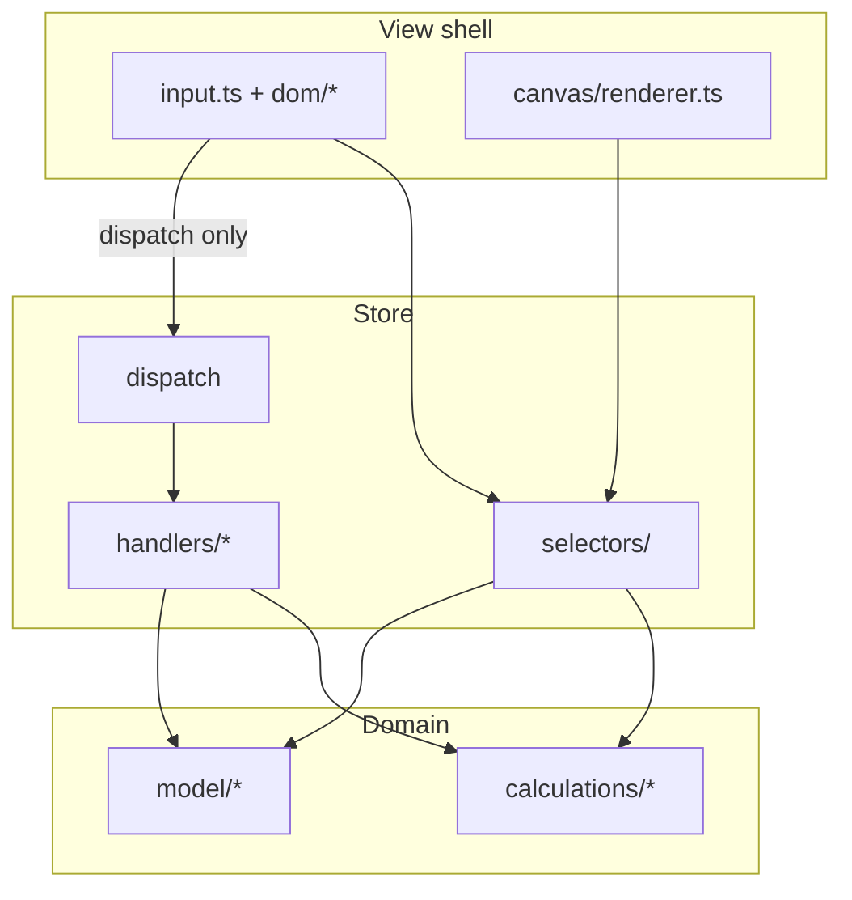
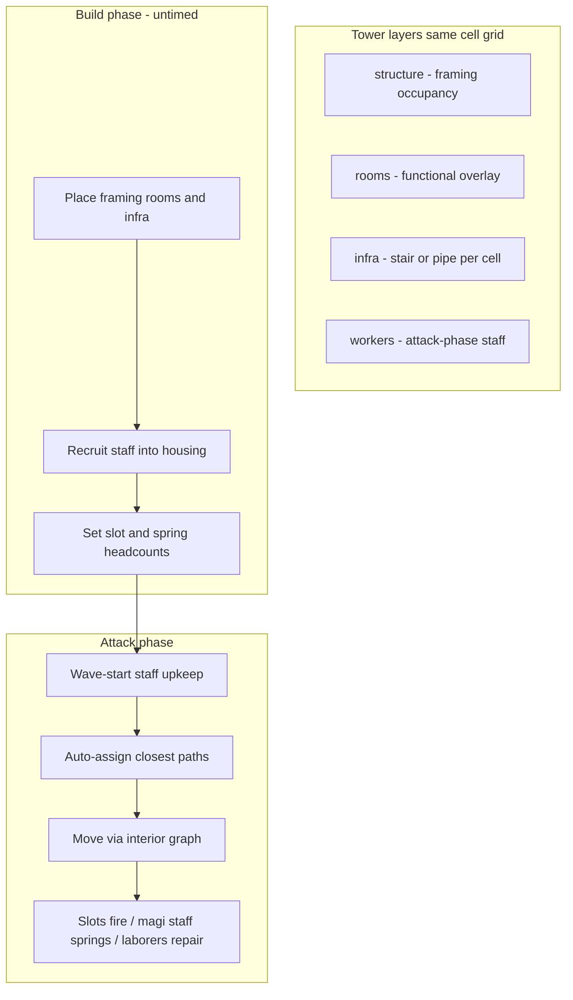

# Wizard Tower Builder

A small prototype for a gravity-constrained, room-stacking tower-defense roguelike. The goal is to model the game quickly and playtest whether the core loop is fun before adding visual polish.

Stack: **TypeScript**, **Vite**, **HTML5 Canvas** (board), **DOM** (UI chrome). No game framework.

## Gameplay

The run alternates between two phases (see [`docs/DAY_NIGHT.md`](docs/DAY_NIGHT.md)):

1. **Day (60s)** — Paint **construction orders** for framing, rooms, and infra. **Stone** and **metal** come from **storage rooms** (starter Supply Room on the ground floor); **souls** and **gold** from the wallet. Laborers haul materials and build over time. Recruit staff, allocate slots, paint stairs/pipes. Inspect with **Select**; right-click queues teardown. Timer auto-starts the wave at dusk (dev: **Skip to night**).
2. **Night (90s)** — Enemies path toward the **solar collector** on the crown. Wizard pathing + spells; staff deploy from housing; surplus laborers **hand-pump** and **harvest stone into storage**. Defenses include turrets, slots, spikes, and spells. Survive to earn **gold** (clear) and **souls** (kills); dawn shows the haul modal. Lose if the **solar collector's HP** reaches zero. See [`docs/PLAYER_MOVEMENT.md`](docs/PLAYER_MOVEMENT.md).

**Win** by clearing a wave while **completed** framing height is still **≥ 100**. Difficulty scales with height at dusk (plateaus + permanent enemy unlocks); see [`docs/HEIGHT_PROGRESSION.md`](docs/HEIGHT_PROGRESSION.md).

### Spells

Mana powers the wizard’s hotbar (keys **1–4** to select, click to aim/cast during attack). With no spell selected, **click the board to path** the wizard. Four elemental schools ship today — **fire**, **air**, **earth**, and **water** — swapped via the HUD school picker in **dev mode**. Wand Strike is always on and not part of any school kit. **Research / tech tree** gates the BUILD library ([`docs/RESEARCH.md`](docs/RESEARCH.md)): start a frontier project, assign magi to Research Rooms, unlock blueprints over waves. Dev mode includes **Unlock all**. Spell discovery (rare height offers) and Mana Well / spell shop remain deferred. School design notes live under `.cursor/plans/spell_school_*.plan.md`.

### Tower placement rules

The tower has three layers on each cell: **structure** (framing), **room** (optional overlay), and **infra** (stairs / pipes / elevators). Physics and stability use the structure layer only.

- **Ground** — Row 0 is the floor; framing can be placed directly on it.
- **Spire blocks (1-wide)** — Framing that must sit on the ground or directly on framing below until **Cantilever Framing** is researched.
- **Overhangs (researched)** — After **Cantilever Framing**, spire blocks may cantilever at most **one step** beyond support below.
- **Rooms** — Functional overlays (housing, generators, damagers). Every footprint cell needs framing; missing cells auto-place Spire Blocks when legal.
- **Infra** — Same rule: must sit on framing; empty cells auto-place a Spire Block when legal.
- **Single tower** — All framing must form **one connected mass** (4-way adjacency).

Unstable towers (floating framing or illegal cantilevers) are highlighted and block starting a wave.

Damage: enemy / flier hits damage **rooms** only. **Earthquake** damages **structure** along a support spine; destroyed framing also destroys any room on those cells. Selling a room leaves framing and infra; selling framing clears infra and any room on it.

### Controls

| Action               | Input                                               |
| -------------------- | --------------------------------------------------- |
| Select / inspect     | **Select** tool (default), then click a room        |
| Place / replace      | Pick a blueprint, click or drag on grid (day phase) |
| Deselect blueprint   | **Esc**, Select tool, or click same blueprint again |
| Remove room / framing | Right-click grid (day phase) — queues teardown |
| Undo / revert layout | HUD buttons (day phase)                           |
| Pause / sim speed    | Sidebar **Pause / 1× / 2× / 5×** (day and night)  |
| Cast spell           | Hotkeys **1–4**, then click (night phase)          |
| Move wizard          | Click board with no spell selected (night phase)   |
| Scroll tower         | Mouse wheel on board                                |

Dev mode toggles are available via intents (`toggleDevMode`, `devAddCurrency`, `devSkipWave`, `devSetSpellSchool`) for local testing.

### World danger

As the tower grows taller, the world gets more dangerous. Wave composition and clear rewards scale from framing height at Start Wave; enemy types unlock permanently when you first start a wave at their threshold. Fliers spawn near the current crown — see [`docs/HEIGHT_PROGRESSION.md`](docs/HEIGHT_PROGRESSION.md) and [`docs/FLYING.md`](docs/FLYING.md).

### Enemy movement

**Crawlers** path on a one-cell-thick exterior "shell" that hugs **framing and rooms**: the ground (row 0), left/right walls, ledges, and pockets beneath overhangs. Open air is never walkable for them. Most steps are orthogonal; a constrained **corner-wrap** diagonal wraps convex shell corners. The live crawler profile is `under_overhang`.

**Fliers** (`docs/FLYING.md`) treat **bare framing as open air** — only **rooms** are solid. They spawn from the sides near the tower crown (height at Start Wave), A\* through air around rooms toward the **solar collector**, and repath when the collector perch moves (e.g. height collapse). Size tiers are `small` / `medium` / `large` (larger = slower). Templates: Striker (melee), Kamikaze, Carrier (launches short-lived drones). Wall of Flame can be placed in open air to cut lanes; spikes miss fliers. Fliers never damage framing.

## Getting started

Requires **Node.js LTS** (see `.nvmrc`; matches CI).

```bash
npm install
npm run dev      # dev server (Vite)
npm test         # Vitest (engine tests)
npm run typecheck
npm run lint     # ESLint + typecheck
npm run build    # production build to dist/
```

Open the URL Vite prints (usually `http://localhost:5173`).

Contributor recipes: [`docs/CONTRIBUTING.md`](docs/CONTRIBUTING.md).

## Architecture

### Agent quick-start

- All user actions flow **Input → Intent → Store handlers → Model**
- Rules live in `src/model/` and `src/calculations/`; test with Vitest
- **UI never mutates `GameState` directly** — only `store.dispatch(intent)`
- Day phase uses **storage reservations** + wallet souls/gold; see [`docs/DAY_NIGHT.md`](docs/DAY_NIGHT.md)
- **Build vs Select mode:** blueprint selected = place/replace; Select tool = inspect/modify

### Engine vs shell

The **engine** (`model/`, `calculations/`, `store/`) is UI-agnostic. The **shell** (`view/`, `main.ts`) is disposable — swap canvas/DOM for another renderer without changing game rules.


```mermaid
flowchart LR
  subgraph engine [Engine]
    Model[model/]
    Calc[calculations/]
    Store[store/]
  end
  subgraph shell [Shell]
    Main[main.ts]
    View[view/]
  end
  View -->|dispatch Intent| Store
  View -->|read Snapshot selectors| Store
  Store --> Model
  Store --> Calc
```

**UI contract** (all a replacement shell needs):

| Export         | Role                                                       |
| -------------- | ---------------------------------------------------------- |
| `Store`        | `dispatch`, `getSnapshot`, `subscribe`, `advance`, `flush` |
| `Intent`       | Typed user/system actions                                  |
| `Snapshot`     | `game` + `view` + render interpolation                     |
| `store/selectors/` | Affordances and derived display state                   |

### Data flow


```mermaid
flowchart TB
  subgraph viewLayer [View shell]
    Input[input.ts + dom/*]
    Canvas[canvas/renderer.ts]
  end
  subgraph storeLayer [Store]
    Dispatch[dispatch]
    Handlers[handlers/*]
    Selectors[selectors/]
  end
  subgraph domain [Domain]
    Model[model/*]
    Calc[calculations/*]
  end
  Input -->|dispatch only| Dispatch
  Dispatch --> Handlers
  Handlers --> Model
  Handlers --> Calc
  Selectors --> Model
  Selectors --> Calc
  Canvas --> Selectors
  Input --> Selectors
```

### Layer dependency rules

| Layer           | May import                                    | Must not import                     |
| --------------- | --------------------------------------------- | ----------------------------------- |
| `model/`        | `calculations/`, `config/`                    | `store/`, `view/`                   |
| `calculations/` | `config/`, `model/`                           | `store/`, `view/`                   |
| `store/`        | `model/`, `calculations/`, `config/`          | **`view/`**                         |
| `view/`         | `store/`, presentation metadata from `model/` | Rule predicates — use **selectors** |

ESLint enforces these boundaries (`npm run lint`).

### Agent guardrails

1. Never import `view/` from `store/`, `model/`, or `calculations/`.
2. Never mutate `game` outside `store/handlers/`.
3. Never call `canPlace` / `canApplyModification` from `view/` — use selectors.
4. New actions = new `Intent` + handler + tests; view only dispatches.
5. Run `npm run lint` before finishing.

### Bootstrap (`main.ts`)

1. `new Store()` — creates `GameState` + `ViewState`
2. `attachInput(canvas, stage, store)` — pointer/wheel → intents
3. DOM factories (`createHud`, `createLibrary`, …) — each returns a `render()` fn
4. `store.subscribe(renderDom)` — DOM updates on discrete state changes
5. `startLoop(store, draw)` — fixed-timestep attack sim + per-frame canvas draw

Mount points: `#board`, `#stage`, `#hud`, `#library`, `#message-log`, `#modal-root`, `#overlay-root`, `#tooltip-root` (see `index.html`).

### Domain glossary

| Term | Meaning |
|------|---------|
| **Tower** | Structures (framing) + rooms + occupancy maps + infra |
| **Room** | Placed blueprint instance (origin, size, hp, modifications) |
| **Blueprint** | Room type definition (multi-resource cost, size, base hp, description) — framing, housing, Slot, Boiler, Mana Spring, Turret, Steam Turret, Forge, Flame Turret, Water Pump, … |
| **Modification** | Leveled add-on on a room (spikes today; housing/slot/boiler expansions, …) |
| **Shell fortification** | Exterior framing-cell attachment for crawler routing / shell hazards — see [`docs/FORTIFICATIONS.md`](docs/FORTIFICATIONS.md) |
| **Infra layer** | Per-cell overlay (`stair`, `pipe`, or `elevator`) on the same grid as rooms; one kind per cell |
| **Staff** | Mobile units (soldier / mage / laborer) recruited into housing; route to workplaces during attack |
| **Spell / school** | Hotbar ability spending mana; fire · air · earth · water kits |
| **Layer** | Visibility/edit plane: `rooms`, `infra`, or `workers` (Maps-style toggles) |
| **Phase** | `day` or `night` within a run |
| **Scene** | `menu`, `run`, `gameOver`, `victory` |
| **Intent** | Typed action dispatched to the store |
| **Storage** | Stone/metal stockpiles in supply/storage rooms; reservations on paint |
| **Selectors** | Pure functions deriving UI affordances from `Snapshot` |

### Where do I…?

| Task | Start here |
|------|------------|
| Plan a feature (batch questions → locked one-shot) | [`.agents/skills/one-shot-plan/SKILL.md`](.agents/skills/one-shot-plan/SKILL.md) |
| Day/night cycle / construction queue | [`docs/DAY_NIGHT.md`](docs/DAY_NIGHT.md) + [`src/model/construction/`](src/model/construction/) |
| Player movement / solar collector | [`docs/PLAYER_MOVEMENT.md`](docs/PLAYER_MOVEMENT.md) |
| Add a spell | [`src/model/spells/README.md`](src/model/spells/README.md) |
| Spell progression / leyline rooms | [`docs/SPELL_PROGRESSION.md`](docs/SPELL_PROGRESSION.md) |
| Add a room (passive or behavioral) | [`src/model/rooms/README.md`](src/model/rooms/README.md) + `blueprints.ts` |
| Add a modification | `src/model/modifications/` (one file + registry line) |
| Shell fortifications (design / roadmap) | [`docs/FORTIFICATIONS.md`](docs/FORTIFICATIONS.md) + [`.cursor/plans/fortifications_index.plan.md`](.cursor/plans/fortifications_index.plan.md) |
| Mine harvest / prospecting (design) | [`docs/MINES.md`](docs/MINES.md) + [`.cursor/plans/mine_harvest_index.plan.md`](.cursor/plans/mine_harvest_index.plan.md) |
| Current build costs by resource | [`docs/ECONOMY_COST_MATRIX.md`](docs/ECONOMY_COST_MATRIX.md) |
| Research / tech tree | [`docs/RESEARCH.md`](docs/RESEARCH.md) + [`.cursor/plans/research_index.plan.md`](.cursor/plans/research_index.plan.md) |
| Tweak balance numbers | [`src/config/README.md`](src/config/README.md) + [`docs/BALANCE.md`](docs/BALANCE.md) |
| Add / lock an expected build | [`docs/BALANCE.md`](docs/BALANCE.md) + [`src/test/balance/builds.ts`](src/test/balance/builds.ts) |
| Save / load tower fixtures from dev mode | [`docs/BALANCE.md`](docs/BALANCE.md) ("Save from dev mode" section) |
| Validate expected-build economy | **Deferred** — [`docs/BALANCE.md`](docs/BALANCE.md) (affordability envelopes on the harness) |
| Change the attack tick order | [`src/model/tick.ts`](src/model/tick.ts) |
| Change day/night phases | [`src/model/phases.ts`](src/model/phases.ts) + [`docs/DAY_NIGHT.md`](docs/DAY_NIGHT.md) |
| Change placement / stability | [`src/model/tower/`](src/model/tower/) |
| Add an intent / UI control | [`src/store/README.md`](src/store/README.md) |
| Change canvas drawing | [`src/view/README.md`](src/view/README.md) → `canvas/layers/` |
| Full task recipes | [`docs/CONTRIBUTING.md`](docs/CONTRIBUTING.md) |

### Project layout

```
src/
  main.ts              # Shell bootstrap
  config/              # Balance knobs by domain (+ README index)
  model/
    tick.ts            # Ordered attack-phase step list
    tower/             # Placement, stability, sell, query
    rooms/             # Behavioral room registry
    spells/            # Schools + registry (see spells/README)
    staff/             # Deploy, assign, combat, harvest
    pipes/ modifications/ …
  calculations/        # Pure helpers (grid, pathfinding, combat, …)
  store/
    handlers/          # Only writers of game state
    selectors/         # UI affordances by domain
  test/
    playability.ts     # Headless build + wave driver
    balance/           # Named expected-build fixtures + sim report
  view/
    canvas/layers/     # Board paint pipeline
    dom/ theme.ts …
docs/
  CONTRIBUTING.md      # Task recipes
  RESEARCH.md          # Tech tree + spell discovery (design)
  HEIGHT_PROGRESSION.md FORTIFICATIONS.md HOUSING.md …
```

### Infrastructure & logistics (core loop)

This game is primarily an **economy and infrastructure** puzzler: mundane structures and soldier routing matter more than auto-turrets. Turrets and the wizard supplement slot defenses.

**Full design:** [`docs/INFRASTRUCTURE.md`](docs/INFRASTRUCTURE.md)


```mermaid
flowchart TB
  subgraph layers [Tower layers same cell grid]
    S[structure - framing occupancy]
    R[rooms - functional overlay]
    I[infra - stair or pipe per cell]
    W[workers - attack-phase staff]
  end
  subgraph build [Build phase - untimed]
    P[Place framing rooms and infra]
    Rec[Recruit staff into housing]
    Alloc[Set slot and spring headcounts]
  end
  subgraph attack [Attack phase]
    Pay[Wave-start staff upkeep]
    Route[Auto-assign closest paths]
    Move[Move via interior graph]
    Work[Slots fire / magi staff springs / laborers repair]
  end
  P --> Rec --> Alloc
  Alloc --> Pay --> Route --> Move --> Work
```

| Concept | Behavior |
|---------|----------|
| **Layers** | `rooms`, `infra`, `workers` — toggled for display; tool selection drives editing |
| **Infra granularity** | Same `(col, row)` as rooms; **one** of stair *or* pipe *or* elevator per cell (forces wider towers) |
| **Housing** | Guardroom (soldiers 3→6), chamber (magi 1→2), quarters (laborers 6→12) |
| **Slot** | Player sets headcount; auto-assign closest; fires during attack (2→4 via mod) |
| **Mana spring** | Water + stationed magi; regen falls off with more magi (cap 5) |
| **Stairs** | Cheap ad-hoc infra; slow vertical; one staffer per cell en route |
| **Elevators** | Expensive vertical shafts; one car (cap 6); call-to-idle; no free climb |
| **Movement** | Staff spawn from housing each wave; **attack phase only** |
| **Pathfinding** | Interior/infra graph for staff; exterior graph for enemies (unchanged) |
| **Logistics** | Warn-only before wave; hover/click shows broken routes |

**Implementation status:** Housing + staff workplaces shipped (see [`docs/HOUSING.md`](docs/HOUSING.md)). Pipes/boilers/springs/forge fire shipped ([`docs/PIPES.md`](docs/PIPES.md)). Fire · air · earth · water spell schools shipped. Elevators shipped. Mid-wave pipe breaks remain deferred.

## License

Copyright (C) 2026 Mark Katerberg

This project is licensed under the [GNU Affero General Public License v3.0 or later](LICENSE) (AGPL-3.0-or-later).

If you modify this software and run it as a network service, you must make the corresponding source available to users interacting with it over a network, as required by the Affero GPL.
