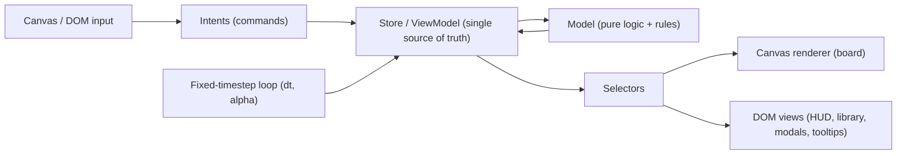

# Tower Builder Prototype Scaffold

Stack: TypeScript + Vite (vanilla), Canvas 2D for the board, DOM for chrome, Vitest for testing the pure model. No game framework. The existing Godot folder at `wizard-tower-builder/wizard-tower-builder/` is left untouched; the web app lives at the repo root.

## Architecture (strict MVVM)

The hard rule that keeps logic testable and swappable: **`src/model/*` imports nothing from the DOM, canvas, or store.** Everything flows one direction.



- Model: pure, deterministic game state + rules. Seeded RNG so runs are reproducible.
- ViewModel (store): wraps model state, exposes `getState()`, `subscribe()`, and `dispatch(intent)`. Holds transient presentation state (selected blueprint, hovered cell, open modal). Translates intents into model mutations and notifies subscribers.
- View: `CanvasView` draws the tower/enemies from a snapshot each frame; DOM views subscribe to selectors and only update on relevant change.

## Proposed file structure

- `index.html`, `package.json`, `tsconfig.json`, `vite.config.ts`
- `src/main.ts` — bootstrap: build model -> store -> views -> start loop
- `src/config/constants.ts` — `CELL_SIZE`, `FIXED_DT = 1/60`, grid bounds, starting currency
- `src/model/` (PURE, no DOM/canvas):
  - `types.ts`, `rng.ts` (seeded)
  - `grid.ts` — coordinates + occupancy + gravity/support checks
  - `tower.ts` — `canPlace()`, `placeRoom()`, `removeRoom()`
  - `blueprints.ts` — static room library (id, name, size w/h, cost, glyph, allowed contents, upgrades)
  - `enemies.ts`, `waves.ts` — enemy defs + per-level wave/reward defs
  - `combat.ts` — attack-phase resolution, advanced by `step(dt)` (pure)
  - `economy.ts` — costs, currency, upgrades/modifiers
  - `phases.ts` — scene/phase finite state machine
  - `game.ts` — `GameState` + top-level `step(dt)` / reducers
- `src/store/store.ts` — reactive store + selectors; `src/store/intents.ts` — intent/command types
- `src/view/loop.ts` — fixed-timestep accumulator loop
- `src/view/canvas/renderer.ts`, `src/view/canvas/camera.ts` (world<->screen + click-to-cell picking)
- `src/view/dom/hud.ts`, `library.ts`, `modal.ts`, `tooltip.ts`
- `src/view/input.ts` — pointer -> intents
- Colocated `*.test.ts` for `model/` (grid/gravity, placement, combat, economy)

## Data modeling

Concrete starting shapes (refined as we iterate):

```ts
type Cell = { col: number; row: number };          // row 0 = ground (bottom)

type Blueprint = {
  id: string; name: string; glyph: string;
  size: { w: number; h: number };                  // multi-cell rooms
  cost: number;
  capacity: number;                                 // how many Items fit
  allowedItems: string[];
};

type Item = { id: string; glyph: string; effects: Effect[] };

type Room = {                                        // a placed Blueprint instance
  id: string; blueprintId: string;
  origin: Cell; size: { w: number; h: number };
  contents: Item[]; modifiers: Modifier[];
  hp: number; maxHp: number; level: number;
};

type Tower = { rooms: Room[]; occupancy: Map<string, string> }; // "col,row" -> roomId

type Enemy = { id: string; pos: { x: number; y: number }; hp: number;
               speed: number; damage: number; targetRoomId: string | null };

type Player = { currency: number; integrity: number;          // lose condition
                unlockedBlueprints: string[]; levelIndex: number };

type Phase = 'build' | 'attack';
type Scene = 'menu' | 'run' | 'gameOver' | 'victory';

type GameState = {
  scene: Scene; phase: Phase; level: number; waveTimer: number;
  player: Player; tower: Tower; enemies: Enemy[]; rngState: number;
};
```

- Currency: single in-run currency for v1 (meta-progression deferred).
- Time: build phase is untimed (turn-based); attack phase advances via `step(FIXED_DT)`; build phase does not call `step` (just renders).
- Phases/scenes: FSM in `phases.ts` — `menu -> run`, then `run` loops `build <-> attack`, exiting to `gameOver`/`victory`.

## Gravity / placement rules (v1, intentionally simple)

`canPlace(tower, blueprint, origin)` returns `{ ok, reason }` and is the single authority. A placement is valid when:
1. In-bounds and no overlap with existing rooms.
2. Supported: every cell of the room's bottom edge rests on either ground (`row 0`) or an occupied cell directly below.
3. Connectivity: the resulting structure connects to the ground (no floating clusters).

Cantilever / center-of-mass / stability-from-width are deferred (see open questions). The build View shows a ghost preview: green when `canPlace` is ok, red otherwise.

## Visuals for the two phases (canvas + DOM)

- Board (canvas): grid lines; each room drawn as a `w x h` block outline with its glyph centered and content glyphs inside (so "Room with Item A" vs "Room with B + C" reads differently); ground line at `row 0`.
- Build phase: DOM library/palette panel of blueprints with costs, currency HUD, selected-blueprint highlight, ghost preview on hover, click-to-place / click-to-inspect (modal), "Start Wave" button.
- Attack phase: same tower render + enemies as moving glyphs/dots approaching the tower, thin HP rects on damaged rooms, wave/level + timer HUD. On wave clear: award currency, return to build.
- Interaction: canvas picking converts pointer -> cell -> intent (place/select); DOM handles modals, tooltips, menus. Both feed the same intent pipeline.

## Game loop (attack phase only)

Fixed-timestep accumulator per current best practice: cap frame time at `0.25s`, run `update(FIXED_DT)` to advance the model, render with interpolation `alpha`. During build phase the loop renders but skips `update`.

## Milestone order (vertical slice first, to test "is it fun")

1. Project scaffold + bootstrap + empty canvas + grid render.
2. Model: grid + gravity `canPlace` + place/remove, with tests.
3. Build View: blueprint library, ghost preview, click-to-place, currency spend.
4. Attack View: spawn one wave, enemies approach + damage rooms, fixed-timestep loop, award currency, return to build.
5. Phase/scene FSM + lose condition (`integrity` to 0) + next-level progression.
6. Inspect modal + tooltips + a second room type and an item to validate the room-contents concept.

## Open questions / things to consider for the first pass

- Enemy targeting: do enemies path along the ground and hit the base, climb/scale the tower, target a specific "core" room, or attack the nearest room? This strongly shapes the fun and the gravity design.
- Lose condition: a single core room that must survive, a global `integrity` value, or "tower collapses if a load-bearing room dies"? (Room destruction + gravity could trigger cascade collapse — powerful but more complex.)
- Gravity depth: pure stacking only for v1, or allow cantilever / width-based stability / center-of-mass now?
- Attack pacing: auto-running real-time (with pause) vs discrete ticks the player advances. Recommend auto real-time via the fixed loop.
- Room contents semantics: how do Item A vs Item B+C change a room's behavior (e.g., room = slot container, items = modules that add attacks/effects)?
- Currency: single currency vs split build-vs-meta currency for between-run roguelike progression.
- Level progression shape: linear escalating waves vs roguelike branching map with blueprint-draft rewards between levels.
- Build constraints: per-phase budget, max height/footprint, room count caps.
- Persistence/save and seeded-run sharing: deferred for v1?
- Godot folder: leave as-is (chosen "abandon for now"), or remove from the repo to reduce confusion?