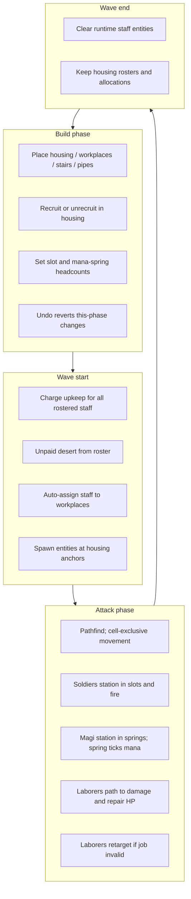

# Housing & staff types

**Status:** Shipped. Complements [`INFRASTRUCTURE.md`](INFRASTRUCTURE.md) (layers, stairs, slots) and [`PIPES.md`](PIPES.md) (mana springs).

Three housing room types, each tied to a distinct staff role. The economy reshapes the tower — especially forcing **mana springs** to be sited where **chambers** can staff them.

Numbers below match `src/config/constants.ts`. Treat gold amounts as flexible until playtested.

---

## Summary

| Housing | Blueprint | Staff | Base → expanded | Workplace |
|---------|-----------|-------|-----------------|-----------|
| **Guardroom** | `guardroomRoom` | Soldiers | **3 → 6** (`guardroomExpansion`) | Slots |
| **Chamber** | `chamberRoom` | Magi | **1 → 2** (`chamberExpansion`) | Mana springs |
| **Quarters** | `quartersRoom` | Laborers | **6 → 12** (`quartersExpansion`) | Damaged rooms (repair HP) |

Shared rules:

- Separate blueprints; `housing?: HousingKind` on `Blueprint`
- Roster keyed by room id in `housingRecruited`
- Place anywhere; all **1×1**, **passable**, available from run start
- Place housing → **1 free occupant** seeded; hard-capped at capacity
- **Unrecruit** floor is **1** (no recruit-cost refund). Upkeep desertion **can** leave roster at **0**
- Recruit in build phase; upkeep every wave for **every** rostered occupant (idle or assigned)
- Attack-only movement; spawn from housing at wave start; clear runtime entities at wave end (roster + allocations persist)
- Auto-assign to workplaces; path via stairs between levels
- Stair shafts: **one staffer per cell** en route (queues down the column; destination workplaces may stack)
- Selling housing prunes roster/allocations for that room
- Build-phase **undo / revert** covers room place/remove, recruit/unrecruit, mods, and workplace allocations

The player **wizard** stays a separate hero entity. Magi are helpers only.

---

## Data model

```ts
type HousingKind = 'guardroom' | 'chamber' | 'quarters';
type StaffKind = 'soldier' | 'mage' | 'laborer';

// Blueprint.housing?: HousingKind

// GameState
staff: StaffUnit[];
housingRecruited: Record<RoomId, number>;
slotAllocations: Record<RoomId, number>;
manaSpringAllocations: Record<RoomId, number>;
buildRecruitSpend: number;

interface StaffUnit {
  id: string;
  kind: StaffKind;
  homeHousingId: string;
  targetWorkplaceId: string | null; // slot | mana spring | damaged room
  pos: Cell;
  path: Cell[];
  pathIndex: number;
  moveCooldown: number;
  status: 'idle' | 'moving' | 'stationed' | 'working';
}
```

Implementation: `src/model/staff/` (capacity, deploy/step/repair, logistics). Store handlers: `src/store/handlers/staff.ts`. Layer id: `workers` (`TowerLayer`).

| Housing ID | Staff | Place cost / HP |
|------------|-------|-----------------|
| `guardroomRoom` | soldier | 9 / 20 |
| `chamberRoom` | mage | 12 / 18 |
| `quartersRoom` | laborer | 8 / 22 |

---

## Capacity & upgrades

| Housing | Start occupied | Unrecruit min | Base max | Expanded max | Mod id |
|---------|----------------|---------------|----------|--------------|--------|
| Guardroom | 1 | 1 | 3 | 6 | `guardroomExpansion` |
| Chamber | 1 | 1 | 1 | 2 | `chamberExpansion` |
| Quarters | 1 | 1 | 6 | 12 | `quartersExpansion` |

- Starting occupant counts toward capacity (guardroom places at `1/3`).
- Recruitment hard-stops at capacity in build phase.
- No cross-type housing mods; no placement zoning.
- Room size is **1×1** for v1.

---

## Economy

| Staff | Recruit cost | Wave-start upkeep |
|-------|--------------|-------------------|
| Soldier | 4 | 2 |
| Mage | 5 | 2 |
| Laborer | 3 | 1 |

- Room cost dominates; recruit is cheap relative to another copy of the room.
- Upkeep: charge at wave start for every rostered occupant; unpaid **desert** (any staff kind).
- Single draft bucket: `buildRecruitSpend`.

---

## Workplaces & behavior

### Soldiers → slots

- Player sets slot headcount (`slotAllocations`, 0..slot capacity; new slots seed **1**).
- Wave start: after upkeep, assign closest guardroom pools (Manhattan on anchors), spawn paths, station, fire volleys.
- Slot fire efficiency by stationed index (0-based): **`[1, 0.8, 0.7, 0.6]`**.

### Magi → mana springs

A mana spring regenerates only if it is **water-connected** *and* has **at least one mage physically stationed** in it during attack.

- Cap **5** magi per spring (`manaSpringAllocations`; new springs seed **1**).
- Regen: `MANA_SPRING_PER_SEC` (0.5) × sum of efficiencies by stationed index: **`[1, 0.8, 0.6, 0.4, 0.2]`**.
- Auto-assign from closest chamber (same closest-pool spirit as guardroom→slot).
- Magi do **not** cast, research, or buff the wizard in v1.
- Springs are **2×2** and **passable** so magi can station inside the footprint.

### Laborers → room repair

During **attack only**, laborers auto-assign to damaged rooms (`hp < maxHp`) and restore room HP.

- Spawn all rostered laborers at quarters (idle), then assign.
- Prefer rooms with **0** laborers; only stack when every damaged reachable room already has ≥1.
- Target heuristic: **lowest HP%**, then nearest.
- Repair rate: **2 HP/sec** for the first laborer; each next does **50% of the previous**.
- No per-room headcount UI; recruit only in quarters.
- Retarget when the job room is gone or fully repaired.
- No repair ticks in build phase.

Deferred: infra/mod repair, mid-wave building.

---

## Layers, UI, logistics

### Workers layer

`TowerLayer = 'rooms' | 'infra' | 'workers'`. Workers render all three staff kinds with distinct glyphs/colors (`STAFF_GLYPHS` / `colors.soldier|mage|laborer`).

### Inspector

Housing: capacity / recruited, recruit + unrecruit, expansion mod when applicable.

Workplaces:

- **Slot** — headcount steppers
- **Mana spring** — mage headcount steppers
- Damaged rooms — no assignment UI; logistics surfaces shortfalls

### Logistics report (warn-only)

`selectLogisticsReport` covers:

- Allocated soldiers > recruited in guardrooms
- Allocated magi > recruited in chambers
- Mana springs / slots wanting staff without path or without recruits
- Damaged rooms with no reachable laborers (or laborer shortage)

Shown as per-room build alerts and a HUD summary line. Does not block `startWave`.

---

## Lifecycle



Attack `game.step` order (staff-related): `stepStaff` → `tickLaborerRepairs` → room behaviors (slots) → `tickManaSprings` → boilers → steam turrets.

---

## Code map

| Area | Location |
|------|----------|
| Blueprints | `guardroomRoom`, `chamberRoom`, `quartersRoom` |
| Roster / deploy / move / repair | `src/model/staff/` |
| Mana gate | `src/model/manaSprings.ts` |
| Expansion mods | `guardroomExpansion`, `chamberExpansion`, `quartersExpansion` |
| Intents | `recruitStaff`, `unrecruitStaff`, `setSlotAllocation`, `setManaSpringAllocation` |
| Layer | `workers` |
| Logistics | `src/model/staff/connectivity.ts` → `selectLogisticsReport` |

---

## Resolved tuning defaults

| Topic | Value in code |
|-------|---------------|
| Magi per mana spring | Cap **5**; efficiency `[1, 0.8, 0.6, 0.4, 0.2]` |
| Laborer repair rate | **2** HP/sec (first laborer) |
| Repair target | Lowest HP%, then nearest |
| Laborer stacking | Prefer singleton rooms; then 50% falloff chain |
| Expanded caps | Guardroom 3→6, Chamber 1→2, Quarters 6→12 |
| Desertion | Any unpaid staff kind |
| Glyphs | Distinct per kind on the workers layer |

---

## Out of scope

- Advanced mage tech (unlocks, research, attack casting)
- Steam-powered workplace analogue
- Repair of pipes/stairs/mods; building during attack
- Cross-housing synergies and roguelike mutually exclusive housing rewards
- Card-heavy or tutorialized housing UX
- Replacing or merging the player wizard with magi
- Soldier death / individual targeting
