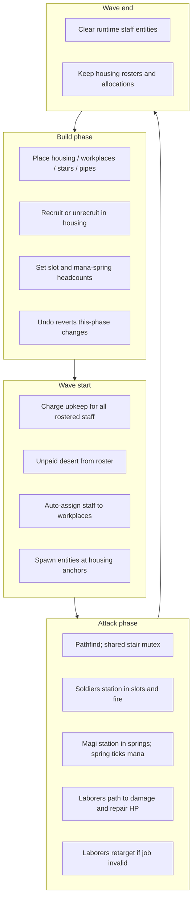

# Housing & staff types

Design plan for splitting soldier-only barracks into three housing room types, each tied to a distinct staff role. Extends the first logistics slice in [`INFRASTRUCTURE.md`](INFRASTRUCTURE.md).

**Goal:** Economy that reshapes the tower — especially forcing **mana springs** to be sited where **chambers** can staff them.

Numbers below are **working defaults**. Treat capacities and gold amounts as flexible until playtested.

---

## Summary

| Housing | Staff | Base capacity | Expanded (via mod) | Workplace (today) |
|---------|-------|---------------|--------------------|-------------------|
| **Guardroom** | Soldiers | **3** | TBD (higher) | Slots (existing) |
| **Chamber** | Magi | **1** | TBD (higher) | Mana springs |
| **Quarters** | Laborers | **6** | **12** | Damaged rooms (repair HP) |

Shared rules:

- Separate blueprints; shared **housing** tag/class in data
- Separate recruit rosters per type
- Place anywhere; all **1×1**, **passable**, available from run start
- Buy a housing room → **1 free occupant** already housed; **hard-capped** at capacity; never below **1**
- Recruit in build phase (cheap relative to room cost); upkeep every wave even when idle
- **Unrecruit** allowed down to 1 (saves upkeep; **no** recruit-cost refund)
- Attack-only movement; spawn from housing at wave start; clear entities at wave end (roster persists)
- Auto-assign to workplaces; path via stairs between levels
- Stair columns: **shared exclusivity** — one staff unit at a time (soldier *or* laborer *or* mage)
- Selling housing **force-unassigns** then removes; destroying housing → occupants **desert**
- Build-phase **undo** must cover room place/remove, recruit/unrecruit, mods, and workplace allocations made this phase

The player **wizard** stays a separate hero entity. Magi are helpers only — similar name, independent systems.

---

## Mentality shift from today

Today’s pipeline is barracks (cap 5→10) → slots → soldiers.

This plan:

1. **Rename / retarget** `barracksRoom` → **guardroom** (soldiers), smaller base capacity.
2. Add **chamber** (magi) and **quarters** (laborers).
3. Generalize “barracks → slot” into **housing → workplace** for all three staff types.
4. Add a single overlay layer (**workers**) that shows all three unit types during attack.
5. Fold connectivity warnings into one **logistics report**.

---

## Data model sketch

### Housing tag

Blueprints stay separate IDs. Mark them as housing so UI, capacity helpers, and pruning share one path:

```ts
type HousingKind = 'guardroom' | 'chamber' | 'quarters';
type StaffKind = 'soldier' | 'mage' | 'laborer';

// On Blueprint (or parallel registry):
// housing?: HousingKind
```

Suggested blueprint IDs (rename existing barracks):

| ID | Display name | Staff |
|----|--------------|-------|
| `guardroomRoom` | Guardroom | soldier |
| `chamberRoom` | Chamber | mage |
| `quartersRoom` | Quarters | laborer |

Migration: rename `barracksRoom` / `barracksExpansion` / `barracksRecruited` → guardroom equivalents (or keep old IDs as aliases briefly if saves exist — prototype has none, so rename cleanly).

### Roster state

Per housing room, track recruited count (same shape as today’s `barracksRecruited`):

```ts
// GameState
housingRecruited: Record<RoomId, number>; // keyed by housing room id
// or three maps — prefer one map + housing kind from room blueprint
buildRecruitSpend: number; // keep one draft-economy bucket unless gameplay needs split
```

Workplace allocations (player-set headcount where applicable):

```ts
slotAllocations: Record<RoomId, number>;          // existing (soldiers)
manaSpringAllocations: Record<RoomId, number>;    // magi headcount desired
// laborers: no player allocation — auto demand from damaged rooms
```

### Runtime entities

Generalize `Soldier` into a staff unit, or keep parallel types sharing movement:

```ts
interface StaffUnit {
  id: string;
  kind: StaffKind;
  homeHousingId: string;
  targetWorkplaceId: string | null; // slot | mana spring | damaged room
  pos: Cell;
  path: Cell[];
  pathIndex: number;
  moveCooldown: number;
  status: 'idle' | 'moving' | 'stationed' | 'working';
  stairColumn: number | null;
}
```

Interior graph / stair mutex must be **staff-wide**, not soldier-only.

---

## Capacity & upgrades

| Housing | Start occupied | Min | Base max | Expanded max |
|---------|----------------|-----|----------|--------------|
| Guardroom | 1 | 1 | 3 | TBD |
| Chamber | 1 | 1 | 1 | TBD |
| Quarters | 1 | 1 | 6 | 12 |

- Starting occupant **counts toward** capacity (guardroom places at `1/3`).
- Recruitment hard-stops at capacity in build phase.
- Every housing type gets an **expansion modification** (quarters: 6→12 known; others TBD).
- No cross-type housing mods; no placement zoning.

Room size stays **1×1** for v1 (likely to diverge later).

---

## Economy

### Intent (not balance-locked)

- **Room cost** dominates.
- **Recruit cost** is cheap.
- Filling a room from its free starter to full capacity should cost on the order of **~50–150% of another copy of that room**.
- Curves differ per staff type eventually; placeholders fine for first ship.

### Upkeep & desertion

- Charge upkeep at **wave start** for every living rostered occupant (idle or assigned).
- If gold cannot cover upkeep, **unpaid staff desert** (decrement roster; do not spawn).
- Applies to soldiers, magi, and laborers.
- Dead staff (future): no upkeep; refill by paying recruit cost again. Not required for this slice.

### Unrecruit

- Build-phase action: decrement roster toward minimum **1**.
- Saves future upkeep; **does not** refund recruit gold.
- Expected to be rare; still support it for economy control and undo symmetry.

### Draft spend

Keep a single `buildRecruitSpend` unless UI or refunds later need per-type breakdown.

---

## Workplaces & behavior (v1)

### Soldiers → slots (unchanged pipeline)

- Guardroom replaces barracks as home.
- Slot headcount allocation, closest-home auto-assign, attack-only pathing, slot volleys — keep as today.
- One guardroom may feed multiple slots; auto-assign remains fine at smaller caps.

### Magi → mana springs

**Today’s rule:** a mana spring regenerates mana only if it is **water-connected** *and* has **at least one mage physically stationed** in it during attack.

- Magi are interchangeable.
- Auto-assign from closest staffed chamber (same spirit as barracks→slot).
- Build-phase: player sets **desired mage headcount** per mana spring (0..spring staff capacity — see open questions).
- Magi do **not** cast, research, or buff the wizard in v1.
- Future: other “ley-like” nodes (e.g. steam-powered equivalent); advanced tech unlocks — out of scope.

This is the intentional tower-shape lever: springs are **2×2** and pipe-gated; chambers must be stair-reachable so springs stop being “drop anywhere and forget.”

### Laborers → room repair

**Today’s rule:** during **attack only**, laborers auto-assign to damaged rooms and path there to restore **room HP**.

- Automatic targeting (worst / nearest damaged — pick one simple heuristic and tune later).
- No player per-room headcount UI for repair in v1 (housing recruit only).
- Laborers are **defenseless**.
- If a target room is destroyed or repaired mid-job → **retarget**.
- Scope creep deferred: infra repair, mod installation during attack, building new structures mid-wave.

Build phase remains paused time — no repair ticks in build.

---

## Layers, UI, logistics

### Layer

Replace the soldier-only overlay with a **workers** layer that renders all three staff kinds (distinct glyphs/colors).

### Inspector

Same pattern as today’s barracks for every housing room:

- Capacity / recruited
- Recruit control (and unrecruit)
- Expansion mod when applicable

Workplace inspectors:

- **Slot** — existing headcount steppers
- **Mana spring** — mage headcount stepper (mirrors slot)
- Damaged rooms — no assignment UI; logistics report surfaces shortfalls

### Logistics report (warn-only)

One report covering:

- Allocated soldiers > recruited in guardrooms
- Mana springs wanting magi without path / without recruited magi
- Damaged rooms with no reachable laborers (or global laborer shortage)
- Missing stairs between housing and workplaces on different levels

Teach capacity softly via “not enough …” copy when the report fires. Don’t bury the player in upfront housing tutorials — UX is in flux.

---

## Lifecycle



---

## Success criterion

v1 is useful when:

1. Mana springs **do nothing** without stationed magi → players cluster chambers + stairs near springs.
2. Laborers visibly walk to damaged rooms and spend attack-phase time repairing, competing with soldiers for stair bandwidth.
3. Guardrooms feel like small dedicated army housing (more rooms, less density) without breaking the slot pipeline.

---

## Suggested implementation slices

Order is flexible; this is a dependency-friendly cut:

### Slice A — Housing foundation

- `housing` tag + rename barracks → guardroom
- Capacity constants + expansion mods for all three
- Shared roster helpers (seed 1, min 1, hard cap, prune on sell)
- Recruit / unrecruit intents; single spend bucket
- Workers layer shell (soldiers rendering under new name)

### Slice B — Magi + mana springs

- Chamber blueprint + mage roster
- Mana spring allocation + auto-assign + pathing
- Gate `tickManaSprings` on stationed mage presence
- Logistics warnings for unstaffed / unreachable springs

### Slice C — Laborers + repair

- Quarters blueprint + laborer roster
- Attack-phase auto-assign to damaged rooms
- Shared stair mutex across staff kinds
- Repair-over-time while stationed; retarget on invalid job
- Logistics warnings for labor shortage / unreachable damage

### Slice D — Polish / docs

- Unified logistics report UI
- README / INFRASTRUCTURE updates
- Tune placeholder gold numbers after a few playtests

Soldier death, advanced mage tech, steam-powered workplaces, and multi-size housing footprints stay deferred.

---

## Mapping onto existing code

| Area | Current | Plan |
|------|---------|------|
| Blueprints | `barracksRoom` | → `guardroomRoom`; add `chamberRoom`, `quartersRoom` |
| Roster | `barracksRecruited` | generalize to housing roster |
| Capacity | `barracksCapacity` / expansion mod | per-housing-kind helpers + mods |
| Deploy | `deploySoldiersForWave` | generalize or parallel deploy per staff kind |
| Movement | `stepSoldiers` + stair column lock | staff-wide movement + mutex |
| Mana | `tickManaSprings` water-only gate | add stationed-mage gate |
| Repair | none | new laborer work loop in attack `step` |
| Layers | rooms / infra / soldiers | rooms / infra / **workers** |
| Alerts | soldier + pipe reports | merge staff issues into logistics report |

---

## Open questions (non-blocking)

Resolve during implementation or first playtest; defaults suggested:

1. **Magi per mana spring** — default **1** stationed required for any regen; allocation cap **1** until we want redundant staffing.
2. **Multiple magi at one spring** — stack regen, or no benefit? Default: **no stack** (first mage enables full `MANA_SPRING_PER_SEC`).
3. **Laborer repair rate** — HP/sec while stationed; start slow enough that stairs + travel matter.
4. **Repair target heuristic** — prefer lowest HP%, then nearest to laborer/housing.
5. **How many laborers per damaged room** — default **1** assigned per room; extras idle or next target.
6. **Guardroom / chamber expanded caps** — pick after quarters 6→12 feels right.
7. **Answer wording “only unpaid workers desert”** — interpreted as unpaid **staff of any type**; confirm if soldiers/magi were meant to be exempt (not recommended).
8. **Glyphs / colors** — pick distinct from slots, springs, and each other for the workers layer.

---

## Explicitly out of scope for this plan

- Advanced mage tech (unlocks, research, attack casting)
- Steam-powered workplace analogue
- Repair of pipes/stairs/mods; building during attack
- Cross-housing synergies and roguelike mutually exclusive housing rewards
- Card-heavy or tutorialized housing UX
- Replacing or merging the player wizard with magi

