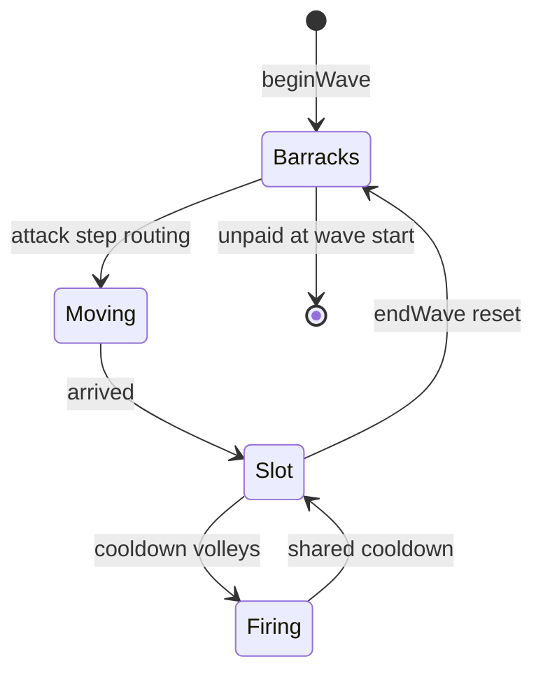

# Infrastructure & logistics

Developer-facing architecture for the tower’s **infrastructure layer** — the core of an economy/logistics tower-defense game. Mundane structures (barracks, slots, stairs, pipes) are the primary defense scaling path; auto-turrets and the wizard are supplementary.

**First vertical slice:** Barracks → Slot soldier staffing over staircase infrastructure.

**Housing expansion (planned):** three housing types (guardrooms, chambers, quarters) for soldiers, magi, and laborers — see [`HOUSING.md`](HOUSING.md).

---

## Design goals

1. **Infrastructure is first-class** — placement, routing, and upkeep matter as much as room HP.
2. **Layered editing** — structure, infra, and soldiers are separate overlays on the same grid (Maps-style visibility).
3. **Logistics during attack** — soldiers spawn in barracks at wave start and **move only during the attack phase**; build phase is untimed planning with no movement.
4. **Separate graphs** — soldiers pathfind on an interior/infra graph; enemies keep the existing exterior surface graph.
5. **Fat towers by choice** — one infra occupancy per cell (stair *or* pipe, not both) forces horizontal expansion.

---

## Layer model

Three tower layers (visibility toggles; dev-focused rendering uses dots/glyphs when a layer is on):

| Layer | Contents | Edit trigger |
|-------|----------|--------------|
| **rooms** | Structure blueprints (spire, buttress, barracks, slot, turret, …) | Select a structure blueprint |
| **infra** | Stairs, pipes, (future) elevators | Select an infra blueprint / tool |
| **soldiers** | Soldier positions during attack (build: allocation UI, not free movement) | Slot headcount panel; auto-routing at wave start |

### Cell granularity

All layers share the **same macro grid** (`GRID_COLS` × unbounded rows). There is **no sub-grid inside a cell**.

Per coordinate `(col, row)`:

```
structure[col,row]  → roomId | null     // existing tower.occupancy
infra[col,row]      → InfraKind | null  // at most ONE kind per cell
```

```ts
type InfraKind = 'stair' | 'pipe' | 'elevator'; // elevator: future

interface InfraCell {
  kind: InfraKind;
  // elevator only (future): shaftId, endpoints, platform state
}
```

**Mutual exclusion:** a cell may hold **one staircase *or* one pipe**, never both. Infra may be painted on cells that already have a structure room (“drawn over” the room on the infra layer). This intentionally prevents cramming pipe + stair through a single spire block.

**Future damage model:** pipes inside a room footprint are logically protected when external bombs hit the room shell first (not implemented yet).

---

## Room roles

### Barracks (`barracksRoom`)

| Property | Value |
|----------|--------|
| Capacity | **5** at base; **10** via modification upgrades |
| Soldier storage | Up to capacity **per barracks room** |
| Recruitment | Player pays gold to recruit soldiers (build phase) |
| Upkeep | **Charged at wave start** for all soldiers the player intends to field; **any soldier not paid leaves** |
| Passable | Yes (soldiers can walk through unless blueprint marked `passable: false`) |
| Behavior (attack) | Spawn point for all assigned soldiers at `beginWave` |

### Slot (`slotRoom`)

| Property | Value |
|----------|--------|
| Capacity | **2** at base; **4** via modification upgrades |
| Staffing | Player sets **headcount needed** per slot in build phase (0..capacity) |
| Assignment | At wave start, system **auto-assigns** soldiers from **closest** barracks along valid paths |
| Combat | Shared cooldown volley; **only soldiers physically present** in the slot contribute |
| Damage | Each present soldier adds `baseDamage × efficiency[index]` (see table below) |
| Range / targeting | Same as turret: range **3**, **nearest** exterior enemy |
| Passable | Occupied by stationed soldiers; routing targets slot interior |

**Slot fire efficiency (crowding):**

| Soldier index (1-based) | Contribution |
|---------------------------|--------------|
| 1 | 100% |
| 2 | 80% |
| 3 | 70% |
| 4 | 60% |

**Baseline tuning:** one soldier at 100% ≈ one turret shot (turret will eventually cost **mana**; mana economy is out of scope for this plan).

### Staircase (`staircase`)

| Property | Value |
|----------|--------|
| Cost | **Cheap utility** (low gold, low HP) |
| Placement | **Ad hoc** segments on the infra layer (not one continuous shaft requirement) |
| Movement | **Required for vertical travel** — soldiers cannot climb through structure without stairs |
| Throughput | **One soldier per stair column** at a time; parallel adjacent columns alleviate blocking |
| Speed | **0.2×** horizontal baseline (tunable in constants) |

### Pipe (`pipe`) — water & steam logistics

**Full design:** [`docs/PIPES.md`](docs/PIPES.md)

| Property | Value |
|----------|--------|
| Tool | Generic pipe; **fluid preview** (gray → blue water / orange steam) |
| Water seed | Any pipe on **row 0** |
| Steam seed | Pipes touching **steam turret** |
| Merge | **Reject** placement that would mix water + steam (Factorio-style) |
| Lock | Fluid type frozen at **wave start** |
| Crossover | **Not planned** — use parallel adjacent columns |

**Implementation status:** Typed pipes, boilers, steam turrets, mana springs, and magic-turret mana are shipped — see `docs/PIPES.md`.

### Elevator (`elevator`) — future

| Property | Value |
|----------|--------|
| Placement | Player picks **start and end** on a **strictly vertical line** (multi-floor shaft) |
| Speed | **2×** horizontal baseline (faster than stairs) |
| Throughput | **Platform** carries up to **10** soldiers; soldiers wait for pickup/drop-off at landings along the shaft |
| Exclusion | Same cell mutual exclusion as stairs/pipes |

### Passability flag

Blueprints may define `passable: boolean` (default **true**). No rooms are blocked by default today; use the flag when a room must deny soldier routing (e.g. future utility rooms).

---

## Soldiers

First-class entities in `GameState` (individual instances; optimize later if hundreds become hot).

```ts
interface Soldier {
  id: string;
  homeBarracksId: string;
  /** Graph position during attack-phase movement */
  pos: { col: number; row: number };
  /** Assigned slot, set at wave start from player headcount allocation */
  targetSlotId: string | null;
  /** Movement state machine: idle | routing | in_slot */
  status: 'idle' | 'moving' | 'stationed';
}
```

### Lifecycle (per wave)



| Rule | Behavior |
|------|----------|
| Wave start | All paid, allocated soldiers spawn in their **home barracks** |
| Build phase | Recruit, allocate per-slot headcounts, paint infra — **no movement** |
| Attack phase | Auto-route to assigned slots, move, fire when stationed |
| Wave end | **Reset** — soldiers return to barracks state for next build phase |
| Death | Deferred — assume respawn; no soldier targeting yet |
| Scale | Individual entities; hundreds of soldiers expected at high levels |

### Player workflow (build phase)

1. Place **barracks** and **slot** structure rooms.
2. Recruit soldiers (up to barracks capacity).
3. Set **headcount per slot** (sum ≤ recruited soldiers).
4. Paint **stairs** (infra layer) to connect barracks to slots vertically/horizontally.
5. Review connectivity warnings (warn-only — wave can still start).
6. Start wave → pay upkeep → unpaid soldiers removed → routing begins.

### Auto-assignment

When the wave starts, for each slot with headcount `N`:

1. Collect soldiers from all barracks (paid).
2. Assign **closest** soldiers (by infra/structure path distance) to each slot until `N` are committed.
3. Each soldier paths independently during attack phase (stair columns serialize to one soldier at a time).

---

## Pathfinding

**Two graphs, never mixed:**

| Graph | Used by | Walkability |
|-------|---------|-------------|
| **Exterior** (existing) | Enemies | Empty cells hugging room surfaces |
| **Interior/infra** (new) | Soldiers | Structure cells marked `passable` + infra stair/elevator cells |

### Movement speeds (relative)

| Mode | Speed |
|------|-------|
| Horizontal through passable rooms | **1.0×** |
| Stair vertical | **0.2×** |
| Elevator (future) | **2.0×** (platform wait time added separately) |

Vertical movement **without** a stair (or elevator) cell is **blocked**.

### Connectivity validation

- **Warn only** before `startWave` — does not block.
- **Hover/click** on slot or barracks shows disconnected routes in UI.
- Selector-driven: `selectSlotConnectivity(snapshot, slotId)` → `{ ok, brokenSegments, unassignedCount }`.

---

## Attack-phase simulation

Extend `game.step(dt)` ordering:

```
1. Spawn / tick enemies (existing)
2. Wizard auto-attack (existing)
3. Turret room behaviors (existing)
4. Soldier movement step (NEW)
5. Slot room volleys for stationed soldiers (NEW)
6. Modification effects (existing)
7. Reap enemies, wave clear (existing)
```

Slot behavior sketch:

```ts
// Per slot room on shared cooldown:
// damage = sum over stationed soldiers of baseDamage * efficiency[slotIndex]
// target = nearest enemy in range 3
```

---

## Economy hooks

| Event | Gold |
|-------|------|
| Recruit soldier | One-time cost in build phase |
| Barracks capacity mod | Modification cost (5 → 10) |
| Slot capacity mod | Modification cost (2 → 4) |
| Wave start upkeep | Per-soldier cost; failure removes soldier |
| Stair / pipe placement | Blueprint cost (stairs: cheap) |

**Mana** (turret operating cost) — deferred; document in economy when added.

---

## Modifications (reuse existing system)

| Room | Mod id (proposed) | Effect |
|------|-------------------|--------|
| Barracks | `barracksExpansion` | Capacity 5 → 10 |
| Slot | `slotExpansion` | Capacity 2 → 4 |

Register defs in `src/model/modifications/` like spikes/turret/gold mine. No new upgrade framework required.

---

## View / UX architecture

### Layer visibility

Maps-style toggles: `rooms` | `infra` | `soldiers`. When off, that layer is not drawn.

### Edit flow

**Tool-driven, not mode-locked:** picking a structure blueprint edits structure; picking stairs/pipes edits infra. Contextual prompts bridge layers (“Slot needs 2 — no path” → focus infra tool).

### Rendering (when layer on)

| Layer | Representation |
|-------|----------------|
| rooms | Existing room glyphs |
| infra | Stair/pipe glyphs on infra cells (overlay same coordinates) |
| soldiers | Dots/glyphs along route and in slots during attack |

### New UI surfaces (shell)

- Layer toggle bar
- Per-slot headcount steppers (build phase)
- Connectivity warning panel + hover highlights
- Barracks recruit / roster summary

All affordances via **selectors**; view dispatches intents only.

---

## Data model changes (summary)

```ts
// tower.ts / types.ts extensions
interface Tower {
  rooms: Room[];
  occupancy: Record<string, string>;
  infra: Record<string, InfraCell>; // NEW — key "col,row"
}

interface GameState {
  // ...existing
  soldiers: Soldier[];              // NEW
  soldierEffectTimers: Record<string, number>; // slot cooldowns if not reusing roomEffectTimers
}

interface Blueprint {
  // ...existing
  passable?: boolean; // default true
}
```

New blueprint ids (working names):

| id | Role |
|----|------|
| `barracksRoom` | Housing (exists) |
| `slotRoom` | Ranged soldier defense |
| `staircase` | Infra: vertical movement |
| `pipe` | Infra: logistics |
| `elevator` | Infra: fast vertical (future) |

---

## Implementation phases

### Phase 0 — Documentation ✅

This file + README architecture summary.

### Phase 1 — Core data model

- `Tower.infra`, `InfraKind`, `Soldier` types
- `Blueprint.passable`
- `createInitialState` / tower helpers for infra read-write
- Unit tests for infra mutual exclusion per cell

### Phase 2 — Barracks

- `barracksRoom` behavior: capacity tracking, recruit intent, roster selectors
- `barracksExpansion` modification (5 → 10)
- Build-phase UI: recruit buttons, capacity display

### Phase 3 — Slot room

- `slotRoom` blueprint + `slotExpansion` mod (2 → 4)
- Build-phase headcount allocation intents + selectors
- `slotRoomBehavior`: shared-cooldown volley with efficiency table
- Tests: partial staffing, damage aggregation

### Phase 4 — Stairs & interior pathfinding

- `staircase` infra blueprint (cheap, paint on infra layer)
- `calculations/interiorGraph.ts` — passable rooms + stair cells
- Soldier movement in `game.step` during attack only
- Auto-assignment at `beginWave`
- Tests: routing, one-soldier-per-column, parallel columns

### Phase 5 — Layer UX

- View layer toggles (`rooms` / `infra` / `soldiers`)
- Infra paint tool (reuse placement pipeline with layer-aware `canPlaceInfra`)
- Soldier dots during attack when layer visible

### Phase 6 — Connectivity feedback

- `selectConnectivityWarnings` selector
- Warn on start wave (non-blocking)
- Hover/click route highlight for slots/barracks

### Phase 7 — Pipes (logistics)

- `pipe` infra blueprint, orthogonal draw
- Logistics hooks stub (no gameplay effect yet)
- Renderer + mutual exclusion with stairs

### Phase 8 — Elevators (future)

- Vertical A→B placement, platform simulation (≤10 soldiers)
- Pickup/drop-off timing along shaft
- Speed 2× vs horizontal

### Phase 9 — Mana & turret operating cost (future)

- Separate currency; turret ≈ one soldier but consumes mana per shot

---

## Testing strategy

| Area | Tests |
|------|-------|
| Infra placement | One kind per cell; exclusion; paint over structure |
| Interior path | Horizontal through passable room; vertical only on stairs |
| Stair throughput | Second soldier waits behind first in same column |
| Auto-assign | Closest barracks preferred; unconnected slot flagged |
| Slot combat | 2 soldiers → 100% + 80%; only stationed count |
| Economy | Wave start upkeep; unpaid removed |
| Wave reset | Soldiers cleared to barracks; allocations kept in view or reset? **Reset allocations each wave** per spec |

---

## Open tuning (constants only)

All combat and speed numbers live in `src/config/constants.ts` or behavior defs — tweak without schema changes.

---

## Related docs

- [`README.md`](../README.md) — architecture overview
- [`CONTRIBUTING.md`](CONTRIBUTING.md) — task recipes (add blueprint, add modification, add room behavior)
