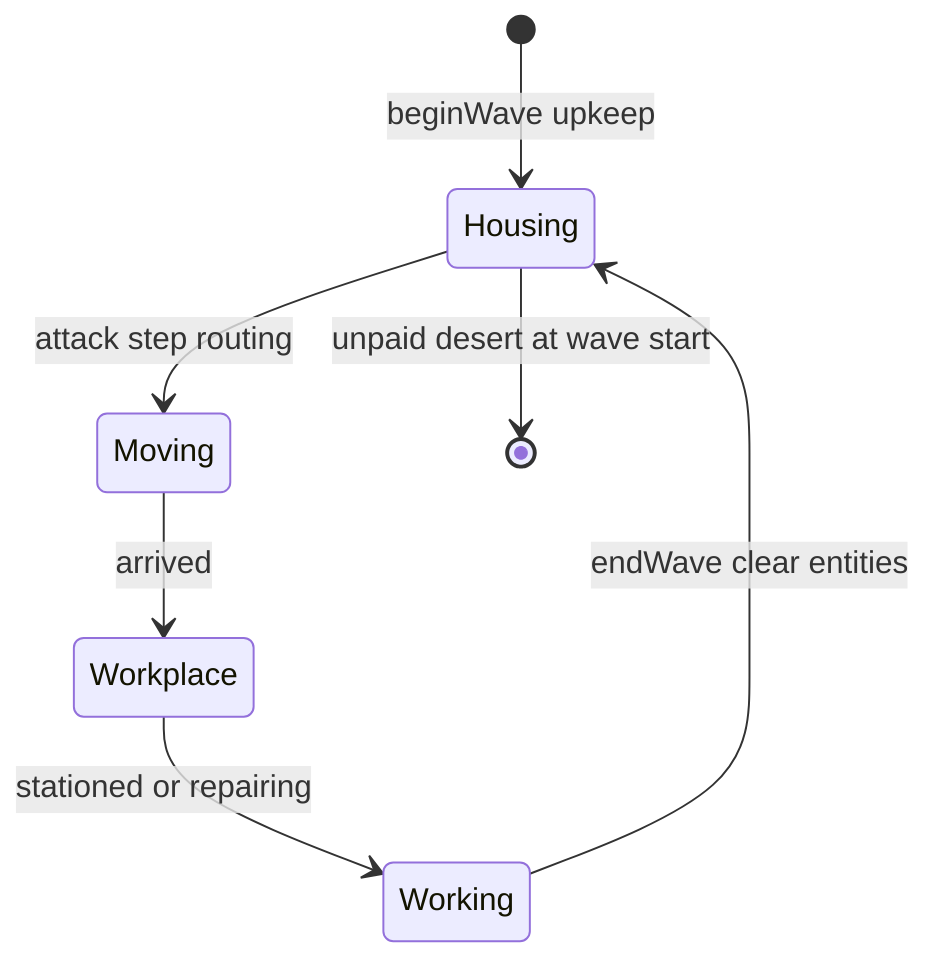

# Infrastructure & logistics

Developer-facing architecture for the tower’s **infrastructure layer** — the core of an economy/logistics tower-defense game. Mundane structures (housing, slots, stairs, pipes) are the primary defense scaling path; auto-turrets and the wizard are supplementary.

**Shipped:** Guardroom → slot soldier staffing over stairs; full housing for soldiers / magi / laborers — see [`HOUSING.md`](HOUSING.md). Pipes, boilers, mana springs, steam — see [`PIPES.md`](PIPES.md).

---

## Design goals

1. **Infrastructure is first-class** — placement, routing, and upkeep matter as much as room HP.
2. **Layered editing** — structure, infra, and workers are separate overlays on the same grid (Maps-style visibility).
3. **Logistics during attack** — staff spawn from housing at wave start and **move only during the attack phase**; build phase is untimed planning with no movement.
4. **Separate graphs** — staff pathfind on an interior/infra graph; enemies keep the existing exterior surface graph.
5. **Fat towers by choice** — one infra occupancy per cell (stair *or* pipe, not both) forces horizontal expansion.

---

## Layer model

Three tower layers (visibility toggles; workers use glyphs when the layer is on):

| Layer | Contents | Edit trigger |
|-------|----------|--------------|
| **rooms** | Structure blueprints (spire, buttress, housing, slot, turret, …) | Select a structure blueprint |
| **infra** | Stairs, pipes (elevators future) | Select an infra blueprint / tool |
| **workers** | Staff positions during attack (build: allocation UI, not free movement) | Slot/spring headcount; auto-routing at wave start |

`TowerLayer = 'rooms' | 'infra' | 'workers'`.

### Cell granularity

All layers share the **same macro grid** (`GRID_COLS` × unbounded rows). There is **no sub-grid inside a cell**.

Per coordinate `(col, row)`:

```
structure[col,row]  → roomId | null     // tower.occupancy
infra[col,row]      → InfraKind | null  // at most ONE kind per cell
```

```ts
type InfraKind = 'stair' | 'pipe'; // elevator: future

interface InfraCell {
  kind: InfraKind;
  fluid?: Fluid; // pipe only; preview in build, locked at wave start
}
```

**Mutual exclusion:** a cell may hold **one staircase *or* one pipe**, never both. Infra may be painted on cells that already have a structure room (“drawn over” the room on the infra layer). This intentionally prevents cramming pipe + stair through a single spire block.

**Future damage model:** pipes inside a room footprint are logically protected when external bombs hit the room shell first (not implemented yet).

---

## Room roles

### Housing

Three housing types — full tables, economy, and workplaces in [`HOUSING.md`](HOUSING.md).

| Blueprint | Staff | Base → expanded | Workplace |
|-----------|-------|-----------------|-----------|
| `guardroomRoom` | Soldiers | 3 → 6 (`guardroomExpansion`) | Slots |
| `chamberRoom` | Magi | 1 → 2 (`chamberExpansion`) | Mana springs |
| `quartersRoom` | Laborers | 6 → 12 (`quartersExpansion`) | Damaged rooms |

| Property | Value |
|----------|--------|
| Size / passable | **1×1**, passable |
| Place seed | **1** recruited occupant |
| Recruitment | Build phase; unrecruit down to **1** |
| Upkeep | Wave start for **all** rostered; unpaid desert (roster may hit **0**) |
| Attack | Spawn / path / work; runtime entities cleared at wave end |

### Slot (`slotRoom`)

| Property | Value |
|----------|--------|
| Capacity | **2** at base; **4** via `slotExpansion` |
| Staffing | Player sets headcount (`slotAllocations`, 0..capacity); new slots seed **1** |
| Assignment | Wave start: closest guardroom pools (Manhattan on anchors), then path |
| Combat | Shared cooldown volley; **only stationed** soldiers contribute |
| Damage | `baseDamage × efficiency[index]` (0-based index) |
| Range / targeting | Range **3**, **nearest** exterior enemy |
| Passable | **true**; routing targets slot interior |

**Slot fire efficiency:**

| Soldier index (0-based) | Contribution |
|-------------------------|--------------|
| 0 | 100% |
| 1 | 80% |
| 2 | 70% |
| 3 | 60% |

Baseline: one soldier at 100% ≈ one magic turret shot (turrets cost **1 mana** per shot — see [`PIPES.md`](PIPES.md)).

### Staircase (`stair` infra)

| Property | Value |
|----------|--------|
| Cost | Cheap utility (infra blueprint) |
| Placement | Ad hoc segments on the infra layer |
| Movement | Stair on floor **N** connects **N ↔ N+1** (leads up into the room above; landing need not have a stair) |
| Throughput | **One staffer per cell** en route (shafts can hold a queue down the column) |
| Speed | **0.2×** horizontal (`STAFF_STAIR_SPEED` / `STAFF_HORIZONTAL_SPEED` = 0.4 / 2) |

### Pipe (`pipe`) — water & steam logistics

**Full design:** [`PIPES.md`](PIPES.md)

| Property | Value |
|----------|--------|
| Tool | Generic pipe; **fluid preview** (gray → blue water / orange steam) |
| Water seed | Any pipe on **row 0** |
| Steam seed | Pipes touching **steam turret** |
| Merge | **Reject** placement that would mix water + steam |
| Lock | Fluid type frozen at **wave start** |

**Status:** Typed pipes, boilers, steam turrets, mana springs, and magic-turret mana are shipped.

### Elevator (`elevator`) — future

| Property | Value |
|----------|--------|
| Placement | Start and end on a strictly vertical line |
| Speed | **2×** horizontal baseline |
| Throughput | Platform carries multiple staff; wait at landings |
| Exclusion | Same cell mutual exclusion as stairs/pipes |

### Passability flag

Blueprints may define `passable: boolean` (default **true**). Boilers and steam turrets are `passable: false`. Mana springs are `passable: true` so magi can station inside.

---

## Staff

First-class entities in `GameState.staff` (`StaffUnit`). See [`HOUSING.md`](HOUSING.md) for the full type and workforce rules.

```ts
interface StaffUnit {
  id: string;
  kind: 'soldier' | 'mage' | 'laborer';
  homeHousingId: string;
  targetWorkplaceId: string | null;
  pos: Cell;
  path: Cell[];
  pathIndex: number;
  moveCooldown: number;
  status: 'idle' | 'moving' | 'stationed' | 'working';
}
```

### Lifecycle (per wave)



| Rule | Behavior |
|------|----------|
| Wave start | Charge upkeep for all rostered; unpaid desert; assign + spawn survivors |
| Build phase | Recruit / unrecruit, allocate slots & springs, paint infra — **no movement** |
| Attack phase | Path, station/work, slots fire, springs tick (if magi), laborers repair |
| Wave end | Clear `staff` entities; **keep** `housingRecruited` and allocations |
| Death | Deferred — no soldier targeting yet |

### Player workflow (build phase)

1. Place **housing** and workplaces (slots, mana springs, …).
2. Recruit staff (up to housing capacity); optionally unrecruit toward 1.
3. Set slot and mana-spring headcounts.
4. Paint **stairs** (and pipes) so housing reaches workplaces.
5. Review logistics / pipe warnings (warn-only — wave can still start).
6. Start wave → pay upkeep → unpaid desert → routing begins.

### Auto-assignment

At wave start (after upkeep):

1. **Soldiers** — for each slot headcount, pull from closest guardroom pools.
2. **Magi** — for each spring allocation, pull from closest chamber pools.
3. **Laborers** — spawn all rostered at quarters idle, then assign to damaged rooms (singleton preference).

Assignment distance uses **Manhattan on room anchors**; each unit then pathfinds on the interior graph. En route, staff wait for a free **cell** (destination workplaces may stack).

---

## Pathfinding

**Two graphs, never mixed:**

| Graph | Used by | Walkability |
|-------|---------|-------------|
| **Exterior** | Enemies | Empty cells hugging room surfaces |
| **Interior/infra** | Staff | Structure cells with `passable !== false` + stair infra cells |

### Movement speeds (relative)

| Mode | Speed |
|------|-------|
| Horizontal through passable rooms | **1.0×** |
| Stair vertical | **0.2×** |
| Elevator (future) | **2.0×** |

Vertical movement requires a stair on the **lower** floor of the step.

### Connectivity validation

- **Warn only** before `startWave` — does not block.
- Per-room alerts + HUD logistics summary (`selectLogisticsReport`).
- Pipe/boiler/spring water warnings remain in the pipe connectivity report and feed the same alert UI.

---

## Attack-phase simulation

Relevant order inside `game.step(dt)` (attack only):

```
1. Spawn / tick enemies, wizard, spells (existing)
2. stepStaff — cell-exclusive movement; shared stair links
3. tickLaborerRepairs — repair + retarget
4. runRoomEffects — slots, turrets, mods
5. tickManaSprings — water + stationed magi
6. tickBoilers → tickSteamTurrets
7. Reap enemies, wave clear
```

---

## Economy hooks

| Event | Gold |
|-------|------|
| Recruit staff | One-time cost in build phase (by kind) |
| Housing expansion mods | Modification cost (guardroom / chamber / quarters) |
| Slot capacity mod | `slotExpansion` (2 → 4) |
| Wave start upkeep | Per rostered occupant by kind; failure deserts |
| Stair / pipe placement | Infra blueprint cost |

**Mana** — shared pool; magic turret **1**/shot; springs staffed by magi; boilers drain while producing. See [`PIPES.md`](PIPES.md).

---

## Modifications

| Room | Mod id | Effect |
|------|--------|--------|
| Guardroom | `guardroomExpansion` | Capacity 3 → 6 |
| Chamber | `chamberExpansion` | Capacity 1 → 2 |
| Quarters | `quartersExpansion` | Capacity 6 → 12 |
| Slot | `slotExpansion` | Capacity 2 → 4 |
| Boiler | `boilerExpansion` | Throughput upgrades |

Defs in `src/model/modifications/`.

---

## View / UX

### Layer visibility

Maps-style toggles: `rooms` | `infra` | `workers`.

### Edit flow

Picking a structure blueprint edits structure; picking stairs/pipes edits infra. Room inspector: recruit/unrecruit, slot/spring steppers, mods.

### Rendering (when layer on)

| Layer | Representation |
|-------|----------------|
| rooms | Room glyphs |
| infra | Stair/pipe overlays |
| workers | Staff glyphs by kind during attack |

Affordances via **selectors**; view dispatches intents only.

---

## Data model (shipped)

```ts
interface Tower {
  rooms: Room[];
  occupancy: Record<string, string>;
  infra: Record<string, InfraCell>;
}

interface GameState {
  // ...
  staff: StaffUnit[];
  housingRecruited: Record<string, number>;
  slotAllocations: Record<string, number>;
  manaSpringAllocations: Record<string, number>;
  buildRecruitSpend: number;
}
```

| Blueprint / infra id | Role |
|----------------------|------|
| `guardroomRoom` | Soldier housing |
| `chamberRoom` | Mage housing |
| `quartersRoom` | Laborer housing |
| `slotRoom` | Ranged soldier defense |
| `manaSpringRoom` | Mana workplace (pipe + magi) |
| `stair` / `pipe` | Infra kinds |

---

## Implementation status

| Area | Status |
|------|--------|
| Infra mutual exclusion, stairs, interior path | Shipped |
| Guardroom → slot staffing | Shipped |
| Housing (three types), workers layer, logistics | Shipped — [`HOUSING.md`](HOUSING.md) |
| Pipes, boilers, steam, mana springs | Shipped — [`PIPES.md`](PIPES.md) |
| Elevators | Future |
| Mid-wave pipe/room network breaks | Deferred |
| Soldier death / targeting | Deferred |

---

## Testing strategy

| Area | Tests |
|------|-------|
| Infra placement | One kind per cell; exclusion; paint over structure |
| Interior path | Horizontal through passable room; vertical when lower cell has a stair |
| Stair throughput | Second climber waits only for the next occupied cell |
| Auto-assign | Closest housing preferred; unconnected workplaces flagged |
| Slot combat | Efficiency table; only stationed count |
| Economy | Wave-start upkeep; unpaid desert |
| Wave reset | Staff cleared; **rosters and allocations persist** |
| Magi / springs | No regen without water or without stationed mage |
| Laborers | Singleton preference; repair falloff; retarget |

---

## Open tuning (constants only)

Combat, capacity, recruit/upkeep, and speed numbers live in `src/config/constants.ts` or behavior defs — tweak without schema changes.

---

## Related docs

- [`HOUSING.md`](HOUSING.md) — housing & staff workplaces
- [`PIPES.md`](PIPES.md) — pipes, boilers, mana springs, steam
- [`README.md`](../README.md) — architecture overview
- [`CONTRIBUTING.md`](CONTRIBUTING.md) — task recipes
