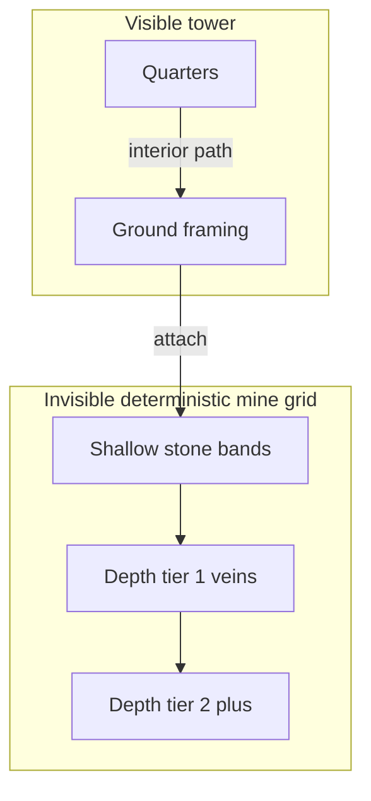

# Mines & laborer harvest

**Status:** Prospecting **shipped** (phase 2: veins + allocation + tier reveal + clear tally). Storage / leylines still later.

Complements [`HOUSING.md`](HOUSING.md) (laborer jobs), [`HEIGHT_PROGRESSION.md`](HEIGHT_PROGRESSION.md) (anti-grind), and the wallet rules in [`.cursor/plans/resource_economy_index.plan.md`](../.cursor/plans/resource_economy_index.plan.md). Live construction costs: [`ECONOMY_COST_MATRIX.md`](ECONOMY_COST_MATRIX.md).

---

## Shipped

| Piece | Behavior |
|-------|----------|
| `GameState.mine` | Deterministic shallow shaft under ground framing (starter prefers col 7) |
| Pathing | Interior graph treats mine tunnels as walkable; free vertical in/into mine |
| Ground access | Quarters path to the mine entrance via **auto-stairs** (or elevators); layout edits that would disconnect rooms are blocked |
| Jobs | After repair + hand-pump reserve, surplus laborers who can reach ground path to stone patches |
| Yield | **Stone** at `MINE_STONE_HARVEST_PER_SEC`; **metal/gold** with `RARE_PATCH_FALLOFF` (×0.5 per extra laborer); passive iron drip at `PASSIVE_IRON_FRACTION` (3%); haul deposits to **storage rooms** (not wallet) |
| Patches | Finite; deplete; laborer retargets when empty |
| Clear UX | Wave-clear **modal** + log line with gold + mine haul + **prospect result** (e.g. "Discovered depth 2 — mixed iron veins") |
| Stay put | Mine/pump/prospect workers are not cleared by the repair retarget loop |
| Render | Staff with `row < 0` are not drawn (invisible mine) |
| Prospecting | Build-phase HUD stepper allocates laborers (0…min(6, recruited)); equip cost charged at wave start; work timer reveals next depth tier with quality-rolled veins |
| Deep tiers | `generateDeepTier` appends tunnels + patches on prospect resolve; quality bands: poor/mixed/rich; never empty |

Knobs: [`src/config/mines.ts`](../src/config/mines.ts). Generation: [`src/model/mines/`](../src/model/mines/).

---

## Player fantasy

During the **night**, free laborers walk the **real grid** into an **underground mine** attached to the tower. Early stone is close and abundant. Deeper tiers take longer round-trips. **Prospecting** (labor allocated out of the normal wave pool) reveals the next depth tier. Rare yields (iron→metal, gems→gold) sit on finite veins with soft caps so dumping infinite bodies on one patch is weak.

Construction stays **queued during day** — laborers haul from storage and build over real time. Pressure is **laborer-seconds, haul distance, and allocation**, not instant placement. See [`DAY_NIGHT.md`](DAY_NIGHT.md).

Wave clear surfaces a short **haul tally** (“+stone / +metal / +gold from gems, vein found…”) so the fight ends with a clear “we accomplished something” beat without a separate harvest mini-game.

---

## Locked decisions

| Topic | Decision |
|-------|----------|
| Timing | Harvest **during night** at real mine sites (not a post-wave phase) |
| Map | One **invisible but deterministic** underground map (not random each wave; player does not map the interior) |
| Geometry | **Real grid**; mine **attaches to the tower** and may spread **below and sideways** |
| Sites | **One** mine system (single dig with depth tiers / veins), not multiple named digs |
| Replace | Abstract `harvest:underground` **removed**; stone starts as **shallow, high-availability** depth bands |
| Iron | Same wallet as **metal** |
| Gems | Translate to **bonus gold** (second gold source beside wave-clear payroll) |
| Vein size | **Finite** patches (StarCraft-style); they last a while, then empty |
| Soft caps | **Stone:** no laborer falloff. **Rare veins:** falloff so prospecting / new tiers stay attractive |
| Prospect | Build-phase **allocation** that **removes** laborers from the regular wave pool; they discover the **next depth tier** |
| Prospect outcome | Always find **something**; quality/usefulness varies — **no death risk**, no dry-hole wipe |
| Equip cost | Prospect parties may cost resources to equip (amounts TBD in implementation) |
| Player vs auto | **Player allocations first** (prospect), then **automatic** distribution of the rest |
| Mine staffing | Scouted/active veins are **auto-filled** from leftover labor (up to usefulness); not hand-picked per vein in v1 |
| vs repair | Auto order still favors **repair (and hand-pump) before mine fill**. Once on a mine job for the wave, harvesters **stay put** (do not peel for new damage) |
| Mine infra | **No** shafts/elevators/staging camps in this plan (future tech) |
| Deep tech | Blueprints / research that make exotic veins useful (fracking, rutile→titanium, …) — **out of scope**; veins may exist before tech unlocks them |
| Passive finds | Digging raw bodies can surface iron at **low %**; **prospect allocation** is the main next-tier unlock |
| Storage | **Storage rooms** (future slice in this track) hold stockpiles; they add mass/height pressure and discourage infinite hoarding |
| Anti-dwell | **Wear** + repair labor tax, **finite veins**, **longer trips as shallow layers empty**, storage mass — not grind seals |
| Clear UX | Wave-clear **modal** + log for haul (**shipped** for stone+metal+gold); prospect stats (**shipped**) |
| Leylines | **Stub only** this pass; magi / substance / mana-spring removal land in the leyline plan |

---

## Spatial model

- The mine is simulated on a **real cell grid** so walk time is honest.
- The player does **not** get a dungeon map UI; they see workplaces / depth / vein summaries and laborers leaving the tower.
- Attachment: contiguous with tower mass at the dig entrance (exact entrance rules in the engine slice).
- Generation: seeded / deterministic for the run so scouting is discovery of a fixed layout, not RNG noise each wave.

### Depth tiers

| Layer idea | Role |
|------------|------|
| Shallow stone bands | Default construction fuel; easy pathing; high total volume |
| Prospected tiers | Next depth unlocked by prospect allocation; vein quality roll |
| Rare patches | Iron (metal) and gem→gold; finite; laborer falloff |

Numbers (cells per band, units per patch, travel) are **balance TBD**.

---

## Laborer job model (mines track)

### Build phase

1. Recruit / roster as today.
2. Optionally **allocate N laborers to prospect** (removed from the regular attack pool for that wave).
3. Optionally pay **equip** cost for the prospect party (TBD).
4. No per-vein harvest sliders in v1.

### Attack phase — priority

1. **Player allocations** — prospectors path to the frontier / next-tier scout job and work it.
2. **Automatic** among remaining laborers:
   - Repair damaged stone-built (and other repairable) mass — primary.
   - Hand-pump reserve when water consumers need the band.
   - **Leftover** laborers auto-assign to available mine workplaces (stone uncapped; rare veins with falloff).
3. Harvesters that took a mine job **stay put** for the wave.

Prospectors do not count as repair/harvest/pump capacity while allocated.

### Yields while working a patch

| Source | Wallet | Notes |
|--------|--------|-------|
| Stone patches | `stone` | Shallow bands plentiful |
| Iron in vein / dig finds | `metal` | Low rate / rare patches; falloff on many bodies |
| Gems | `gold` | Bonus gold; amends “clear-only gold” for payroll fantasy — clear gold remains the primary payroll curve |

Harvest rate still scales with **laborer-seconds on site** after travel. Empty patch → laborers need a new auto target or idle.

---

## Prospecting

| Rule | Detail |
|------|--------|
| What it unlocks | The **next depth tier** of the single mine |
| Cost | Laborers reserved for the wave + optional equip resources |
| Failure | None — always reveals a tier; **quality** may be poor / not immediately useful |
| Death | None |
| When resolved | During attack (work timer / reach site); summarized on wave clear |
| Passive iron | Low % while mining raw bodies — flavor + small metal drip, not a substitute for prospecting |

Future tech may gate *usefulness* of exotic minerals without blocking discovery.

---

## Storage rooms (anti-hoard)

**Intent (same track, may be a later slice):** stockpile capacity is not infinite in the abstract wallet forever. Storage rooms:

- Raise how much stone/metal/(later substance) you can bank, **or** gate overflow.
- Cost stone/metal and add **tower mass** (wear + larger silhouette / height pressure).
- Make “dump every laborer into mining forever” pay a structural tax even when wear alone is soft.

Exact capacity rules TBD in the storage slice plan.

---

## Accomplishment & anti-grind

| Wanted feel | Mechanism |
|-------------|-----------|
| “We brought something home” | Wave-clear haul + prospect summary |
| No build timers | Instant place; labor limited in attack |
| No mid-height farm loop | Finite veins, longer trips, wear/repair, upkeep, storage mass |
| Keep climbing | Easy stone early; rare stuff and depth require prospect + travel time that fights longer waves |

Aligns with [`HEIGHT_PROGRESSION.md`](HEIGHT_PROGRESSION.md): refine in place is OK; seal-style grind is not.

---

## Economy amendments

Relative to the resource economy index:

| Prior lock | Amendment |
|------------|-----------|
| Gold income = wave clear only | **Also** gem→gold from mines (secondary) |
| Surplus harvest = abstract 25% metal / 75% stone | **Replaced** by site/vein yields on the mine grid |
| Gold Mine room | Still removed; this mine system is the replacement fantasy |

Souls remain kills-only. Payroll gold curve still height-scaled. Construction sinks unchanged until the cost matrix review suggests new iron/substance spends ([`ECONOMY_COST_MATRIX.md`](ECONOMY_COST_MATRIX.md)).

---

## Out of scope (this design / first implementation track)

- Leyline bands, substance wallet, mana-spring removal (stub plan only)
- Player-drawn mine interiors / fog-of-war mapping UI
- Mine elevators, staging camps, multi-mine sites
- Research tech trees (fracking, titanium, …)
- Exact balance numbers
- Renaming “substance”

---

## Implementation slices (suggested)

Use the index plan; do not implement from this doc alone.

| # | Slice | Outcome |
|---|-------|---------|
| 0 | Design (this doc + matrix + index + leyline stub) | Locked concept |
| 1 | Mine grid engine + entrance attach + replace abstract harvest with shallow stone | **Shipped** |
| 2–3 | Prospecting phase: veins + allocation + tier reveal + clear tally | **Shipped** via [`mine_harvest_prospect.plan.md`](../.cursor/plans/mine_harvest_prospect.plan.md) |
| 4 | Storage rooms | Anti-hoard mass |
| 5 | Balance / docs refresh | Numbers + status → shipped |

---

## Open balance (not blocking design)

1. Prospect equip costs and laborer counts per tier
2. Vein HP / units, falloff curve for rare patches
3. Stone band volume vs wear break-even
4. Whether gem gold needs a soft cap vs payroll gold
5. Storage capacity formula and which resources it holds
6. How much of the invisible map is hinted in UI (depth meter vs icons only)
