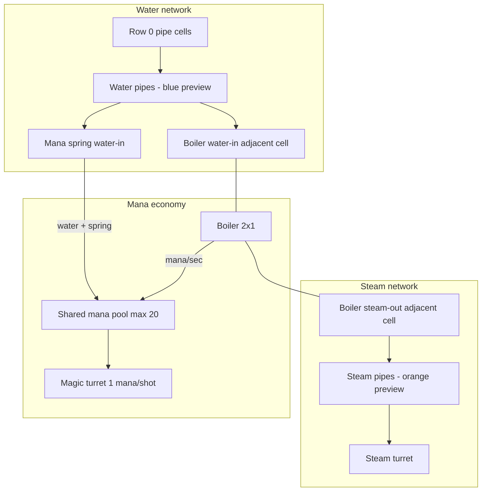

# Pipes, boilers & steam

Developer spec for the **fluid logistics** slice: ground water, boilers, mana springs, steam turrets, and typed pipe networks. Complements [`INFRASTRUCTURE.md`](INFRASTRUCTURE.md) (layers, soldiers, stairs).

**Status:** Planned — not yet implemented (pipe infra exists as untyped placeholder).

---

## Overview



| Defense line | Resource | Upstream |
|--------------|----------|----------|
| **Soldier slots** | Gold + logistics | Barracks, stairs |
| **Steam turrets** | Steam charge | Boiler water + mana |
| **Magic turret** | Mana per shot | Mana springs + pool |

Spells are **out of scope** for this phase.

---

## Design goals

1. **One fluid per pipe cell** — no mixing water and steam in the same cell.
2. **Generic pipe tool** — fluid type from **network seeds** + live **preview**; **locks at wave start**.
3. **Factorio-style merge reject** — cannot place a pipe that would connect water and steam networks.
4. **Parallel runs** — water and steam in **adjacent columns** around boilers (no crossover building).
5. **Instant hydraulic transfer** — connectivity is binary; steam charge rate uses **throughput split**, not fluid simulation.
6. **Shared mana** — boilers and magic turrets compete for the same pool.

---

## Pipe layer

### Placement

- Same infra layer as stairs (`Tower.infra`).
- **One** of stair or pipe per cell (unchanged).
- Orthogonal segments only; may run through room footprints (protected inside structure).
- **No edits** during attack phase; fluid labels frozen for the wave.

### Fluid typing (Option 3 hybrid)

| Preview state | Color | When |
|---------------|-------|------|
| Unassigned | Gray `~` | Not connected to a seed |
| Water | **Blue** | Component touches **row 0** pipe cell |
| Steam | **Orange** | Component touches a **steam turret** (adjacent pipe cell) |

**Seeds:**

- **Water:** any pipe cell on **row 0** (ground). Any number of ground connections; no separate `waterSpring` structure.
- **Steam:** flood from cells **4-adjacent to any steam turret** (consumer pulls steam type through the pipe graph).

Re-preview **immediately** on pipe/room edits during build.

**Wave start:** resolve all components → assign `fluid` → **lock** for attack.

### Merge rule (Option 1 — reject)

If placing a pipe would **4-connect** two components whose resolved fluids differ (water vs steam), or water-capable vs steam-capable with conflicting labels:

- **Block placement**
- Message: e.g. *"Would mix water and steam"*
- **Drag-paint:** stroke **stops** at last valid cell + message

**Allowed:** T-junctions and crosses **within one fluid** only.

**Not in scope:** Pipe crossover / bridge buildings.

### Boiler attachment

- Pipes **cannot** occupy boiler footprint cells.
- **Water in** and **steam out** use **distinct adjacent cells** (one fluid per cell).
- Port type is inferred from first connection (water net vs steam net); shown **only via pipe colors**, not port labels on inspect.

---

## Structure rooms

### Boiler (`boilerRoom`)

| Property | Value |
|----------|--------|
| Size | **2×1** |
| Water | Adjacent cell connected to **ground-water** network |
| Steam | Adjacent cell connected to **steam-turret** network |
| Mana | **~0.25/sec** while producing (tunable); **stops** at 0 mana |
| Output | Steam **available** on steam network when water + mana OK |
| Throughput | **3 / 4 / 5** units via `boilerExpansion` mod (levels 0 / 1 / 2) |
| Passable | TBD (default: **false**) |
| Cost / HP | TBD — balance pass later |

**Throughput:** each connected steam turret = **1 unit**. Charge rate split:

```
chargeRate = boilerUnits / sum(connectedTurretUnits)
fullChargeTime = 3s / chargeRate   // 3s at 1.0×
```

Many boilers may share water and steam networks.

### Steam turret (`steamTurretRoom`)

| Property | Value |
|----------|--------|
| Size | **1×1** |
| Input | Adjacent **steam** pipe |
| Charge | **3s** at 1.0× throughput; **keeps partial charge** if steam/mana stops |
| Fire | **Full dump** when charged + enemy in blast zone |
| Damage | **~2×** magic turret (~10 if turret = 5) |
| Blast | **Air-facing side(s)**; **3 cells wide** perpendicular; depth **~3** (tunable) |
| Targeting | **Any** enemy in blast lane |
| Both sides open | May fire **both** lanes same tick if enemies on both |
| Passable | TBD (default: **false**) |
| Cost / HP | TBD |

### Mana spring (`manaSpringRoom`)

| Property | Value |
|----------|--------|
| Size | **2×2** |
| Cost | **High** (TBD) — large investment structure |
| Water | Same adjacent-pipe rules as boiler |
| Output | **~0.5 mana/sec** per spring (stacks on shared water net) |
| No water | **0** mana; **inspect warning** |
| Placement | Any **stable** cell |
| Passable | TBD (default: **false**) |

---

## Mana economy

| Rule | Value |
|------|--------|
| Pool | **Shared**; **max 20** |
| Wave start | **Full** (20) |
| Passive regen | **0** without mana springs |
| Magic turret | **1 mana** per shot (include in this slice) |
| Boiler | Drains mana while producing steam |
| Spells | **Deferred** |

Intent: mana springs + turret shots compete with boiler fire — player cannot run everything on mana alone.

---

## Attack-phase behavior

### Simulation order (addition to `game.step`)

```
… existing enemy / wizard / slot / magic turret …
1. Tick mana springs (+mana/sec if water-connected)
2. Tick boilers (−mana/sec if water + producing; mark steam available)
3. Tick steam turret charge (throughput split from connected boiler capacity)
4. Fire steam turrets when charged + valid exterior targets
```

### Network breaks

**Design:** destroying a room or pipe mid-wave can break networks.

**MVP:** room destruction / dynamic breaks **deferred** — topology treated as static for the wave.

When implemented: re-resolve fluids, boilers/turrets/spring go offline if disconnected.

---

## Connectivity validation

| Check | Behavior |
|-------|----------|
| Water net without row 0 | Warn |
| Boiler without water path | Warn |
| Boiler without mana (forecast) | Info/warn |
| Steam turret without steam path to boiler | Warn |
| Mana spring without water | Warn on inspect |
| Would-merge (build) | **Reject** placement |

**Warn only** before `startWave` (same pattern as soldier routing). HUD lists pipe warnings.

---

## Data model (planned)

```ts
type Fluid = 'water' | 'steam' | 'unassigned';

interface InfraCell {
  kind: 'pipe';
  fluid: Fluid; // locked at wave start
}

interface Player {
  mana: number;
  maxMana: number;
}

// Per-room runtime (attack phase)
interface BoilerState {
  producing: boolean; // water + mana
}

interface SteamTurretState {
  charge: number;     // 0..1
  chargeRate: number; // from throughput split
}
```

**Pipe networks:** flood-fill orthogonal pipe cells; type from seeds; merge reject on build.

**No** `waterSpring` blueprint — ground row is the only water source.

---

## UI

| Surface | Behavior |
|---------|----------|
| Pipe preview | Gray → blue (water) / orange (steam) on touch seed |
| Illegal merge | Red ghost / blocked placement |
| Layers | Infra layer shows pipe colors when on |
| Inspect | Mana spring dry warning; pipe warnings in HUD |
| Boiler ports | **Colors only** — no "W in / S out" labels |

---

## Implementation phases

| Phase | Deliverable |
|-------|-------------|
| **P0** | This doc + `Player.mana` + constants stubs |
| **P1** | `InfraCell.fluid`, seed flood-fill, preview colors, merge reject |
| **P2** | Ground-water detection; connectivity warnings |
| **P3** | Boiler 2×1 + `boilerExpansion` + mana drain + steam availability |
| **P4** | Steam turret + charge + side blast + exterior targeting |
| **P5** | Mana spring 2×2 + water gate + inspect warning |
| **P6** | Magic turret 1 mana/shot |
| **P7** | Balance pass (costs, HP, passable flags) |

**Explicitly skipped:** crossover bridges, spells, pipe damage, dynamic network breaks, separate waterSpring structure.

---

## Open tuning (constants only)

Placeholders until balance pass:

```ts
// Suggested defaults — change in constants.ts
BOILER_MANA_PER_SEC = 0.25;
MANA_SPRING_PER_SEC = 0.5;
MANA_MAX = 20;
STEAM_TURRET_CHARGE_SEC = 3;
STEAM_TURRET_DAMAGE = 10;
MAGIC_TURRET_MANA_COST = 1;
BOILER_THROUGHPUT = [3, 4, 5];
```

| TBD | Notes |
|-----|--------|
| Boiler / steam turret / mana spring **cost & HP** | Set in blueprints when implementing |
| Steam turret **passable** | Default false |
| Blast **depth** | Default 3 exterior cells |

---

## Related docs

- [`INFRASTRUCTURE.md`](INFRASTRUCTURE.md) — layers, soldiers, stairs
- [`CONTRIBUTING.md`](CONTRIBUTING.md) — task recipes
