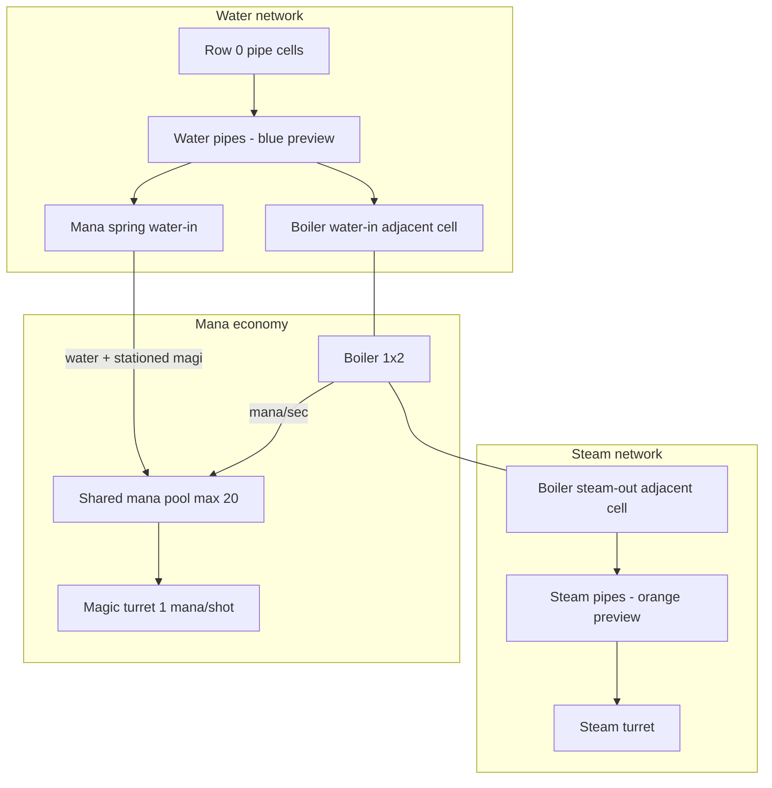

# Pipes, boilers & steam

Developer spec for the **fluid logistics** slice: ground water, boilers, mana springs, steam turrets, and typed pipe networks. Complements [`INFRASTRUCTURE.md`](INFRASTRUCTURE.md) (layers, workers, stairs) and [`HOUSING.md`](HOUSING.md) (magi staffing springs).

**Status:** Shipped (P0–P7). Topology is static for the wave; see [Deferred / out of scope](#deferred--out-of-scope).

---

## Overview



| Defense line | Resource | Upstream |
|--------------|----------|----------|
| **Soldier slots** | Gold + logistics | Guardrooms, stairs |
| **Steam turrets** | Steam charge | Boiler water + mana |
| **Magic turret** | Mana per shot | Mana springs (water + magi) + pool |

Spells spend mana but are **not** part of this logistics slice.

---

## Design goals

1. **One fluid per pipe cell** — no mixing water and steam in the same cell.
2. **Generic pipe tool** — fluid type from **network seeds** + live **preview**; **locks at wave start**.
3. **Factorio-style merge reject** — cannot place a pipe that would connect water and steam networks.
4. **Parallel runs** — water and steam in **adjacent columns** around boilers (no crossover building).
5. **Instant hydraulic transfer** — connectivity is binary; steam charge rate uses **throughput split**, not fluid simulation.
6. **Shared mana** — boilers and magic turrets compete for the same pool.

---

## Pipe layer

### Placement

- Same infra layer as stairs (`Tower.infra`).
- **One** of stair or pipe per cell (unchanged).
- Orthogonal segments only; may run through room footprints (except boiler cells).
- **No edits** during attack phase; fluid labels frozen for the wave.

### Fluid typing

| Preview state | Color | When |
|---------------|-------|------|
| Unassigned | Gray | Not connected to a seed |
| Water | **Blue** | Component touches **row 0** pipe cell |
| Steam | **Orange** | Component touches a **steam turret** (adjacent pipe cell) |

**Seeds:**

- **Water:** any pipe cell on **row 0** (ground). Any number of ground connections; no separate `waterSpring` structure.
- **Steam:** flood from cells **4-adjacent to any steam turret** (consumer pulls steam type through the pipe graph).

Re-preview **immediately** on pipe/room edits during build.

**Wave start:** resolve all components → write `InfraCell.fluid` → **lock** for attack rendering. Attack-phase boilers / springs / turrets re-read live topology; with static networks this matches the lock.

### Merge rule

If placing a pipe would **4-connect** water and steam neighborhoods:

- **Block placement**
- Message: *"Would mix water and steam."*
- **Drag-paint:** invalid cells are skipped (message shown); the stroke does **not** abort — the player can continue over later valid cells

**Allowed:** T-junctions and crosses **within one fluid** only.

### Boiler attachment

- Pipes **cannot** occupy boiler footprint cells.
- **Water in** and **steam out** use **distinct adjacent cells** (one fluid per cell).
- Port type is inferred from network colors only — **no** "W in / S out" labels on inspect.

### Pipe drawing

Pipes draw through the **cell center** to **edge midpoints** toward each orthogonal joint:

- Neighbor **pipe** cells
- Adjacent **fluid-port rooms** (boiler, mana spring, steam turret)
- **Ground** stub on row-0 pipes (south into the ground line)

That yields continuous L / T / + shapes instead of a side riser.

---

## Structure rooms

### Boiler (`boilerRoom`)

| Property | Value |
|----------|--------|
| Size | **1×2** |
| Water | Adjacent cell connected to **ground-water** network |
| Steam | Adjacent cell connected to **steam-turret** network |
| Mana | **0.25/sec** while producing; **stops** at 0 mana |
| Output | `steamAvailable` when water + steam port + mana OK |
| Throughput | **3 / 4 / 5** units via `boilerExpansion` mod (levels 0 / 1 / 2) |
| Passable | **false** |
| Cost / HP | **16 / 22** |

**Throughput:** each connected steam turret = **1 unit**. Charge rate split:

```
chargeRate = boilerUnits / sum(connectedTurretUnits)
fullChargeTime = 3s / chargeRate   // 3s at 1.0×
```

Many boilers may share water and steam networks.

### Steam turret (`steamTurretRoom`)

| Property | Value |
|----------|--------|
| Size | **1×1** |
| Input | Adjacent **steam** pipe |
| Charge | **3s** at 1.0× throughput; **keeps partial charge** if steam/mana stops |
| Fire | **Full dump** when charged + enemy in blast zone (holds at full until a target appears) |
| Damage | **10** (~2× magic turret’s 5) |
| Blast | Open **left/right** faces (neighbor cell empty); **3** wide × depth **3** |
| Targeting | **All** enemies in blast cells |
| Both sides open | May fire **both** lanes in the same dump |
| Passable | **false** |
| Cost / HP | **14 / 20** |

### Mana spring (`manaSpringRoom`)

| Property | Value |
|----------|--------|
| Size | **2×2** |
| Cost / HP | **28 / 30** |
| Water | Same adjacent-pipe rules as boiler |
| Staffing | Needs stationed **magi** from chambers (see [`HOUSING.md`](HOUSING.md)); up to **5**, efficiency `[1, 0.8, 0.6, 0.4, 0.2]` |
| Output | **0.5 mana/sec** × mage efficiency sum (stacks across springs) |
| No water / no mage | **0** mana; room build alert / inspect |
| Placement | Any **stable** cell |
| Passable | **true** (magi station inside the footprint) |

### Magic turret (`turretRoom`)

Existing room; **1 mana per shot**. Cooldown still ticks when dry; the shot is skipped until mana is available.

---

## Mana economy

| Rule | Value |
|------|--------|
| Pool | **Shared**; **max 20** (`MAX_MANA`) |
| Wave start | **Full** (20) |
| Passive regen | **0** without water-connected, mage-staffed springs |
| Magic turret | **1 mana** per shot |
| Boiler | Drains mana while producing steam |
| UI | Mana label rounded to the **nearest tenth** |

Intent: mana springs + turret shots compete with boiler fire — the player cannot run everything on mana alone.

---

## Attack-phase behavior

### Simulation order (`game.step`, after room effects / magic turret)

```
1. Tick mana springs (+mana/sec if water-connected and staffed by magi)
2. Tick boilers (−mana/sec if water + steam port + mana; mark steamAvailable)
3. Tick steam turret charge (throughput split) and fire when charged + targets
```

### Network breaks

**MVP:** topology is **static for the wave** — no mid-wave pipe/room destruction, no re-resolve. See deferred list below.

---

## Connectivity validation

Build-phase only. Warnings are **per-room** (red outline + hover/inspect), same pattern as logistics/slot alerts — **not** a HUD dump.

| Check | Behavior |
|-------|----------|
| Unassigned / orphan pipes (no seed) | **Gray preview only** — no dedicated warning |
| Boiler without water | Warn: *"Needs water from ground pipes"* |
| Boiler without steam outlet | Warn: *"Needs a steam pipe outlet"* |
| Steam turret without steam pipe | Warn: *"Needs a steam pipe"* |
| Steam turret steam net with no boiler | Warn: *"No steam from a boiler"* |
| Mana spring without water | Warn: *"Needs water from ground pipes"* |
| Would-merge (build) | **Reject** placement |

---

## Data model

```ts
type Fluid = 'water' | 'steam' | 'unassigned';

interface InfraCell {
  kind: 'stair' | 'pipe';
  fluid?: Fluid; // written at wave start for pipes
}

interface Player {
  mana: number;
  maxMana: number;
}

// GameState attack-phase runtime
boilerRuntime: Record<roomId, { producing: boolean; steamAvailable: boolean }>;
steamTurretRuntime: Record<roomId, { charge: number; chargeRate: number }>;
```

**Pipe networks:** flood-fill orthogonal pipe cells; type from seeds; merge reject on build.

**No** `waterSpring` blueprint — ground row is the only water source.

---

## UI

| Surface | Behavior |
|---------|----------|
| Pipe preview | Gray → blue (water) / orange (steam) on touch seed |
| Pipe joints | Center hub + orthogonal stubs (pipes, port rooms, ground) |
| Illegal merge | Red ghost / blocked placement |
| Layers | Infra layer shows pipe colors when on |
| Warnings | Room outline + hover/inspect (`selectRoomBuildAlerts`) |
| Boiler ports | **Colors only** — no port labels |
| Mana | `N.N / max` to nearest tenth |

---

## Implementation phases (history)

| Phase | Deliverable |
|-------|-------------|
| **P0** | Doc + `Player.mana` + constants |
| **P1** | `InfraCell.fluid`, seed flood-fill, preview colors, merge reject |
| **P2** | Connectivity warnings (room alerts) |
| **P3** | Boiler 1×2 + `boilerExpansion` + mana drain + steam availability |
| **P4** | Steam turret + charge + side blast + exterior targeting |
| **P5** | Mana spring 2×2 + water gate + inspect warning |
| **P6** | Magic turret 1 mana/shot |
| **P7** | Balance pass (costs, HP, passable flags) |
| **Post** | Magi staffing gate + spring passable (see [`HOUSING.md`](HOUSING.md)) |

---

## Deferred / out of scope

| Item | Notes |
|------|-------|
| Crossover / bridge buildings | Not planned |
| Pipe damage | Not planned |
| Dynamic mid-wave network breaks | Topology static for the wave |
| Separate `waterSpring` structure | Ground row only |
| Orphan-pipe component warnings | Gray unassigned is the signal |
| Boiler mana-forecast warning | Not implemented |
| Drag-paint abort on first illegal cell | Invalid cells skipped; stroke continues |
| Spell mana as a logistics deliverable | Spells already spend the shared pool |

---

## Balance defaults (constants + blueprints)

```ts
BOILER_MANA_PER_SEC = 0.25;
MANA_SPRING_PER_SEC = 0.5;
MAX_MANA = 20;
STEAM_TURRET_CHARGE_SEC = 3;
STEAM_TURRET_DAMAGE = 10;
STEAM_TURRET_BLAST_DEPTH = 3;
MAGIC_TURRET_MANA_COST = 1;
BOILER_THROUGHPUT = [3, 4, 5];
```

| Room | Cost | HP | Passable |
|------|------|----|----------|
| Boiler | 16 | 22 | false |
| Steam turret | 14 | 20 | false |
| Mana spring | 28 | 30 | true (magi station inside) |
| Magic turret | 10 | 18 | (existing) |

---

## Related docs

- [`INFRASTRUCTURE.md`](INFRASTRUCTURE.md) — layers, workers, stairs
- [`HOUSING.md`](HOUSING.md) — chambers / magi staffing for springs
- [`CONTRIBUTING.md`](CONTRIBUTING.md) — task recipes
