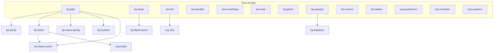

# Research, tech tree & spell discovery

Design for **gated progression**: a static tech tree researched through **research rooms + magi**, plus a separate **rare spell-discovery** path tied to height clears. Players start with basics; interconnection-heavy builds unlock over the run. Spells stay a skilled “micro” layer — rooms and staff should be enough to brute-force a run.

**Status:** v1 static tech tree **implemented** (starter kit, research rooms + magi progress, queue, DAG modal UI, expansion gating, dev Unlock). Spell discovery / school pick / spell bonuses and procedural trees remain deferred.

---

## Goals

1. **Different towers, shared arc** — branch choice and school identity make runs feel different; tree depth and hard gates keep “later = more interconnected / stronger,” without height seal-gates on blueprints.
2. **Start simple** — starter kit covers construct + a macro defense path; pipes, forges, elevators, advanced forts, and workplace chains come through research.
3. **Research is labor** — pick a frontier node, pay costs to **start** it, then allocate magi to research rooms until it completes (time / labor-cycles + souls and other resources).
4. **Spells are micro** — rooms/staff carry the run; spells cover gaps and reward skill (StarCraft-micro analogy). The spellbook stays small; new spells are rare and **not** tech-tree nodes.
5. **Slow pace** — players can bank capacity and start research when ready; completions typically land on a ~every-few-waves cadence, not every wave.
6. **Local tree visibility** — sidebar shows active/queue only; the DAG modal shows completed + available + the next preview layer (not the entire fogged tree).

---

## Two systems (do not merge)

| System | What it unlocks | How |
|--------|-----------------|-----|
| **Tech tree (research)** | Blueprints, room expansion/mod subtrees, **spell bonuses** (CD / cost / power) | Start research → magi in research rooms progress it |
| **Spell discovery** | Individual spells (hotbar entries) | Rare offers after clearing a wave at certain heights; pick **1 of 3** |

Spell *identity* (fireball, wall of flame, …) comes from discovery. Spell *mastery* (raw damage, shorter CD, cheaper mana) can sit on the tech tree so a fire mage can invest in their craft without unlocking every fire spell from research.

---

## Locked decisions

| Decision | Choice |
|----------|--------|
| Claim fantasy | Commission research: pick node → pay to start → allocate researchers |
| Researchers | **Magi** stationed in **research rooms** (new room; Chamber still houses them) |
| Progress currency | Labor-cycles over waves/build time + **souls** (and other resources as node costs require) |
| “Higher = better” | **Tree depth / hard gates** for blueprints; **soft** correlation via longer runs having more research cycles — **not** height seal-gates on build unlocks |
| Early combat | **Rooms/staff carry**; spells are optional power for skilled play |
| School pick | Run-start pick grants that school’s **base** spell; Wand Strike always on |
| Cross-school spells | **Allowed** via discovery — not abnormal, but often weaker synergy with the tower you built |
| Spells on tech tree? | **No** — only spell **bonuses** |
| Spell discovery volume | About **3–5** spells unlocked per tower climb (tunable) |
| Spell offer shape | On eligible height clear: choose **1 of 3** offered spells |
| Tree contents | Blueprints (+ optional bundled starter mods); each room blueprint opens a **small expansion/mod subtree** |
| Staff hard gate | Any workplace that needs a staff kind requires that housing unlocked first (e.g. **Chamber before Mana Spring**) |
| Pace | Can bank and start when ready; research then runs via allocation (not instant unlock on spend) |
| Queue | Up to **5** paid enqueued projects (excludes active); full refund if removed before start |
| Cancel active | Half resource refund; all progress lost; inline warning |
| Tree visibility (v1) | Sidebar = active/queue; modal DAG = completed + frontier + one preview layer |
| v1 tree shape | **Static** authored DAG |
| Procedural trees | Deferred — hard gates below stay sacred for a later generator |

---

## Design principles

### Macro first, micro second

The fantasy is **tower builder**. A player who never casts should still clear with housing, slots, turrets, pipes, and logistics. Spells help cover bad shapes, plug leaks, and spike threats — a large power bump for players who micro well, not a required DPS channel.

### Research is a tower job

Unlocking is not a free “level up” button. It competes with:

- Magi also wanted on **mana springs**
- Souls (and other costs) also wanted for construction / recruitment pressure
- Floor space for research rooms vs defenses

That scarcity is the pace knob.

### Soft height correlation, no blueprint seals

[`HEIGHT_PROGRESSION.md`](HEIGHT_PROGRESSION.md) rejects grind seals for **enemy** pressure. Blueprint research must not reintroduce “must farm height N before the next room type.” Longer climbs naturally yield more research labor; better stuff sits **deeper on the tree**, not behind a height lock.

Spell **discovery** *does* key off clearing at height bands — that is intentional rarity, separate from build unlocks, and must stay sparse (3–5 per run) so it does not become a height checklist.

### Hard gates teach interconnection

Prerequisites encode “you must understand pipes before steam.” Sacred edges survive into any future procedural layout: node **order** may shuffle; **prereqs** must not.

---

## Research loop


### Start / enqueue

1. Build phase: open the research DAG modal (**Choose research…** or **Edit**).
2. Select a frontier node; confirm **Start** (idle) or **Enqueue** (when something is already active).
3. At most **one** active project; up to **5** paid items in the queue (excludes active).
4. Enqueue spends `startCost` immediately. Removing a queued item before it becomes active refunds **100%**.
5. Cancelling the **active** project refunds **50%** of its `startCost` (floored per resource) and **wipes progress** (inline warning required).
6. When active completes, the queue head auto-promotes to active (no second charge).

### Research rooms & allocation

- Blueprint: **Research room** (starter kit). Magi path from **Chamber**.
- During attack: stationed magi generate research progress toward the active node.
- Progress needed scales with node depth/power; numbers flexible for playtest.

### Completion

- When progress fills, unlocks apply immediately; frontier / preview layer updates.
- No extra “claim” click after completion.

---

## Tech tree contents

### Node kinds

| Kind | Unlocks | Notes |
|------|---------|-------|
| `blueprint` | One library blueprint id | May **bundle** a basic mod or two as “comes with the room” |
| `expansion` | Room modification / capacity tech | Lives on a **small subtree** rooted at that room’s blueprint node |
| `spellBonus` | CD / cost / effectiveness (scoped to school or spell) | Never grants a new hotbar spell |

One node → one primary unlock. Shared prerequisites are edges, not duplicate nodes.

### Starter kit (shipped)

Always available at run start (no research):

| Ids | Role |
|-----|------|
| `stem` | Framing |
| `quartersRoom`, `guardroomRoom`, `chamberRoom` | Housing |
| `turretRoom` | Simple damager |
| `researchRoom` | Research workplace |
| `spikes` (mod) | Starter modification |

Stairs are **not** researched or unlocked — they are auto-generated (see [`INFRASTRUCTURE.md`](INFRASTRUCTURE.md)).

### Static node inventory (shipped)

Source of truth: [`src/model/research/tree.ts`](../src/model/research/tree.ts).

| Node id | Unlocks | Requires |
|---------|---------|----------|
| `tech-overhang` | Cantilever Framing (one-step spire overhangs) | — |
| `bp-pipe` | pipe | — |
| `bp-elevator` | elevator | — |
| `bp-slot` | slotRoom | — |
| `bp-forge` | forgeRoom | — |
| `bp-pump` | pumpRoom | bp-pipe |
| `bp-boiler` | boilerRoom | bp-pipe |
| `bp-mana-spring` | manaSpringRoom | bp-pipe |
| `bp-hydrant` | hydrantRoom | bp-pipe |
| `bp-steam-turret` | steamTurretRoom | bp-pipe, bp-boiler |
| `bp-flame-turret` | flameTurretRoom | bp-forge |
| `bp-moat` | moat | — |
| `bp-glacis` | glacis | — |
| `bp-parapet` | parapet | — |
| `bp-cornice` | cornice | — |
| `bp-stakes` | stakes | — |
| `bp-barbican` | barbican | bp-parapet |
| `exp-guardroom` | guardroomExpansion | — |
| `exp-chamber` | chamberExpansion | — |
| `exp-quarters` | quartersExpansion | — |
| `exp-slot` | slotExpansion | bp-slot |
| `exp-boiler` | boilerExpansion | bp-boiler |



### Sacred hard gates (v1)

Must never break (static tree now; procedural generator later):

| Prerequisite | Before |
|--------------|--------|
| Pipe | Boiler, Water Pump, Mana Spring, Hydrant, Steam Turret |
| Pipe + Boiler | Steam Turret |
| Forge | Flame Turret |
| Guardroom | Slot (and soldier workplaces) — Guardroom is starter, so Slot is a root node |
| Chamber | Mana Spring staffing — Chamber is starter; spring still pipe-gated |
| Elevator | Elevator is a root research node (faster vertical travel; stairs are automatic and free) |
| Room blueprint | That room’s expansion/mod subtree |
| School base spell | That school’s spell **bonuses** (bonuses still do not grant new spells) |

### Room → expansion subtree

Unlocking a room blueprint reveals a short frontier of expansions (e.g. Slot → slotExpansion; Boiler → boilerExpansion levels). Expansions are researched like any other node (start + magi progress), not free on place — unless a blueprint node explicitly **bundles** a starter mod.

### Spell bonuses on the tree

Examples (not a final roster):

- School-wide: −mana cost, −cooldown, +damage / potency
- Narrower: bonuses that only apply to the **base** spell or to discovered spells the player already owns

A fire mage can invest heavily in raw damage without ever discovering Wall of Flame.

---

## Spell discovery (separate track)

### School pick

- Once per run at start (UI in a later shot).
- Sets `activeSpellSchool` and grants that school’s designated **base** spell.
- Hotbar starts tiny (base + empty slots as discoveries arrive). Wand Strike remains auto and off-hotbar.

### Height-clear offers

- After clearing a wave whose Start Wave height crossed an offer band (exact bands tunable; align spirit with [`HEIGHT_PROGRESSION.md`](HEIGHT_PROGRESSION.md) plateaus, not per-row spam).
- Offer: **3** candidate spells → player picks **1**.
- Target yield: **~3–5** discoveries over a full climb to height 100.
- Candidates may include **other schools**; cross-school is normal but often less synergistic with the researched tower (e.g. water tools in a forge/flame build).
- Pool rules (soft): prefer unowned spells; weight toward active school without excluding others; never re-offer owned ids.

### Hotbar

- Only **discovered** (and starter) spells appear.
- Today’s full 4-spell school kits become the **pool** for discovery, not the starting loadout.
- Dev school swap may remain for testing; production runs use pick + discovery.

### Explicit non-goals for spells (this design)

- Spell shop / gold-for-spell purchases
- Mana Well as unlock gated here (room may exist later on the **blueprint** tree)
- Tech-tree nodes that grant new spell ids
- Requiring spell casts to win

---

## Pace & run identity

| Lever | Intent |
|-------|--------|
| Node progress cost | Deeper / stronger nodes take more magi-cycles |
| Magi split | Springs vs research vs (later) other mage jobs |
| Resource start cost | Souls (etc.) gate *starting* ambitious nodes |
| Banking | Player may delay starting research to save souls or finish a build |

Expected feel: not an unlock every wave; often a project spanning **~2–3 waves** of allocation, with room to bank and dump into a long project.

Run identity comes from:

1. School pick + which discoveries appeared
2. Which frontier branches were prioritized (pipes rush vs soldier line vs forts vs spell mastery)

---

## UI (v1)

- **Sidebar:** active project + progress; queue summary; **Choose research…** (idle) or **Edit** (active/queued). No full frontier list in the sidebar.
- **DAG modal:** layered graph (**top to bottom** by prereq depth) of **completed + available + preview** (direct children of those, including unmet multi-prereq children greyed with missing-prereq labels). Expansion nodes collapse into their own chips — housing expansions sit with the roots; per-blueprint upgrades sit in the next row under the parent. Edges follow parent→child downward; skip-layer edges arc around intervening rows.
- On open, scroll so the **frontier band** is in view.
- Click a node → detail pane (name, unlocks, cost, labor, missing prereqs). Primary action **Start** (idle) or **Enqueue** (busy). Dev **Unlock** on the node chip; **Unlock all** in modal footer.
- Cancel active: inline confirm with half-refund warning. Dequeue: full refund, no confirm beyond the remove control.
- Research room inspector: assigned magi.
- Spell offer modal on eligible wave clear (pick 1 of 3) — still deferred.

---

## Data model (design-level)

Exact TypeScript lands in the engine plan. Shape for implementers:

```ts
// Per-run state
// player.research: {
//   completedNodeIds: ResearchNodeId[];
//   active: { nodeId; progress } | null;
//   queue: ResearchNodeId[]; // max 5, paid, not yet active
// }
```

Library filtering already respects `unlockedBlueprints` ([`src/store/selectors/build.ts`](../src/store/selectors/build.ts)).

---

## Future: procedural tree layout (deferred)

When the static tree is fun enough:

- At run start, generate a DAG that **preserves sacred hard gates** but varies depth/order of non-critical nodes (e.g. steam turret immediately after pipes in one run, or behind another mid-tier room in another).
- Claim loop stays research-room based; frontier UI still only shows what’s available.
- Optional later: draft-style research offers — **not** required for procedural value.

---

## Explicit non-goals (v1)

- Procedural / per-run tree generation
- Showing the **entire** fogged tree beyond completed + frontier + one preview layer
- Instant unlock on pay (no magi progress) outside dev tools
- Spells as tech-tree blueprint-style nodes
- Height-gated **blueprint** unlocks
- Mana Well / spell shop economy
- Magi combat casting / replacing the wizard
- Queue reorder UI
- Training rooms / troop-type gates beyond housing→workplace hard gates above

---

## Implementation roadmap

| Order | Plan (create when that shot starts) | Scope |
|-------|-------------------------------------|-------|
| 1 | Design doc (this file) + index | Docs only — **done** |
| 2 | `research_engine.plan.md` | Unlock state, starter kit, static tree — **shipped in static v1** |
| 3 | `research_rooms.plan.md` | Research room + magi labor-cycles — **shipped in static v1** |
| 4 | `research_ui.plan.md` | Frontier list — superseded by DAG modal |
| 4b | Research DAG modal + queue | Sidebar slim + DAG modal + enqueue/cancel — **this shot** |
| 5 | `spell_discovery.plan.md` | School pick, unlocked spell hotbar, height-clear 1-of-3 offers |
| 6 | `research_content.plan.md` | Author static edges — **initial roster shipped**; tune pace in playtest |
| 7 | Later | Procedural layout generator |

Orient-only index: [`.cursor/plans/research_index.plan.md`](../.cursor/plans/research_index.plan.md).

**Rule for agents:** implement from **one** shot plan at a time; do not pull spell discovery into the research-engine PR unless that shot’s plan says so.

---

## Decision log

| # | Topic | Decision |
|---|-------|----------|
| 1 | Claim loop | Research rooms + magi; pay to start; progress over labor-cycles |
| 2 | Higher = better | Tree depth + soft wave/labor correlation; no blueprint height seals |
| 3 | Early combat | Rooms/staff macro; spells micro |
| 4 | Cross-school spells | Available via discovery; synergy not guaranteed |
| 5 | Tree vs spells | Blueprints + expansions + spell bonuses on tree; spell ids via discovery |
| 6 | Spell rarity | ~3–5 per tower; 1-of-3 offers on height clears |
| 7 | Staff gates | Housing before workplaces that need that staff |
| 8 | Pace | Bankable start; progress via allocation |
| 9 | Visibility | Sidebar active/queue; modal DAG local neighborhood |
| 10 | v1 tree | Static DAG; procedural deferred |
| 11 | Queue | Cap 5; pay on enqueue; full refund if not started |
| 12 | Cancel active | Half refund; progress lost |
| 13 | Auto-promote | Queue head starts when active completes |

---

## Related docs

- [`HOUSING.md`](HOUSING.md) — Chamber / magi; research rooms extend mage jobs beyond springs
- [`HEIGHT_PROGRESSION.md`](HEIGHT_PROGRESSION.md) — enemy unlocks & anti-grind; spell discovery may share height bands but must not seal blueprints
- [`PIPES.md`](PIPES.md) / [`INFRASTRUCTURE.md`](INFRASTRUCTURE.md) — interconnection targets for hard gates
- [`FORTIFICATIONS.md`](FORTIFICATIONS.md) — forts as gated blueprints
- Spell school plans under `.cursor/plans/spell_school_*.plan.md` — spell pools for discovery
